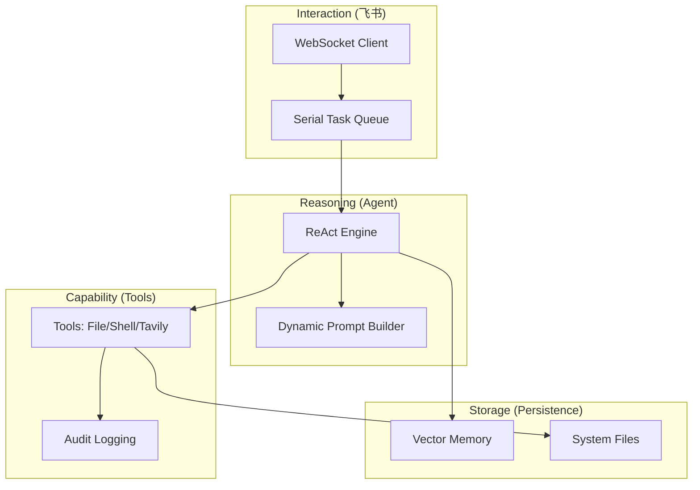

# R-MAN: 通用 AI 自动化执行助理

[](https://www.python.org/)
[](#核心特性)
[](https://open.feishu.cn/)
[](LICENSE)

**R-MAN** 是一个面向生产环境设计的通用 AI Agent。它通过深度融合大语言模型（LLM）的推理能力与底层系统工具，为用户提供一个安全、可审计、且具备长期记忆的自动化任务执行环境。

---

## 🚀 核心特性

- **🤖 智能推理 (ReAct)**: 基于 `<think>` / `<final>` 标签解析，实现标准的“思考-行动-观察”闭环。
- **🔌 深度集成飞书**:
    - **WebSocket 模式**: 无需公网 IP，即可实现双向实时通信。
    - **卡片化交互**: 自动将 Markdown 转换为飞书原生 UI 组件（表格、分栏、状态色）。
- **🧠 长期记忆系统**:
    - 基于 **SQLite + sqlite-vec** 的本地向量存储。
    - **隐私优先**: 仅存储脱敏摘要，不记录原始对话。
    - **自动维护**: 默认 90 天有效期，支持 24 小时自动巡检清理。
- **🛠️ 强大的工具箱**:
    - **文件系统**: 具备 `read`, `write`, `replace` 手术刀式代码/配置修改能力。
    - **进程管理**: 支持后台异步执行 Shell 命令，具备 PID 追踪与日志读取能力。
    - **联网研究**: 集成 Tavily AI，支持实时搜索、网页提取与主题研究。
- **🛡️ 工业级安全**:
    - **目录隔离**: 严格锁定在 `workspace/` 与 `/tmp/` 目录。
    - **人工确认**: 针对删除、强杀进程等破坏性操作，强制触发文字指令确认流。
    - **全面审计**: 所有敏感操作意图同步写入独立的 `audit.log`。

---

## 📂 逻辑架构



---

## 🛠️ 快速开始

### 1. 环境准备
确保您的服务器安装了 Python 3.12+。

### 2. 一键初始化
执行全交互式安装向导，它将引导您配置虚拟环境并填入各平台凭证（Feishu, LLM, Tavily）：
```bash
git clone <repository-url>
cd r_man
chmod +x setup.sh
./setup.sh
```

### 3. 系统自检
启动前建议运行诊断工具，确保 API 连通性与数据库扩展正常：
```bash
PYTHONPATH=. ./venv/bin/python rman/common/doctor.py
```

### 4. 运行服务
```bash
PYTHONPATH=. ./venv/bin/python rman/main.py
```

---

## 📖 文档索引

遵循“需求-设计-代码三位一体同步”原则，项目提供了详尽的模块化文档：

- **需求文档**: [docs/requirements/index.md](docs/requirements/index.md)
- **技术设计**: [docs/design/index.md](docs/design/index.md)
- **用户手册**: [USER_GUIDE.md](USER_GUIDE.md)

---

## 🤝 参与开发

在修改代码前，请务必阅读：
- [AGENTS.md](AGENTS.md) — 资深工程师开发准则。
- [GEMINI.md](GEMINI.md) — 项目指令集与同步规范。

---
> 🤖 **R-MAN**: Reasoning, Managing, and Acting Now.
