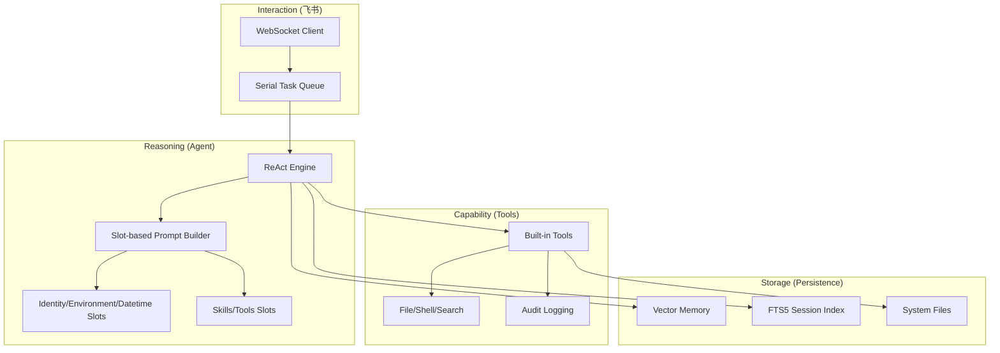

# R-MAN: 通用 AI 自动化执行助理

[](https://www.python.org/)
[](#核心特性)
[](https://open.feishu.cn/)
[](LICENSE)

**R-MAN** 是一个面向生产环境设计的通用 AI Agent。它通过深度融合大语言模型（LLM）的推理能力与底层系统工具，为用户提供一个安全、可审计、且具备长期记忆的自动化任务执行环境。

---

## 🚀 核心特性

- **🤖 智能推理 (ReAct & Fallback)**: 
    - 深度实现“思考-行动-观察”闭环。
    - **高可用保障**: 内置 **LLM Fallback 机制**，在主模型遇到拥堵 (429/529) 或故障时，自动按优先级切换至备选模型（如 Gemini、Kimi 等）。
- **🧩 插件化技能系统**: 
    - 支持动态扫描 `rman/skills/` 下的专家 SOP 文件。
    - 采用 Frontmatter 语义解析与 **XML 结构化 Prompt 注入**，让 Agent 能够即时获得特定领域的专家知识。
- **🔍 混合记忆检索 (FTS5 & Vector)**:
    - **全局全文搜索**: 基于 **SQLite FTS5** 引擎，支持跨会话的秒级关键词检索。
    - **语义记忆**: 结合 **sqlite-vec** 提供脱敏后的技术摘要存储与向量检索。
- **🎭 自适应专家身份**: 
    - 采用**插槽化 (Slot-based) Prompt 架构**。
    - 身份不再硬编码，Agent 能够根据任务需求自主切换专业角色（工程师、运维、研究员等）。
- **🔌 深度集成飞书**:
    - **WebSocket 模式**: 无需公网 IP，即可实现双向实时通信。
    - **互动卡片**: 自动将 Markdown 渲染为飞书原生 UI（多级标题优化、动态表格、状态色）。

---

## 📂 逻辑架构



---

## 🛠️ 快速开始

### 1. 环境准备
确保您的服务器安装了 Python 3.12+。

### 2. 一键初始化
执行全交互式安装向导，它将引导您配置虚拟环境并填入各平台凭证（Feishu, LLM, Tavily）：
```bash
git clone <repository-url>
cd r_man
chmod +x setup.sh
./setup.sh
```

### 3. 系统自检
启动前建议运行诊断工具，确保 API 连通性与数据库扩展正常：
```bash
PYTHONPATH=. ./venv/bin/python rman/common/doctor.py
```

### 4. 运行服务
```bash
PYTHONPATH=. ./venv/bin/python rman/main.py
```

---

## 📖 文档索引

遵循“需求-设计-代码三位一体同步”原则，项目提供了详尽的模块化文档：

- **需求文档**: [docs/requirements/index.md](docs/requirements/index.md)
- **技术设计**: [docs/design/index.md](docs/design/index.md)
- **用户手册**: [USER_GUIDE.md](USER_GUIDE.md)

---

## 🤝 参与开发

在修改代码前，请务必阅读：
- [AGENTS.md](AGENTS.md) — 资深工程师开发准则。
- [GEMINI.md](GEMINI.md) — 项目指令集与同步规范。

---
> 🤖 **R-MAN**: Reasoning, Managing, and Acting Now.
