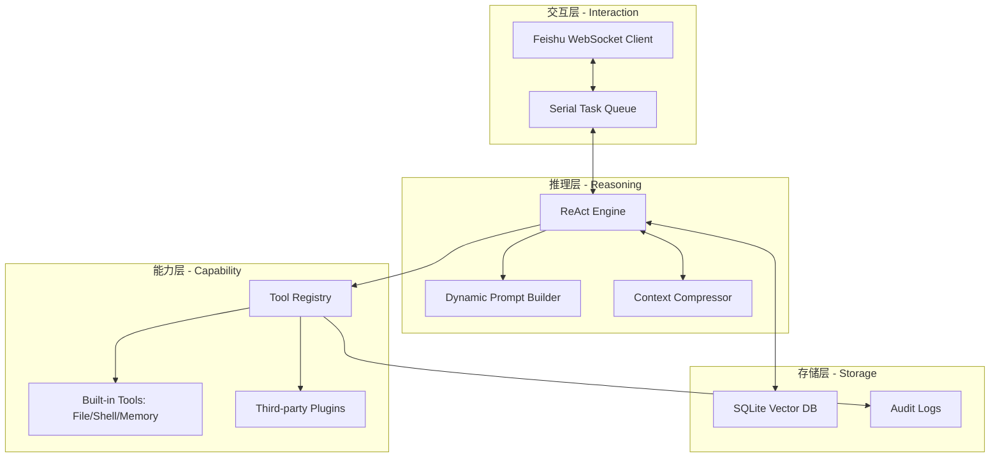
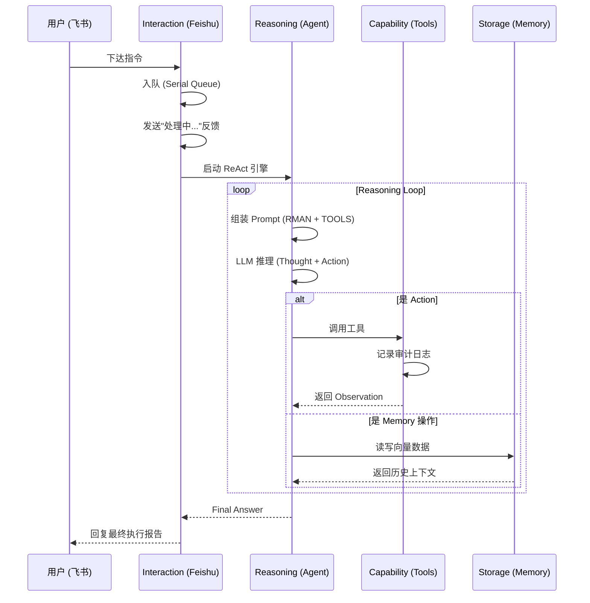

# ARCH_OVERVIEW: r-man 整体架构设计

| 版本号 | 日期 | 变更说明 | 作者 |
| :--- | :--- | :--- | :--- |
| v1.0.0 | 2026-04-16 | 初始版本，定义分层架构与全局数据流 | Gemini CLI |

## 1. 系统愿景

**r-man** 旨在通过一套标准化的“思考-行动”循环，将碎片化的系统工具与强大的 LLM 推理能力粘合，为用户提供一个安全、可靠且可定制的自动化执行环境。

## 2. 逻辑架构 (Layered Architecture)

系统分为四层，自上而下分别为：



### 2.1 交互层 (Interaction)
负责与飞书平台保持 WebSocket 长连接，接收用户消息。它包含一个**串行 FIFO 队列**，确保单一用户发起的任务在执行上是互斥且保序的，防止并发 shell 操作冲突。

### 2.2 推理层 (Reasoning)
系统的核心大脑。实现 ReAct 循环（Think → Act → Observe），并负责从 `RMAN.md` 和 `TOOLS.md` 中动态组装 System Prompt。在 Token 接近限制时，执行背景摘要压缩。

### 2.3 能力层 (Capability)
Agent 可调用的“手脚”。所有工具均需在 `ToolRegistry` 注册。它实现了工具定义的强契约，并负责在执行前记录审计日志，在执行后封装错误信息。

### 2.4 存储层 (Storage)
负责持久化。包含用于 Memory 功能的 SQLite 向量数据库，以及用于安全追溯的本地审计日志文件。

## 3. 核心全局数据流

### 3.1 任务处理序列



## 4. 物理目录结构 (Project Layout)

```text
r-man/
├── config/                 # 配置文件 (config.yaml)
├── data/                   # 持久化数据 (SQLite, 审计日志)
├── docs/                   # 需求与设计文档
├── rman/                   # 源代码根目录
│   ├── __init__.py
│   ├── main.py             # 入口程序
│   ├── agent/              # 推理层：ReAct 引擎、Prompt 构建
│   ├── tools/              # 能力层：工具基类与内置工具实现
│   ├── storage/            # 存储层：SQLite 封装、向量操作
│   ├── interaction/        # 交互层：飞书 WebSocket、队列管理
│   └── common/             # 通用：配置解析、日志、数据模型
├── tests/                  # 测试用例
├── RMAN.md                 # 用户可编辑：角色与约束
├── TOOLS.md                 # 系统自动生成：工具说明
├── requirements.txt        # 依赖清单
└── venv/                   # 虚拟环境 (被忽略)
```

## 5. 核心技术栈

| 组件 | 选型 | 理由 |
| :--- | :--- | :--- |
| **语言** | Python 3.12 | 工业级异步支持与成熟的 AI 生态 |
| **SDK** | `lark-oapi` | 飞书官方 SDK，支持 WebSocket 自动重连与 Token 管理 |
| **模型协议** | OpenAI Compatible | 兼容 GPT-4o 及各类私有化推理后端 |
| **存储** | SQLite + `sqlite-vec` | 轻量化、零运维，原生支持向量检索 |
| **数据建模** | Pydantic V1 | 强类型契约保障，与主流 SDK 兼容性好 |
| **日志** | `loguru` | 结构化日志，配置简单 |

---
> 下一步：[核心推理层详细设计](core-agent/DETAILED_DESIGN.md)
