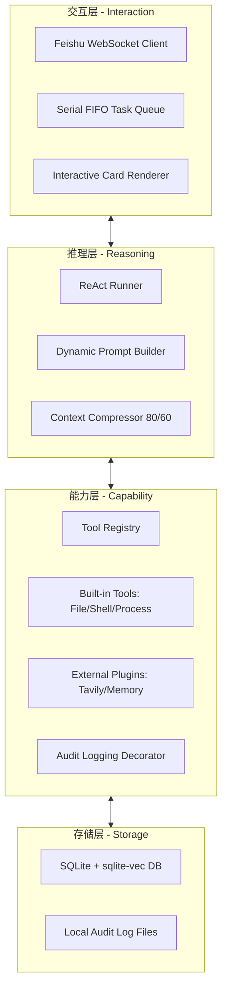

# ARCH_OVERVIEW: r-man 核心架构总览

| 版本号 | 日期 | 变更说明 | 作者 |
| :--- | :--- | :--- | :--- |
| v2.0.0 | 2026-04-17 | 全量同步最新实现，定义四层逻辑分层 | Gemini CLI |

## 1. 设计愿景
**r-man** 旨在通过一套标准化的“思考-行动-观察”循环（ReAct），将碎片化的系统工具（Shell、文件、进程）与强大的大语言模型（LLM）推理能力深度粘合，构建一个安全、可审计、具备长期记忆的自动化执行环境。

## 2. 逻辑架构 (Layered Architecture)

系统采用严谨的四层分层模型，各层之间通过标准数据契约（Pydantic）通信：

### 2.1 交互层 (Interaction)
维护与飞书的长连接。包含 **串行 FIFO 队列**，确保针对单用户的文件/Shell 操作是互斥且保序的。负责将 Markdown 自动升级为 UI 卡片组件。

### 2.2 推理层 (Reasoning)
系统的“大脑”。实现标签化解析（`<think>`/`<final>`）。监控 Token 压力，在达到 80% 阈值时自动触发摘要压缩（60% 目标）。

### 2.3 能力层 (Capability)
系统的“手脚”。所有操作必须经过 **`@audit_log` 装饰器** 记录意图。具备严格的路径校验，支持 `/tmp` 和 `workspace/` 路径放宽。

### 2.4 存储层 (Storage)
系统的“持久化根基”。存储 90 天有效期的向量化记忆，以及不可篡改的本地审计链。

## 3. 技术栈总结

- **核心语言**: Python 3.12+
- **交互引擎**: `lark-oapi` (WebSocket 模式)
- **推理后端**: OpenAI Compatible API (支持 Native Tool Calling)
- **存储引擎**: SQLite 3 + `sqlite-vec` 扩展
- **日志审计**: `loguru` (带异步队列与轮转)

---
> 下一步：[核心推理层设计](core-agent/DETAILED_DESIGN.md)
