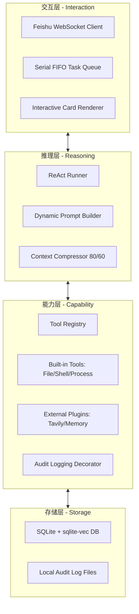

# ARCH_OVERVIEW: r-man 核心架构总览

| 版本号 | 日期 | 变更说明 | 作者 |
| :--- | :--- | :--- | :--- |
| v2.0.0 | 2026-04-17 | 全量同步最新实现，定义四层逻辑分层 | Gemini CLI |
| v2.1.0 | 2026-05-15 | 同步多项稳定性与安全加固：LLM 熔断器/退避、Shell 安全加固、Feishu 卡片限制、Memory 配置化 | GitHub Copilot |
| v2.2.0 | 2026-05-22 | 新增前台命令进度心跳、AgentRunner 死锁检测与优雅超限退出、session.py timestamp Bug 修复、shell_tools 代码重构、backend traceback 修复 | GitHub Copilot |

## 1. 设计愿景
**r-man** 旨在通过一套标准化的“思考-行动-观察”循环（ReAct），将碎片化的系统工具（Shell、文件、进程）与强大的大语言模型（LLM）推理能力深度粘合，构建一个安全、可审计、具备长期记忆的自动化执行环境。

## 2. 逻辑架构 (Layered Architecture)

系统采用严谨的四层分层模型，各层之间通过标准数据契约（Pydantic）通信：

```mermaid
graph TD
    subgraph Interaction_Layer [交互层 - Interaction]
        A[Feishu WebSocket Client]
        B[Serial FIFO Task Queue]
        C[Interactive Card Renderer]
    end

    subgraph Reasoning_Layer [推理层 - Reasoning]
        D[ReAct Runner]
        E[Dynamic Prompt Builder]
        F[Context Compressor 80/60]
    end

    subgraph Capability_Layer [能力层 - Capability]
        G[Tool Registry]
        H[Built-in Tools: File/Shell/Process]
        I[External Plugins: Tavily/Memory]
        J[Audit Logging Decorator]
    end

    subgraph Storage_Layer [存储层 - Storage]
        K[SQLite + sqlite-vec DB]
        L[Local Audit Log Files]
    end

    Interaction_Layer <--> Reasoning_Layer
    Reasoning_Layer <--> Capability_Layer
    Capability_Layer <--> Storage_Layer
```

### 2.1 交互层 (Interaction)
维护与飞书的长连接。包含 **串行 FIFO 队列**，确保针对单用户的文件/Shell 操作是互斥且保序的。负责将 Markdown 自动升级为 UI 卡片组件。

**安全约束**：飞书消息解析加入 try/except，防止非预期格式导致 SDK 事件循环崩溃。卡片 JSON 发送前执行双层大小保护（官方限制 30 KB）：软上限 18 KB 预截断内容，硬上限 28 KB 降级兜底；同时修复 `ensure_ascii=False`，避免 CJK 字符占用翻倍。

**长时间命令进度心跳（v2.2.0）**：`_send_card()` 返回 `message_id`，`_process_agent_task()` 持有该 ID 用于就地更新。新增 `_patch_card()` 方法，调用飞书 `PATCH /messages/{id}` 接口在同一张卡片上刷新进度，避免长时间运行命令（如 `docker build`）期间用户无反馈或刷屏。进度回调由 `AgentRunner.run(progress_callback=...)` 统一传递，每 60 秒触发一次。

### 2.2 推理层 (Reasoning)
系统的“大脑”。实现标签化解析（`<think>`/`<final>`）。监控 Token 压力，在达到 80% 阈值时自动触发**增量滚动摘要**压缩（60% 目标）。

**上下文压缩升级**：v2.0.0 引入增量滚动摘要（Incremental Rolling Summary），每次压缩在 `existing_summary` 基础上叠加，而非重新摘要全部历史，避免已压缩信息的二次信息损耗。支持 `summarizer_model` 独立配置，可使用更廉价的模型完成压缩任务。

**LLM 后端稳定性**：引入**熔断器（Circuit Breaker）**和**指数退避（Exponential Backoff）**。主模型连续失败 3 次后进入 OPEN 状态（熔断），60 秒后自动尝试恢复，避免超时堆叠浪费。退避等待优先读取 API 响应的 `Retry-After` 头。v2.2.0 修复 `raise last_exception` 导致异常调用栈丢失的问题，改为裸 `raise` 保留完整 traceback。

**死锁检测与优雅超限退出（v2.2.0）**：`AgentRunner` 新增 `consecutive_empty` 计数器，连续 3 轮无有效输出时触发三级升级（温和引导 → 强制指令 → 提前退出），并通过 `_build_progress_summary()` 生成进展摘要。达到 `max_iterations` 时同样调用摘要器，而非裸报错。新增 `progress_callback` 参数，供工具层（如 `ShellCommandTool`）在长时间执行期间周期性向上层汇报进度。

### 2.3 能力层 (Capability)
系统的“手脚”。所有操作必须经过 **`@audit_log` 装饰器** 记录意图。具备严格的路径校验，支持 `/tmp` 和 `workspace/` 路径放宽。

**安全加固（v2.1.0）**：
- Shell 命令安全检查升级为两层：`shlex.split` 解析 + 危险二进制白名单（`_DANGEROUS_BINARIES`） + 重定向目标路径提取，防止 `rm -rf` 变体绕过。
- 路径校验全面改用 `os.path.realpath()` 替代 `abspath()`，防御符号链接（Symlink）穿越攻击。

**代码质量改进（v2.2.0）**：`ShellCommandTool` 抽取私有方法 `_prepare_and_launch()`，封装工作目录验证、安全检查、子进程创建及后台模式处理，消除 `execute()` 与 `execute_with_progress()` 约 70% 的重复代码。前台长命令新增 `_run_foreground_with_heartbeat()` 流式读取，每 60 秒触发进度回调，同时修复原 `communicate()` 方案管道缓冲区满导致进程死锁的潜在问题。`session.py` 修复 `save_message()` INSERT 语句漏写 `timestamp` 列的 Bug，使 FTS5 全文搜索时间字段恢复正常。

### 2.4 存储层 (Storage)
系统的“持久化根基”。向量化记忆有效期由 **`config.memory.default_ttl_days`** 配置（默认 90 天），清理间隔由 **`config.memory.cleanup_interval_hours`** 配置（默认 24 小时），以及不可篡改的本地审计链。

**检索正确性修复（v2.1.0）**：`memory_search` 查询新增 `expires_at > CURRENT_TIMESTAMP` 过滤，防止定时清理未执行时过期记忆污染搜索结果。新增 `idx_memory_expires` 索引加速清理查询。定时清理改用 `_get_connection()`（加载 sqlite_vec 扩展）替换裸连接，修复向量表清理静默失败的 Bug。

## 3. 技术栈总结

- **核心语言**: Python 3.12+
- **交互引擎**: `lark-oapi` (WebSocket 模式)
- **推理后端**: OpenAI Compatible API (支持 Native Tool Calling)
- **存储引擎**: SQLite 3 + `sqlite-vec` 扩展
- **日志审计**: `loguru` (带异步队列与轮转)

---
> 下一步：[核心推理层设计](core-agent/DETAILED_DESIGN.md)
