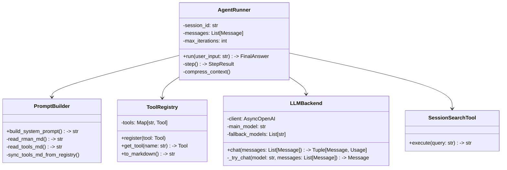

# DETAILED_DESIGN: 核心 Agent 推理层设计

| 版本号 | 日期 | 变更说明 | 作者 |
| :--- | :--- | :--- | :--- |
| v1.0.0 | 2026-04-16 | 初始版本，定义 ReAct 引擎实现与 Prompt 组装 | Gemini CLI |

## 1. 模块职责

核心 Agent 模块负责管理 LLM 对话上下文、解析推理逻辑、调度工具执行，并确保系统在 Token 超限前进行自我维护。

## 2. 核心类设计 (Class Diagram)



## 3. ReAct 状态机实现

Agent 的 `run` 方法是一个同步/异步阻塞过程，核心逻辑如下：

1.  **初始化**: 创建 `session_id`，从 `PromptBuilder` 获取 System Prompt，将其作为第一条消息。
2.  **迭代循环**:
    - **Step 1: 带故障转移的 LLM 调用**:
        1. 调用 `LLMBackend.chat`。
        2. 后端首先尝试 `main_model`。
        3. 若捕获到 429/529/500 等异常，后端按顺序遍历 `fallback_models` 列表进行尝试。
        4. 成功后返回消息及消耗统计，并标识实际使用的模型。
    - **Step 2**: 解析 LLM 输出。
        - 匹配 `Thought:` 和 `Action:` JSON。
        - 若匹配失败且未输出 `Final Answer:`，则向 LLM 注入格式错误提示并重试（最多 1 次）。
    - **Step 3**: 若解析出 `Action`，则从 `ToolRegistry` 查找工具并执行。
    - **Step 4**: 将工具返回的 `Observation` 封装为消息，存入上下文。
    - **Step 5**: 检查迭代次数。若 `iterations >= max_iterations`，强制结束并返回摘要。
3.  **终止**: 解析出 `Final Answer:` 时，返回结果。

## 4. 动态 Prompt 组装逻辑

`PromptBuilder` 负责维护模板与工作区的一致性，遵循“工作区优先，模板兜底”原则：

- **初始化流程 (Startup Check)**:
    1.  检查 `workspace/` 目录。
    2.  若 `workspace/RMAN.md` 缺失，则检测 `templates/RMAN.md`。若有则拷贝，若无则按内置常量创建。
    3.  若 `workspace/TOOLS.md` 缺失，则检测 `templates/TOOLS.md`。若有则拷贝，若无则调用 `ToolRegistry` 生成。
- **加载逻辑**:
    - 每次会话启动时，强制从 `workspace/` 重新读取文件内容。
    - 文件长度限制 32KB。
- **输出组装**:
    - 将 `RMAN.md`、工具说明（来自 `TOOLS.md`）与格式规范拼接为最终的 System Prompt。

## 5. 上下文压缩算法 (Context Compression)

为了维持长对话的有效性，`AgentRunner` 采用“分段摘要”机制：

### 5.1 消息序列分段 (Message Segmentation)
压缩触发时，消息序列被划分为三部分：
1.  **Fixed (Index 0)**: 永远保留的 System Prompt。
2.  **Compressible (Index 1 to -N)**: 待压缩的历史中间过程（含以前的 Summary）。
3.  **Preserved (Last N rounds)**: 保留最近 5 轮消息，确保当前推理的语义连贯性。

### 5.2 压缩流程 (Compression Flow)
1.  **Count**: 每一轮推理前调用 `tiktoken` (或估算函数) 计算 Token。
2.  **Extract**: 提取 `Compressible` 部分的文本。
3.  **Summarize**: 调用 LLM 专门的“压缩指令”生成技术摘要。
4.  **Rewrite**: 
    - 组合新的 `messages = [System, NewSummary, ...Preserved]`.
    - 此时 `NewSummary` 包含历史所有的压缩记录。

### 5.3 压缩指令 (Compression Prompt)
> “你是一个上下文管理专家。请将以下历史对话过程总结为一段技术摘要。
> 重点保留：已完成的任务目标、关键参数配置、重要的 Observation 数据。
> 形式：使用时间轴或步骤列表，字数压缩率需达到 90% 以上。”

## 5. 上下文窗口管理 (Context Window Management)

Agent 采用五层结构来维护 Context Window，平衡“长短期记忆”与“细节精度”：

1.  **系统层 (System Layer)**:
    - 动态生成，包含 System Prompt 和当前环境可用的工具定义。
2.  **历史摘要 (Summary Layer)**:
    - 仅在触发 **80/60 自动压缩**（即 Token 达到窗口 80%）后出现。
    - LLM 将过往较早的对话和 ReAct 步骤总结为 `[Compacted Summary]`。
3.  **近期消息 (Recent Message Layer)**:
    - 包含未被压缩的 `User` 原始提问和 `Assistant` 的思考/回复。
4.  **工具调用记录 (Tool Call Layer)**:
    - 包含 Agent 发出的具体工具指令（`tool_calls` 或 `Action: {}`）。
5.  **工具观察结果 (Observation Layer)**:
    - 包含工具执行的原始 `Observation` 输出。
    - 受 **100k 硬熔断** 约束，仅在字符数超过 100,000 时进行物理截断，以保护系统稳定性。不再对单次 Observation 进行 AI 摘要，以保持原始数据的纯净度。数据压缩统一由“80/60 自动压缩准则”在全局层面处理。

### 5.4 自动窗口压缩 (80/60 准则)
当估算 Token 达到 80% 阈值时：
- 保留系统层和最近的 5 条消息。
- 将中间所有消息（包含历史摘要和 ReAct 步骤）进行技术性压缩，生成新的摘要。
- 压缩后的 Context 占用降至约 60%。

### 5.5 会话持久化与恢复
- **存储内容**: 持久化存储实时记录完整的消息流。
- **恢复逻辑**: 重启会话时，系统按序回填最近的消息。如果历史中存在 `[Compacted Summary]`，它将作为历史背景自然存在于上下文的早期部分，后续则是原始的工具执行细节。不再生成额外的全任务汇总摘要。

## 6. 工具注册与执行契约

所有工具必须继承 `BaseTool` 基类，并定义 Pydantic 参数模型。

```python
class BaseTool(ABC):
    name: str
    description: str
    parameters_schema: Type[BaseModel]

    @abstractmethod
    async def execute(self, **kwargs) -> str:
        """必须捕捉所有异常，返回字符串"""
        ...
```

---
> 下一步：[内存系统详细设计](../memory-system/DETAILED_DESIGN.md)
