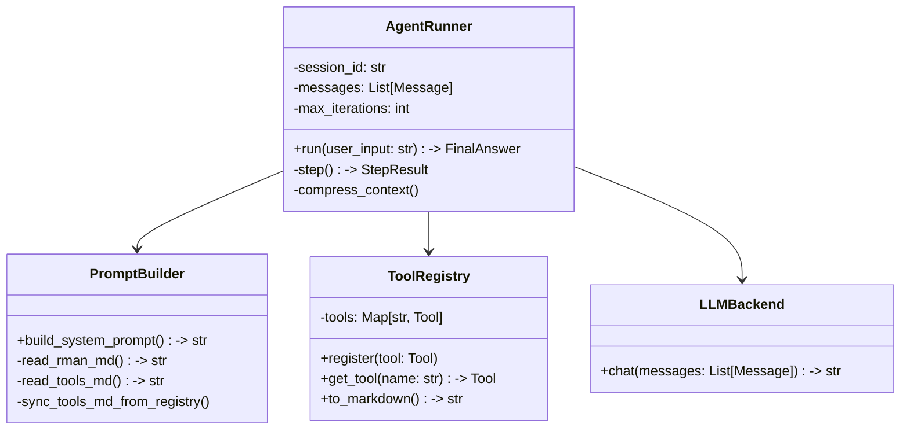

# DETAILED_DESIGN: 核心 Agent 推理层设计

| 版本号 | 日期 | 变更说明 | 作者 |
| :--- | :--- | :--- | :--- |
| v1.0.0 | 2026-04-16 | 初始版本，定义 ReAct 引擎实现与 Prompt 组装 | Gemini CLI |

## 1. 模块职责

核心 Agent 模块负责管理 LLM 对话上下文、解析推理逻辑、调度工具执行，并确保系统在 Token 超限前进行自我维护。

## 2. 核心类设计 (Class Diagram)



## 3. ReAct 状态机实现

Agent 的 `run` 方法是一个同步/异步阻塞过程，核心逻辑如下：

1.  **初始化**: 创建 `session_id`，从 `PromptBuilder` 获取 System Prompt，将其作为第一条消息。
2.  **迭代循环**:
    - **Step 1**: 将当前 `messages` 发送给 `LLMBackend`。
    - **Step 2**: 解析 LLM 输出。
        - 匹配 `Thought:` 和 `Action:` JSON。
        - 若匹配失败且未输出 `Final Answer:`，则向 LLM 注入格式错误提示并重试（最多 1 次）。
    - **Step 3**: 若解析出 `Action`，则从 `ToolRegistry` 查找工具并执行。
    - **Step 4**: 将工具返回的 `Observation` 封装为消息，存入上下文。
    - **Step 5**: 检查迭代次数。若 `iterations >= max_iterations`，强制结束并返回摘要。
3.  **终止**: 解析出 `Final Answer:` 时，返回结果。

## 4. 动态 Prompt 组装逻辑

`PromptBuilder` 负责维护模板与工作区的一致性，遵循“工作区优先，模板兜底”原则：

- **初始化流程 (Startup Check)**:
    1.  检查 `workspace/` 目录。
    2.  若 `workspace/RMAN.md` 缺失，则检测 `templates/RMAN.md`。若有则拷贝，若无则按内置常量创建。
    3.  若 `workspace/TOOLS.md` 缺失，则检测 `templates/TOOLS.md`。若有则拷贝，若无则调用 `ToolRegistry` 生成。
- **加载逻辑**:
    - 每次会话启动时，强制从 `workspace/` 重新读取文件内容。
    - 文件长度限制 32KB。
- **输出组装**:
    - 将 `RMAN.md`、工具说明（来自 `TOOLS.md`）与格式规范拼接为最终的 System Prompt。

## 5. 上下文压缩算法 (Context Compression)

为了维持长对话的有效性，`AgentRunner` 监测 Token 计数：

1.  **触发点**: `total_tokens >= context_window * 0.8`。
2.  **压缩策略**:
    - 保留 System Prompt（Index 0）和最近的 3 轮对话。
    - 对中间的历史 `Observation` 消息，调用 LLM 进行“极简摘要”。
    - 摘要格式：`[Observation Summary (轮次 X-Y): 执行了 ls -la，结果包含 5 个文件，其中 test.py 占用最大]`。
    - 替换原消息，确保 `total_tokens <= context_window * 0.6`。

## 6. 工具注册与执行契约

所有工具必须继承 `BaseTool` 基类，并定义 Pydantic 参数模型。

```python
class BaseTool(ABC):
    name: str
    description: str
    parameters_schema: Type[BaseModel]

    @abstractmethod
    async def execute(self, **kwargs) -> str:
        """必须捕捉所有异常，返回字符串"""
        ...
```

---
> 下一步：[内存系统详细设计](../memory-system/DETAILED_DESIGN.md)
