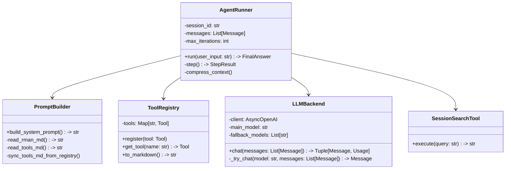
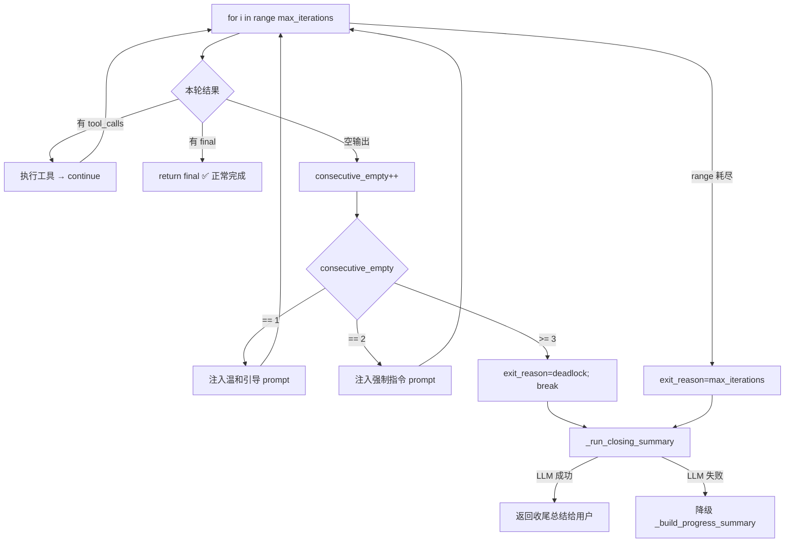
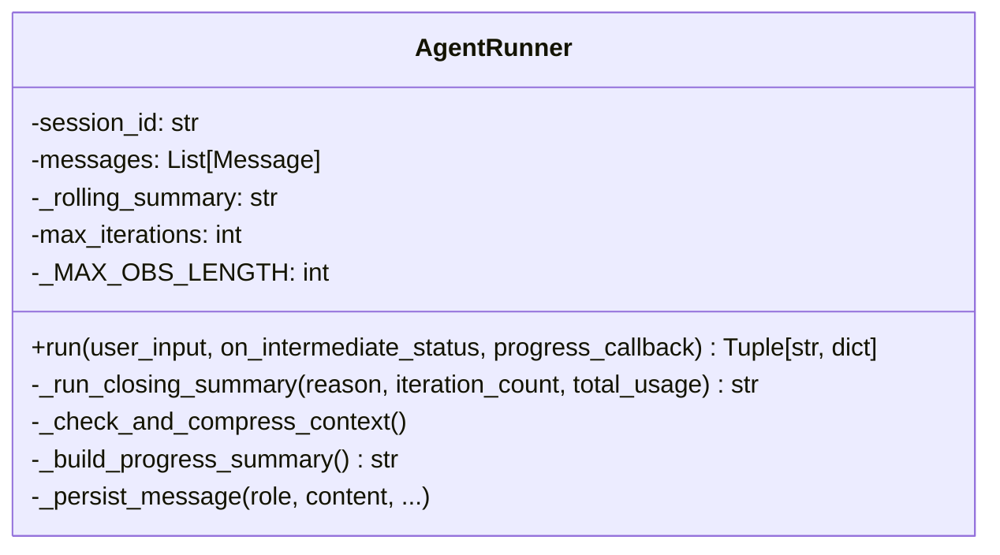

# DETAILED_DESIGN: 核心 Agent 推理层设计

| 版本号 | 日期 | 变更说明 | 作者 |
| :--- | :--- | :--- | :--- |
| v1.0.0 | 2026-04-16 | 初始版本，定义 ReAct 引擎实现与 Prompt 组装 | Gemini CLI |
| v2.0.0 | 2026-05-15 | 全面更新：重构上下文压缩系统、LLM 后端引入熔断器与指数退避 | GitHub Copilot |
| v2.1.0 | 2026-05-22 | 新增死锁检测三级升级机制、优雅超限退出、progress_callback 参数；修复裸 except、backend traceback 丢失；模块级 import 清理 | GitHub Copilot |
| v2.2.0 | 2026-06-09 | 新增 §7 N+1 收尾轮设计：`_run_closing_summary()`、退出路径统一重构、closing prompt 模板 | GitHub Copilot |


## 1. 模块职责

核心 Agent 模块负责管理 LLM 对话上下文、解析推理逻辑、调度工具执行，并确保系统在 Token 超限前进行自我维护。

## 2. 核心类设计 (Class Diagram)


```mermaid
classDiagram
    class AgentRunner {
        -session_id: str
        -messages: List[Message]
        -max_iterations: int
        +run(user_input: str) -> FinalAnswer
        -step() -> StepResult
        -compress_context()
    }

    class PromptBuilder {
        +build_system_prompt() -> str
        -read_rman_md() -> str
        -read_tools_md() -> str
        -sync_tools_md_from_registry()
    }

    class ToolRegistry {
        -tools: Map[str, Tool]
        +register(tool: Tool)
        +get_tool(name: str) -> Tool
        +to_markdown() -> str
    }

    class LLMBackend {
        -client: AsyncOpenAI
        -main_model: str
        -fallback_models: List[str]
        +chat(messages: List[Message]) -> Tuple[Message, Usage]
        -_try_chat(model: str, messages: List[Message]) -> Message
    }

    class SessionSearchTool {
        +execute(query: str) -> str
    }

    AgentRunner --> PromptBuilder
    AgentRunner --> ToolRegistry
    AgentRunner --> LLMBackend
    AgentRunner --> SessionSearchTool
```

## 3. ReAct 状态机实现

Agent 的 `run` 方法是一个同步/异步阻塞过程，核心逻辑如下：

1.  **初始化**: 创建 `session_id`，从 `PromptBuilder` 获取 System Prompt，将其作为第一条消息。
2.  **迭代循环**:
    - **Step 1: 带故障转移的 LLM 调用**:
        1. 调用 `LLMBackend.chat`。
        2. 后端首先尝试 `main_model`。
        3. 若捕获到 429/529/500 等异常，后端按顺序遍历 `fallback_models` 列表进行尝试。
        4. 成功后返回消息及消耗统计，并标识实际使用的模型。
    - **Step 2**: 解析 LLM 输出。
        - 匹配 `Thought:` 和 `Action:` JSON。
        - 若匹配失败且未输出 `Final Answer:`，则向 LLM 注入格式错误提示并重试（最多 1 次）。
    - **Step 3**: 若解析出 `Action`，则从 `ToolRegistry` 查找工具并执行。
    - **Step 4**: 将工具返回的 `Observation` 封装为消息，存入上下文。
    - **Step 5**: 检查迭代次数。若 `iterations >= max_iterations`，强制结束并返回摘要。
3.  **终止**: 解析出 `Final Answer:` 时，返回结果。

## 4. 动态 Prompt 组装逻辑

`PromptBuilder` 负责维护模板与工作区的一致性，遵循“工作区优先，模板兜底”原则：

- **初始化流程 (Startup Check)**:
    1.  检查 `workspace/` 目录。
    2.  若 `workspace/RMAN.md` 缺失，则检测 `templates/RMAN.md`。若有则拷贝，若无则按内置常量创建。
    3.  若 `workspace/TOOLS.md` 缺失，则检测 `templates/TOOLS.md`。若有则拷贝，若无则调用 `ToolRegistry` 生成。
- **加载逻辑**:
    - 每次会话启动时，强制从 `workspace/` 重新读取文件内容。
    - 文件长度限制 32KB。
- **输出组装**:
    - 将 `RMAN.md`、工具说明（来自 `TOOLS.md`）与格式规范拼接为最终的 System Prompt。

## 5. 上下文压缩算法 (Context Compression)

为了维持长对话的有效性，`AgentRunner` 采用“分段摘要”机制：

### 5.1 消息序列分段 (Message Segmentation)
压缩触发时，消息序列被划分为三部分：
1.  **Fixed (Index 0)**: 永远保留的 System Prompt。
2.  **Compressible (Index 1 to -N)**: 待压缩的历史中间过程（含以前的 Summary）。
3.  **Preserved (Last N rounds)**: 保留最近 5 轮消息，确保当前推理的语义连贯性。

### 5.2 压缩流程 (Compression Flow)
1.  **Count**: 每一轮推理前调用 `tiktoken` 进行精确 Token 计算。如果模型不被 `tiktoken` 原生支持，则回退到 `cl100k_base` 编码或启发式估算。
2.  **Extract**: 提取 `Compressible` 部分的文本。
3.  **Budgeting**: 动态计算摘要可用的 Token 预算。
    - `allowed_summary_tokens = max(100, (context_window * 0.6) - system_tokens - preserved_tokens)`。
4.  **Summarize**: 调用 LLM 专门的“压缩指令”生成技术摘要。
    - **动态详略程度**: 根据 `allowed_summary_tokens` 自动调整 Prompt 中的字数限制与细节要求（分为极简、简洁、详细、极详四档）。
5.  **Rewrite**: 
    - 组合新的 `messages = [System, NewSummary, ...Preserved]`.
    - 此时 `NewSummary` 包含历史所有的压缩记录。

### 5.3 压缩指令 (Compression Prompt)
> “你是一个上下文管理专家。请将以下历史对话过程总结为一段技术摘要。
> 重点保留：已完成的任务目标、关键参数配置、重要的 Observation 数据。
> 形式：使用时间轴或步骤列表，字数压缩率需达到 90% 以上。”

## 6. 上下文窗口管理 (Context Window Management)

Agent 采用五层结构来维护 Context Window，平衡“长短期记忆”与“细节精度”：

1.  **系统层 (System Layer)**:
    - 动态生成，包含 System Prompt 和当前环境可用的工具定义。
2.  **历史摘要 (Summary Layer)**:
    - 仅在触发 **80/60 自动压缩**（即 Token 达到窗口 80%）后出现。
    - LLM 将过往较早的对话和 ReAct 步骤总结为 `[Compacted Summary]`。
3.  **近期消息 (Recent Message Layer)**:
    - 包含未被压缩的 `User` 原始提问和 `Assistant` 的思考/回复。
4.  **工具调用记录 (Tool Call Layer)**:
    - 包含 Agent 发出的具体工具指令（`tool_calls` 或 `Action: {}`）。
5.  **工具观察结果 (Observation Layer)**:
    - 包含工具执行的原始 `Observation` 输出。
    - 受 **100k 硬熔断** 约束，仅在字符数超过 100,000 时进行物理截断，以保护系统稳定性。不再对单次 Observation 进行 AI 摘要，以保持原始数据的纯净度。数据压缩统一由“80/60 自动压缩准则”在全局层面处理。

### 5.4 自动窗口压缩 (80/60 准则)
当估算 Token 达到 80% 阈值时：
- 保留系统层和最近的 5 条消息。
- 将中间所有消息（包含历史摘要和 ReAct 步骤）进行技术性压缩，生成新的摘要。
- 压缩后的 Context 占用降至约 60%。

### 5.5 会话持久化与恢复
- **存储内容**: 持久化存储实时记录完整的消息流。
- **恢复逻辑**: 重启会话时，系统按序回填最近的消息。如果历史中存在 `[Compacted Summary]`，它将作为历史背景自然存在于上下文的早期部分，后续则是原始的工具执行细节。不再生成额外的全任务汇总摘要。

## 7. 工具注册与执行契约

所有工具必须继承 `BaseTool` 基类，并定义 Pydantic 参数模型。

```python
class BaseTool(ABC):
    name: str
    description: str
    parameters_schema: Type[BaseModel]

    @abstractmethod
    async def execute(self, **kwargs) -> str:
        """必须捕捉所有异常，返回字符串"""
        ...
```

---
> 下一步：[内存系统详细设计](../memory-system/DETAILED_DESIGN.md)

---

## 8. N+1 收尾轮设计（v2.2.0）

> 需求来源：[REQ-CORE-004](../../requirements/core-agent/REQ-CORE-004.md)

### 7.1 设计目标

在 N 轮正常 ReAct 循环结束后，额外执行 **1 轮收尾对话**，由主模型主动生成"当前进展总结 + 下一步行动建议"，取代原先被动的 summarizer 摘要，提升用户体验。

### 7.2 退出路径统一重构

原有两条独立退出路径（内联 `return`）统一重构为 `break` + 收敛到 `_run_closing_summary()`：


```mermaid
flowchart TD
    A[for i in range max_iterations] --> B{本轮结果}
    B -->|有 tool_calls| C[执行工具 → continue]
    B -->|有 final| D["return final ✅ 正常完成"]
    B -->|空输出| E[consecutive_empty++]
    E --> F{consecutive_empty}
    F -->|== 1| G[注入温和引导 prompt]
    F -->|== 2| H[注入强制指令 prompt]
    F -->|">= 3"| I["exit_reason=deadlock; break"]
    C --> A
    G --> A
    H --> A
    A -->|range 耗尽| J["exit_reason=max_iterations"]
    I --> K[_run_closing_summary]
    J --> K
    K -->|LLM 成功| L[返回收尾总结给用户]
    K -->|LLM 失败| M[降级 _build_progress_summary]
```

**关键变化**：死锁路径从 `return` 改为 `break`，与超限路径一起收敛到循环外统一处理，消除重复逻辑。

### 7.3 `_run_closing_summary()` 方法设计

**签名**：
```python
async def _run_closing_summary(
    self,
    reason: str,          # "max_iterations" | "deadlock"
    iteration_count: int, # 已执行的轮次数（用于 prompt 中说明）
    total_usage: dict,    # 就地累加 token 用量
) -> str:
```

**执行逻辑**：

```
1. 根据 reason 选择对应 closing_prompt 模板，填入 iteration_count
2. 构造临时 messages：self.messages + [{"role": "user", "content": closing_prompt}]
3. 调用 llm_backend.chat(tmp_messages, tools=None)
4. 若返回 usage，累加至 total_usage
5. 取 reply.content（忽略任何 tool_calls）
6. 加前缀标识后返回
7. 异常时降级到 _build_progress_summary()，并记录 WARNING
```

**注意**：`tmp_messages` 是临时构造的局部变量，**不修改** `self.messages`，收尾 prompt 不写入 session history。

### 7.4 Closing Prompt 模板

#### 超限触发（reason = "max_iterations"）

```
你已执行了 {iteration_count} 轮推理步骤（系统最大步数限制），任务尚未完全完成。

请根据以上完整的对话记录，用自然语言完成以下两件事：

1. **当前进展总结**：到目前为止，你已经完成了什么？任务还差哪些步骤没有完成？
2. **下一步建议**：如果用户希望继续这个任务，他/她应该做什么？请给出具体、可操作的建议。

请用清晰的 Markdown 格式回复，不要调用任何工具。
```

#### 死锁触发（reason = "deadlock"）

```
你在最近连续多轮推理中未能产生有效输出（既没有调用工具，也没有给出结论），系统已提前终止任务。

请根据以上完整的对话记录，用自然语言完成以下两件事：

1. **当前进展总结**：到目前为止，你已经完成了什么？任务还差哪些步骤没有完成？
2. **下一步建议**：如果用户希望继续这个任务，他/她应该做什么？请给出具体、可操作的建议。

请用清晰的 Markdown 格式回复，不要调用任何工具。
```

### 7.5 `AgentRunner` 类图更新（对比 v2.1.0）


```mermaid
classDiagram
    class AgentRunner {
        -session_id: str
        -messages: List[Message]
        -_rolling_summary: str
        -max_iterations: int
        -_MAX_OBS_LENGTH: int
        +run(user_input, on_intermediate_status, progress_callback) Tuple[str, dict]
        -_run_closing_summary(reason, iteration_count, total_usage) str
        -_check_and_compress_context()
        -_build_progress_summary() str
        -_persist_message(role, content, ...)
    }
```

`_run_closing_summary()` 替代了原先分散在两处的内联退出逻辑；`_build_progress_summary()` 降级为其 fallback，不再直接被 `run()` 调用。

### 7.6 Token 用量追踪

`total_usage` 是一个可变 dict，在 `_run_closing_summary` 内就地累加：

```python
if usage:
    total_usage["input"] += usage.prompt_tokens
    total_usage["output"] += usage.completion_tokens
```

收尾轮的 token 消耗对调用方透明，`run()` 返回的 `total_usage` 始终包含完整统计。

### 7.7 降级行为

| 场景 | 行为 | 日志级别 |
| :--- | :--- | :--- |
| LLM 正常返回 | 直接使用 `reply.content` | INFO |
| Context 超限（API 报错） | 降级到 `_build_progress_summary()` | WARNING |
| 网络超时 / 熔断器开路 | 降级到 `_build_progress_summary()` | WARNING |
| `_build_progress_summary` 也失败 | 返回固定兜底文字 | ERROR |
