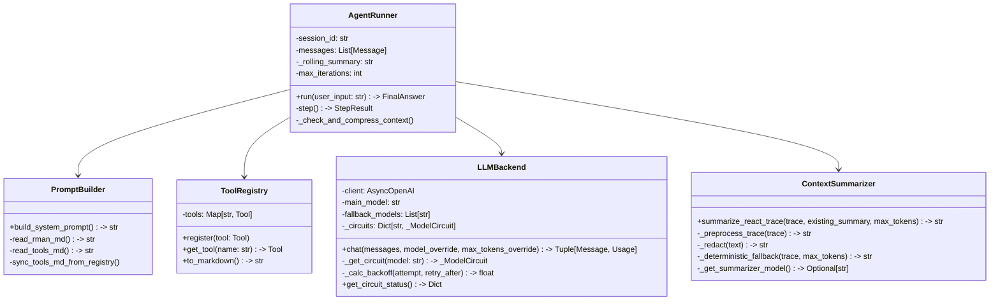
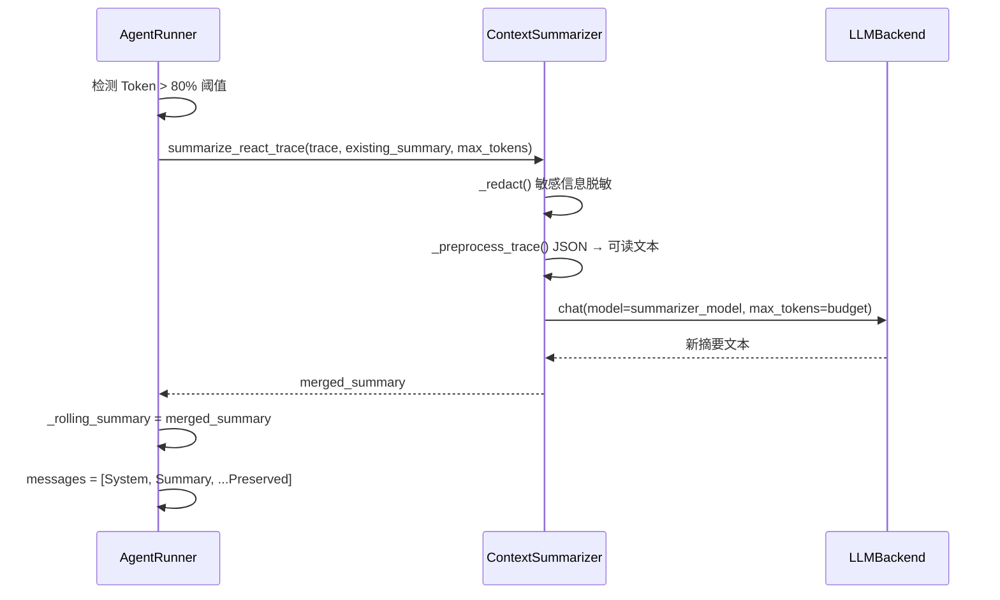
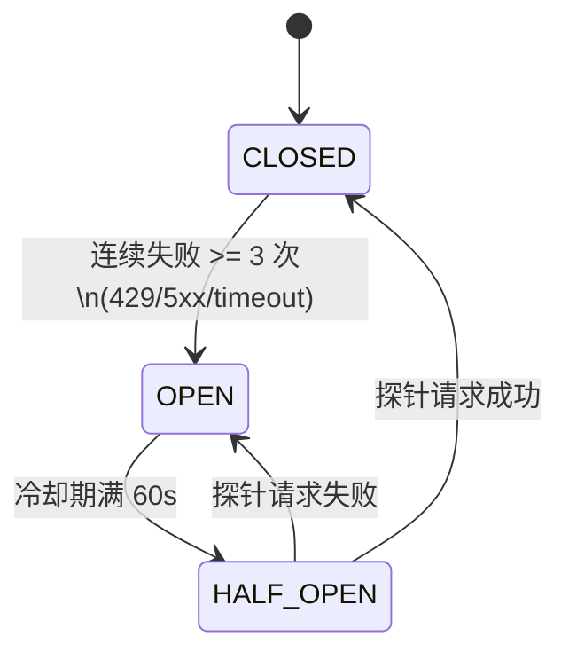
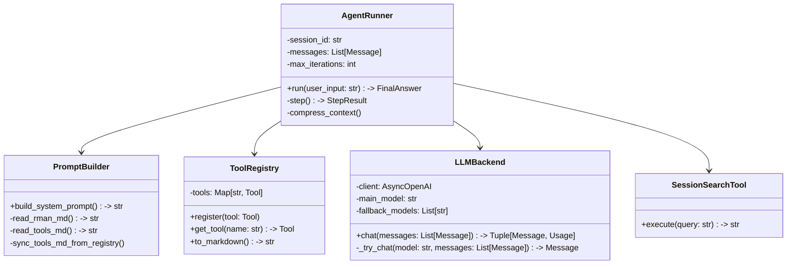

# DETAILED_DESIGN: 核心 Agent 推理层设计

| 版本号 | 日期 | 变更说明 | 作者 |
| :--- | :--- | :--- | :--- |
| v1.0.0 | 2026-04-16 | 初始版本，定义 ReAct 引擎实现与 Prompt 组装 | Gemini CLI |
| v2.0.0 | 2026-05-15 | 全面更新：重构上下文压缩系统、LLM 后端引入熔断器与指数退避 | GitHub Copilot |

## 1. 模块职责

核心 Agent 模块负责管理 LLM 对话上下文、解析推理逻辑、调度工具执行，并确保系统在 Token 超限前进行自我维护。

## 2. 核心类设计 (Class Diagram)


```mermaid
classDiagram
    class AgentRunner {
        -session_id: str
        -messages: List[Message]
        -_rolling_summary: str
        -max_iterations: int
        +run(user_input: str) -> FinalAnswer
        -step() -> StepResult
        -_check_and_compress_context()
    }

    class PromptBuilder {
        +build_system_prompt() -> str
        -read_rman_md() -> str
        -read_tools_md() -> str
        -sync_tools_md_from_registry()
    }

    class ToolRegistry {
        -tools: Map[str, Tool]
        +register(tool: Tool)
        +get_tool(name: str) -> Tool
        +to_markdown() -> str
    }

    class LLMBackend {
        -client: AsyncOpenAI
        -main_model: str
        -fallback_models: List[str]
        -_circuits: Dict[str, _ModelCircuit]
        +chat(messages, model_override, max_tokens_override) -> Tuple[Message, Usage]
        -_get_circuit(model: str) -> _ModelCircuit
        -_calc_backoff(attempt, retry_after) -> float
        +get_circuit_status() -> Dict
    }

    class ContextSummarizer {
        +summarize_react_trace(trace, existing_summary, max_tokens) -> str
        -_preprocess_trace(trace) -> str
        -_redact(text) -> str
        -_deterministic_fallback(trace, max_tokens) -> str
        -_get_summarizer_model() -> Optional[str]
    }

    AgentRunner --> PromptBuilder
    AgentRunner --> ToolRegistry
    AgentRunner --> LLMBackend
    AgentRunner --> ContextSummarizer
```

## 3. ReAct 状态机实现

Agent 的 `run` 方法是一个同步/异步阻塞过程，核心逻辑如下：

1.  **初始化**: 创建 `session_id`，从 `PromptBuilder` 获取 System Prompt，将其作为第一条消息。`_rolling_summary` 初始化为空字符串。
2.  **迭代循环**:
    - **Step 1: 带熔断器的 LLM 调用**:
        1. 调用 `LLMBackend.chat`。
        2. 后端首先检查主模型的熔断器状态：
           - `CLOSED`：正常发起请求，失败后进行指数退避重试（最多 3 次）。
           - `OPEN`：主模型已熔断（近期多次失败），跳过，直接尝试 fallback 模型。
           - `HALF_OPEN`：熔断恢复期，发出一次探针请求，成功则闭合，失败则重开。
        3. 若所有模型均不可用，抛出异常并记录告警日志。
        4. 成功后返回消息及消耗统计，并标识实际使用的模型。
    - **Step 2**: 解析 LLM 输出。
        - 匹配 `Thought:` 和 `Action:` JSON。
        - 若匹配失败且未输出 `Final Answer:`，则向 LLM 注入格式错误提示并重试（最多 1 次）。
    - **Step 3**: 若解析出 `Action`，则从 `ToolRegistry` 查找工具并执行。
    - **Step 4**: 将工具返回的 `Observation` 封装为消息，存入上下文。
    - **Step 5**: 检查迭代次数。若 `iterations >= max_iterations`，强制结束并返回摘要。
3.  **终止**: 解析出 `Final Answer:` 时，返回结果。

## 4. 动态 Prompt 组装逻辑

`PromptBuilder` 负责维护模板与工作区的一致性，遵循"工作区优先，模板兜底"原则：

- **初始化流程 (Startup Check)**:
    1.  检查 `workspace/` 目录。
    2.  若 `workspace/RMAN.md` 缺失，则检测 `templates/RMAN.md`。若有则拷贝，若无则按内置常量创建。
    3.  若 `workspace/TOOLS.md` 缺失，则检测 `templates/TOOLS.md`。若有则拷贝，若无则调用 `ToolRegistry` 生成。
- **加载逻辑**:
    - 每次会话启动时，强制从 `workspace/` 重新读取文件内容。
    - 文件长度限制 32KB。
- **输出组装**:
    - 将 `RMAN.md`、工具说明（来自 `TOOLS.md`）与格式规范拼接为最终的 System Prompt。

## 5. 上下文压缩系统 (Context Compression)

v2.0.0 对压缩系统进行了完整架构升级，从单次 LLM 调用变为**增量滚动摘要（Incremental Rolling Summary）**模式。

### 5.1 触发条件（80/60 准则）

在每一轮推理前，`AgentRunner._check_and_compress_context()` 使用 `tiktoken` 计算当前消息序列 Token 数。当 Token 数 > `context_window * 0.8` 时触发压缩，目标将 Token 降至约 60%。

### 5.2 消息序列分段

压缩触发时，消息序列被划分为三部分：

| 分段 | 内容 | 处理 |
| :--- | :--- | :--- |
| **Fixed (Index 0)** | System Prompt | 永远保留 |
| **Compressible** | Index 1 到 -5 的历史消息 | 提取为文本，调用压缩器 |
| **Preserved** | 最后 5 轮消息 | 原样保留，保证当前推理语义连贯 |

### 5.3 增量滚动摘要流程


```mermaid
sequenceDiagram
    participant R as AgentRunner
    participant S as ContextSummarizer
    participant L as LLMBackend

    R->>R: 检测 Token > 80% 阈值
    R->>S: summarize_react_trace(trace, existing_summary, max_tokens)
    S->>S: _redact() 敏感信息脱敏
    S->>S: _preprocess_trace() JSON → 可读文本
    S->>L: chat(model=summarizer_model, max_tokens=budget)
    L-->>S: 新摘要文本
    S-->>R: merged_summary
    R->>R: _rolling_summary = merged_summary
    R->>R: messages = [System, Summary, ...Preserved]
```

**关键设计**：
- `existing_summary` 参数传入当前的 `_rolling_summary`，每次压缩都是**在上一次摘要基础上追加**，而非重新摘要全部历史，避免已压缩信息的二次信息损耗。
- `_rolling_summary` 在 `AgentRunner` 实例上持久化，跨多轮压缩积累。

### 5.4 压缩 Pipeline 细节

1. **预处理（`_preprocess_trace`）**: 将 JSON Action/Observation 转换为人类可读的文本结构，减少 LLM 处理时的结构噪声。
2. **脱敏（`_redact`）**: 使用正则规则组 `_REDACT_RULES` 抹除 API Key、密码、IP、Token 等敏感信息，替换为 `[REDACTED]`。
3. **Token 预算（`max_tokens`）**: 正确使用 `max_tokens / 1.5` 换算为汉字上限（1 汉字 ≈ 1.5 Token），传入 LLM 的 `max_tokens` 参数有效约束输出长度。
4. **确定性兜底（`_deterministic_fallback`）**: LLM 调用失败时，使用正则从 trace 中提取关键行（含 `Final Answer`、`Action:`、`Error` 等），生成结构化文本摘要，确保压缩不会因 LLM 故障而整体失败。

### 5.5 摘要专用模型配置

```yaml
llm:
  summarizer_model: "gpt-4o-mini"  # 留空则沿用主模型
```

`_get_summarizer_model()` 读取此配置，允许使用更便宜、更快速的模型执行压缩任务，节约主模型配额。

## 6. LLM 后端稳定性设计

### 6.1 熔断器（Circuit Breaker）

`LLMBackend` 为每个模型维护一个 `_ModelCircuit` 实例，实现三状态熔断：


```mermaid
stateDiagram-v2
    [*] --> CLOSED
    CLOSED --> OPEN: 连续失败 >= 3 次\n(429/5xx/timeout)
    OPEN --> HALF_OPEN: 冷却期满 60s
    HALF_OPEN --> CLOSED: 探针请求成功
    HALF_OPEN --> OPEN: 探针请求失败
```

**关键约束**：
- `401 Unauthorized`、`400 Bad Request` 等**应用层错误**不计入熔断计数，避免配置错误时误熔断所有备用模型。
- 仅 `429`、`5xx`、`timeout` 计入失败次数（基础设施故障）。

### 6.2 指数退避（Exponential Backoff）

每次请求失败后，等待时间按 `base * 2^attempt + jitter` 计算（上限 30 秒），优先从响应头 `Retry-After` 读取等待时间（用于 429 场景）。

```
attempt 1: base(1s) * 2^0 = 1s ± jitter
attempt 2: base(1s) * 2^1 = 2s ± jitter
attempt 3: base(1s) * 2^2 = 4s ± jitter (主模型放弃，切 fallback)
```

### 6.3 配置参数

| 常量 | 默认值 | 说明 |
| :--- | :--- | :--- |
| `_CB_FAILURE_THRESHOLD` | 3 | 触发熔断的连续失败次数 |
| `_CB_RECOVERY_SECONDS` | 60 | OPEN → HALF_OPEN 冷却时间（秒） |
| `_BACKOFF_BASE` | 1.0 | 退避基数（秒） |
| `_BACKOFF_MAX` | 30.0 | 单次退避最大等待（秒） |

## 7. 工具注册与执行契约

所有工具必须继承 `BaseTool` 基类，并定义 Pydantic 参数模型。

```python
class BaseTool(ABC):
    name: str
    description: str
    parameters_schema: Type[BaseModel]

    @abstractmethod
    async def execute(self, **kwargs) -> str:
        """必须捕捉所有异常，返回字符串"""
        ...
```

---
> 下一步：[内存系统详细设计](../memory-system/DETAILED_DESIGN.md)


## 1. 模块职责

核心 Agent 模块负责管理 LLM 对话上下文、解析推理逻辑、调度工具执行，并确保系统在 Token 超限前进行自我维护。

## 2. 核心类设计 (Class Diagram)


```mermaid
classDiagram
    class AgentRunner {
        -session_id: str
        -messages: List[Message]
        -max_iterations: int
        +run(user_input: str) -> FinalAnswer
        -step() -> StepResult
        -compress_context()
    }

    class PromptBuilder {
        +build_system_prompt() -> str
        -read_rman_md() -> str
        -read_tools_md() -> str
        -sync_tools_md_from_registry()
    }

    class ToolRegistry {
        -tools: Map[str, Tool]
        +register(tool: Tool)
        +get_tool(name: str) -> Tool
        +to_markdown() -> str
    }

    class LLMBackend {
        -client: AsyncOpenAI
        -main_model: str
        -fallback_models: List[str]
        +chat(messages: List[Message]) -> Tuple[Message, Usage]
        -_try_chat(model: str, messages: List[Message]) -> Message
    }

    class SessionSearchTool {
        +execute(query: str) -> str
    }

    AgentRunner --> PromptBuilder
    AgentRunner --> ToolRegistry
    AgentRunner --> LLMBackend
    AgentRunner --> SessionSearchTool
```

## 3. ReAct 状态机实现

Agent 的 `run` 方法是一个同步/异步阻塞过程，核心逻辑如下：

1.  **初始化**: 创建 `session_id`，从 `PromptBuilder` 获取 System Prompt，将其作为第一条消息。
2.  **迭代循环**:
    - **Step 1: 带故障转移的 LLM 调用**:
        1. 调用 `LLMBackend.chat`。
        2. 后端首先尝试 `main_model`。
        3. 若捕获到 429/529/500 等异常，后端按顺序遍历 `fallback_models` 列表进行尝试。
        4. 成功后返回消息及消耗统计，并标识实际使用的模型。
    - **Step 2**: 解析 LLM 输出。
        - 匹配 `Thought:` 和 `Action:` JSON。
        - 若匹配失败且未输出 `Final Answer:`，则向 LLM 注入格式错误提示并重试（最多 1 次）。
    - **Step 3**: 若解析出 `Action`，则从 `ToolRegistry` 查找工具并执行。
    - **Step 4**: 将工具返回的 `Observation` 封装为消息，存入上下文。
    - **Step 5**: 检查迭代次数。若 `iterations >= max_iterations`，强制结束并返回摘要。
3.  **终止**: 解析出 `Final Answer:` 时，返回结果。

## 4. 动态 Prompt 组装逻辑

`PromptBuilder` 负责维护模板与工作区的一致性，遵循“工作区优先，模板兜底”原则：

- **初始化流程 (Startup Check)**:
    1.  检查 `workspace/` 目录。
    2.  若 `workspace/RMAN.md` 缺失，则检测 `templates/RMAN.md`。若有则拷贝，若无则按内置常量创建。
    3.  若 `workspace/TOOLS.md` 缺失，则检测 `templates/TOOLS.md`。若有则拷贝，若无则调用 `ToolRegistry` 生成。
- **加载逻辑**:
    - 每次会话启动时，强制从 `workspace/` 重新读取文件内容。
    - 文件长度限制 32KB。
- **输出组装**:
    - 将 `RMAN.md`、工具说明（来自 `TOOLS.md`）与格式规范拼接为最终的 System Prompt。

## 5. 上下文压缩算法 (Context Compression)

为了维持长对话的有效性，`AgentRunner` 采用“分段摘要”机制：

### 5.1 消息序列分段 (Message Segmentation)
压缩触发时，消息序列被划分为三部分：
1.  **Fixed (Index 0)**: 永远保留的 System Prompt。
2.  **Compressible (Index 1 to -N)**: 待压缩的历史中间过程（含以前的 Summary）。
3.  **Preserved (Last N rounds)**: 保留最近 5 轮消息，确保当前推理的语义连贯性。

### 5.2 压缩流程 (Compression Flow)
1.  **Count**: 每一轮推理前调用 `tiktoken` 进行精确 Token 计算。如果模型不被 `tiktoken` 原生支持，则回退到 `cl100k_base` 编码或启发式估算。
2.  **Extract**: 提取 `Compressible` 部分的文本。
3.  **Budgeting**: 动态计算摘要可用的 Token 预算。
    - `allowed_summary_tokens = max(100, (context_window * 0.6) - system_tokens - preserved_tokens)`。
4.  **Summarize**: 调用 LLM 专门的“压缩指令”生成技术摘要。
    - **动态详略程度**: 根据 `allowed_summary_tokens` 自动调整 Prompt 中的字数限制与细节要求（分为极简、简洁、详细、极详四档）。
5.  **Rewrite**: 
    - 组合新的 `messages = [System, NewSummary, ...Preserved]`.
    - 此时 `NewSummary` 包含历史所有的压缩记录。

### 5.3 压缩指令 (Compression Prompt)
> “你是一个上下文管理专家。请将以下历史对话过程总结为一段技术摘要。
> 重点保留：已完成的任务目标、关键参数配置、重要的 Observation 数据。
> 形式：使用时间轴或步骤列表，字数压缩率需达到 90% 以上。”

## 5. 上下文窗口管理 (Context Window Management)

Agent 采用五层结构来维护 Context Window，平衡“长短期记忆”与“细节精度”：

1.  **系统层 (System Layer)**:
    - 动态生成，包含 System Prompt 和当前环境可用的工具定义。
2.  **历史摘要 (Summary Layer)**:
    - 仅在触发 **80/60 自动压缩**（即 Token 达到窗口 80%）后出现。
    - LLM 将过往较早的对话和 ReAct 步骤总结为 `[Compacted Summary]`。
3.  **近期消息 (Recent Message Layer)**:
    - 包含未被压缩的 `User` 原始提问和 `Assistant` 的思考/回复。
4.  **工具调用记录 (Tool Call Layer)**:
    - 包含 Agent 发出的具体工具指令（`tool_calls` 或 `Action: {}`）。
5.  **工具观察结果 (Observation Layer)**:
    - 包含工具执行的原始 `Observation` 输出。
    - 受 **100k 硬熔断** 约束，仅在字符数超过 100,000 时进行物理截断，以保护系统稳定性。不再对单次 Observation 进行 AI 摘要，以保持原始数据的纯净度。数据压缩统一由“80/60 自动压缩准则”在全局层面处理。

### 5.4 自动窗口压缩 (80/60 准则)
当估算 Token 达到 80% 阈值时：
- 保留系统层和最近的 5 条消息。
- 将中间所有消息（包含历史摘要和 ReAct 步骤）进行技术性压缩，生成新的摘要。
- 压缩后的 Context 占用降至约 60%。

### 5.5 会话持久化与恢复
- **存储内容**: 持久化存储实时记录完整的消息流。
- **恢复逻辑**: 重启会话时，系统按序回填最近的消息。如果历史中存在 `[Compacted Summary]`，它将作为历史背景自然存在于上下文的早期部分，后续则是原始的工具执行细节。不再生成额外的全任务汇总摘要。

## 6. 工具注册与执行契约

所有工具必须继承 `BaseTool` 基类，并定义 Pydantic 参数模型。

```python
class BaseTool(ABC):
    name: str
    description: str
    parameters_schema: Type[BaseModel]

    @abstractmethod
    async def execute(self, **kwargs) -> str:
        """必须捕捉所有异常，返回字符串"""
        ...
```

---
> 下一步：[内存系统详细设计](../memory-system/DETAILED_DESIGN.md)
