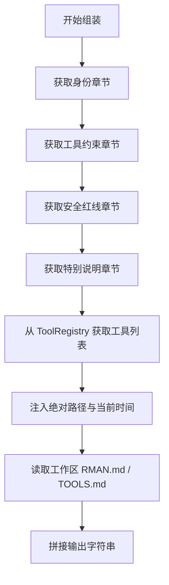

# DETAILED_DESIGN: 动态 System Prompt 组装系统设计

| 版本号 | 日期 | 变更说明 | 作者 |
| :--- | :--- | :--- | :--- |
| v1.0.0 | 2026-04-16 | 初始版本，定义组装算法与内容模板 | Gemini CLI |

## 1. 核心类逻辑：`PromptBuilder`

`PromptBuilder` 采用“流式组装”模式。在每次调用 `build()` 时执行以下流程：

### 1.1 组装序列


## 2. 章节内容定义

### 2.1 交互格式 (Strict Tagging)
回复结构必须为：
```text
<think>
[内部推理逻辑：为什么选择这个工具，用户的潜在意图分析]
</think>
<final>
[给用户的回复]
</final>
```

### 2.2 工具调用 (Concise Execution)
- 禁止前置说明：“我现在将调用 read_file 来查看...”。
- 除非是需要向用户解释的多步流程，否则直接在回复中触发 `tool_calls`。
- 文本回退模式下的工具名称必须精确对齐。

### 2.2 安全 (目录隔离与隐私保护)
**核心提示语**: 
1. 写入工具 write_file, replace 只能操作工作目录（workspace）或临时目录（/tmp）。
2. 读工具 read_file 允许访问系统内所有有权限的文件。
3. 允许修改当前工作目录下的 `RMAN.md` 和 `TOOLS.md` 以优化 Agent 行为。
4. **破坏性操作确认**: 在执行删除（rm）、强制停止进程（kill）等破坏性操作前，必须先在 `<final>` 标签中向用户解释计划，并显式等待用户回复“确认”后方可执行。

### 2.3 飞书界面呈现准则 (UI Rendering)
为了在飞书卡片中达到最佳显示效果，LLM 必须遵循：
1.  **Header Icons**: 在 `<final>` 开头使用 ✅/❌/⚠️ 表示状态。
2.  **Native Table**: 展示列表数据时，必须产出合法的 JSON 表格标签：
    `{ "tag": "table", "columns": [...], "rows": [...] }`。
3.  **Title Limit**: 仅允许使用 `#` 和 `##`。
4.  **Color Highlighting**: 对关键文本使用 `[文本内容](text_color:颜色名)`，常用颜色：`green`, `red`, `blue`, `grey`。
5.  **Clean Code**: 代码块必须标明语言，如 ` ```python `。

### 2.4 动态注入项
- **工作目录**: 调用 `os.path.abspath(workspace_dir)`。
- **时间**: 使用 `datetime.now(timezone.utc)` 并格式化。

## 3. 实现考量

- **原子性读取**: 确保在读取 RMAN.md 和 TOOLS.md 时处理文件锁定或读取异常，避免半截内容被注入。
- **Token 限制**: 为 RMAN.md 和 TOOLS.md 的总长度设置 32KB 的硬限制，超过则进行截断并发出警告。
- **模板同步**: 延续 `_ensure_files_exist` 逻辑，确保工作区始终有合法的源文件可供读取。
