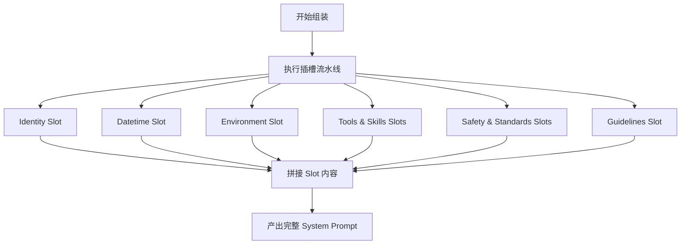

# DETAILED_DESIGN: 动态 System Prompt 组装系统设计

| 版本号 | 日期 | 变更说明 | 作者 |
| :--- | :--- | :--- | :--- |
| v1.0.0 | 2026-04-16 | 初始版本，定义组装算法与内容模板 | Gemini CLI |

## 1. 核心类逻辑：`PromptBuilder`

`PromptBuilder` 采用“插槽化（Slot-based）”组装模式。

### 1.1 组装序列 (Slot Pipeline)

## 2. 插槽详细定义 (Slot Definitions)

### 2.1 Identity (身份) - `_build_identity_slot()`
- **数据源**: `templates/slots/identity.md` (或 `RMAN.md` 对应节)。
- **核心内容**: 注入 Agent 角色定义（AI 架构专家、资深工程师）及性格准则。

### 2.2 Datetime (时空定位) - `_build_datetime_slot()`
- **数据源**: 系统实时时钟。
- **变量注入**: 
    - `current_date`: 格式 `YYYY-MM-DD`。
    - `current_time`: 格式 `HH:MM:SS`。
- **目的**: 增强 Agent 对时间敏感任务的理解能力（如“清理昨天的日志”）。

### 2.3 Environment (环境上下文) - `_build_environment_slot()`
- **数据源**: `sys.platform` 与 `config.agent.workspace_dir`。
- **变量注入**:
    - `os_platform`: 标识 Linux/Darwin/Win32。
    - `workspace_dir`: 当前绝对工作路径。
- **目的**: 指导 Agent 选择兼容的 Shell 工具。

### 2.4 Workflow (工作流协议) - `_build_workflow_slot()`
- **数据源**: `templates/slots/workflow.md`。
- **核心内容**: 强制执行 `<think>`、`<final>` 标签协议，以及 ReAct 的 T-A-O 循环规范。

### 2.5 Tools & Skills (工具与技能) - `_build_tools_slot()`, `_build_skills_slot()`
- **数据源**: `ToolRegistry` 注册表与 `skills/` 目录。
- **核心内容**: 
    - 动态生成工具的 JSON Schema。
    - 扫描并加载特定领域的“技能片段”，提供更具针对性的 Prompt 辅助。

### 2.6 Safety & Standards (安全与标准) - `_build_safety_slot()`, `_build_standards_slot()`
- **数据源**: `templates/slots/safety.md`, `templates/slots/standards.md`。
- **核心内容**: 
    - 注入目录隔离、凭证保护红线。
    - 注入原子化文件编辑、200 行拆分规则等工程化准则。

### 2.7 Guidelines (特定指南) - `_build_guidelines_slot()`
- **数据源**: 任务关联的特定提示语。
- **内容示例**: 针对 Linux 操作系统的最佳实践、错误恢复建议。

## 3. 实现考量

- **原子性读取**: 确保在读取 RMAN.md 和 TOOLS.md 时处理文件锁定或读取异常，避免半截内容被注入。
- **Token 限制**: 为 RMAN.md 和 TOOLS.md 的总长度设置 32KB 的硬限制，超过则进行截断并发出警告。
- **模板同步**: 延续 `_ensure_files_exist` 逻辑，确保工作区始终有合法的源文件可供读取。
