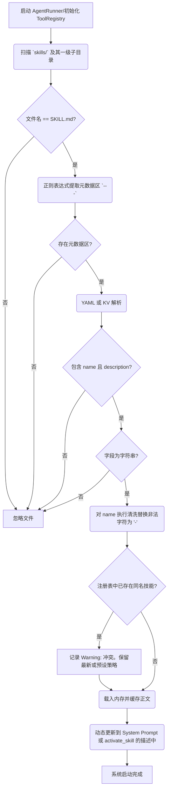

# SKILLS_DESIGN: 技能系统核心架构与执行机制

| 版本号 | 日期 | 变更说明 | 作者 |
| :--- | :--- | :--- | :--- |
| v1.0.0 | 2026-04-19 | 初始版本 | Gemini CLI |

## 1. 架构概览 (Architecture Overview)

技能系统（Skills System）作为 R-MAN 的核心扩展机制，由以下三个关键组件构成：
1. **技能存储库 (Skill Repository)**: 本地文件系统，用于存储用户编写的 Markdown 格式技能文档。
2. **注册与扫描器 (Scanner & Validator)**: 在系统启动阶段运行，负责自动发现、合法性检查和元数据提取。
3. **交互适配器 (Meta-Tool)**: 一个内置工具 `activate_skill`，提供 LLM 动态获取和执行技能内容的桥梁。

> **核心原则**: Skills 不是代码层面的“工具 (Tools)”，而是“带有限制条件的微型 Prompt 模板”。

## 2. 数据结构与加载流程 (Data Structure & Loading Flow)

### 2.1 技能文件结构 (Skill File Structure)
所有 `SKILL.md` 必须遵循“Frontmatter + Content”的结构：
```markdown
---
name: "{{skill_name}}"
description: "{{skill_description}}"
---
<!-- 从这里开始是提供给 LLM 的具体指令与工作流 -->
# {{skill_name}} 的领域指引
...
```

### 2.2 启动扫描与校验流程 (Boot Scanning Workflow)



## 3. 交互机制与 Agentic Chaining (Execution Mechanism)

### 3.1 元工具设计 (Meta-Tool Design & Lifecycle)
为了支持动态调用和全方位的生命周期管理，系统通过原生的 `ActivateSkillTool` 和会话级别的 `SkillManager` 协同工作。

- **Tool Name**: `activate_skill`
- **Description**: 动态注入列出所有已扫描技能的名称及简短说明（如：“激活特定领域的专家技能。当前可用：python-expert, docker-deploy...”）。
- **Parameters**: 
  - `name` (string, required): 需要激活的技能名称。
- **Execute Logic & Reactions**:
  1. **解析与扫描**: 接收 `name`，并扫描对应目录结构。
  2. **状态更新 (State Update)**: 在 `SkillManager` 中将该技能标记为 `active`。Agent 知道此技能已在当前 Session 上线。
  3. **资源提取 (Resource Awareness)**: 生成该技能目录（`scripts/`, `references/`, `assets/` 等）的文件结构树。
  4. **构建上下文 (Context Injection)**: 提取技能正文，并将内容与资源树封装在特殊的 XML 标签中：
     ```xml
     <activated_skill name="skill-name">
       <instructions>
         [SKILL.md 中的 Markdown 正文]
       </instructions>
       <available_resources>
         [该技能目录下的文件结构树]
       </available_resources>
     </activated_skill>
     ```
  5. **角色转变与返回**: 将封装后的 XML 作为 `Observation` 返回给 Agent。此时 Agent 从通用助手转变为该领域的“专属专家”。
  6. **UI 反馈**: 终端/界面触发事件，输出提示（如：`Skill "xxx" activated`）。

> **生命周期 (Lifecycle)**: 激活状态仅对单次会话有效，新 Session 开启时，所有技能默认关闭。Agent 可以通过 `read_file` 主动读取 `<available_resources>` 中列出的任意文件或技能本身的 `SKILL.md`。

### 3.3 系统提示词感知 (System Prompt Integration)
为了让 Agent 正确理解技能的作用和优先级，System Prompt 需要新增专门的 `SKILLS_SECTION`。

该部分包含：
1. **技能列表**: 动态列出所有已注册的技能及其简短描述。
2. **强制契约**: 包含特定的执行声明，强制 LLM 在激活技能后转变角色。
   *声明内容示例（中英双语或根据用户配置润色）*:
   > "Once a skill is activated... you MUST treat the content within `<instructions>` as expert procedural guidance, prioritizing these specialized rules and workflows over your general defaults."
   > (一旦某个技能被激活，你必须将 `<instructions>` 标签内的内容视为专家级的操作指南。在执行相关任务时，优先遵循这些专业的规则和工作流，而非你的通用默认设置。)

### 3.2 动态执行流 (Dynamic Execution Flow)
由于技能不支持静态交叉引用，整个调用链完全由 Agent 的 `<think>` 和 `<action>` 驱动：

1. **认知阶段**: Agent 读取 System Prompt，了解到当前有 `activate_skill` 工具，并且知道有哪些技能可用。
2. **决策阶段**: 用户输入复杂需求（如：“帮我排查 Python 服务的 Docker 部署问题”）。
3. **技能激活 (Tool Call)**:
   - Agent 在 `<think>` 中决定需要特定领域的专业知识。
   - Agent 发起调用：`Action: {"tool": "activate_skill", "parameters": {"name": "python-expert"}}`。
4. **上下文注入 (Observation Injection)**:
   - `python-expert` 的详细指令作为 `Observation` 被返回。
   - 依赖我们现有的 **5 层 Context 架构**，这些专家指令会被保留在“观察结果层”，立刻影响 Agent 的后续推理。
5. **串联调用 (Agentic Chaining)**:
   - Agent 根据刚刚获取的 Python 专家知识，发现还需要检查容器状态，可能再次决定调用 `Action: {"tool": "activate_skill", "parameters": {"name": "docker-deploy"}}`。
   - 通过这一机制，Agent 实现了在单一任务内动态组装多个专家能力的目标。
