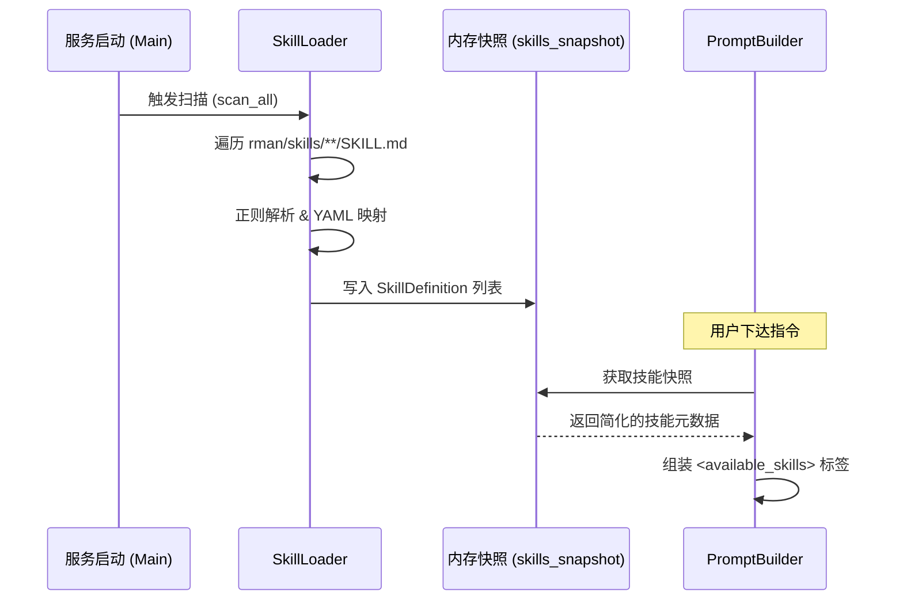

# DETAILED_DESIGN: 技能系统 (Skills System)

| 版本号 | 日期 | 变更说明 | 作者 |
| :--- | :--- | :--- | :--- |
| v1.0.0 | 2026-04-21 | 初始版本，定义 SKILL.md 扫描与 XML 注入逻辑 | Gemini CLI |

## 1. 核心架构

技能系统旨在提供一种轻量级的领域知识注入方案。它通过在服务启动时扫描物理目录，建立内存索引，并在生成 System Prompt 时为 LLM 提供可选的技能清单。

## 2. 详细设计

### 2.1 技能文件规范 (SKILL.md)
每个技能必须存放在 `rman/skills/{id}/SKILL.md`，格式如下：
```markdown
---
name: skill-name
description: 简短描述该技能的作用
---
此处是技能的具体指令、SOP 或调用示例。
```

### 2.2 解析引擎
系统采用正则表达式进行流式解析：
- **Regex**: `^---([\s\S]*?)---(?:\r?\n([\s\S]*))?`
- **处理步骤**:
    1. 强制使用 `UTF-8` 读取。
    2. 提取 `match[1]` 作为 YAML 元数据块，解析获取 `name` 和 `description`。
    3. 提取 `match[2]` 作为 `body` 内容。
    4. 对 `name` 进行清洗（去除空格，转为小写/连字符格式）。

### 2.3 内存生命周期 (Lifecycle)


## 3. 数据结构定义

```python
class SkillDefinition(BaseModel):
    name: str              # 唯一标识名
    description: str       # 供 LLM 理解的职能描述
    location: str          # 磁盘绝对路径
    body: str              # 核心指令内容
```

## 4. Prompt 注入规范

在 `System Prompt` 的 `Skills Slot` 中，输出格式如下：

```xml
<available_skills>
  <skill>
    <name>lark-excel-expert</name>
    <description>精通飞书电子表格 API 调用的专家技能</description>
    <location>/root/rman/skills/lark-excel/SKILL.md</location>
  </skill>
</available_skills>
```
