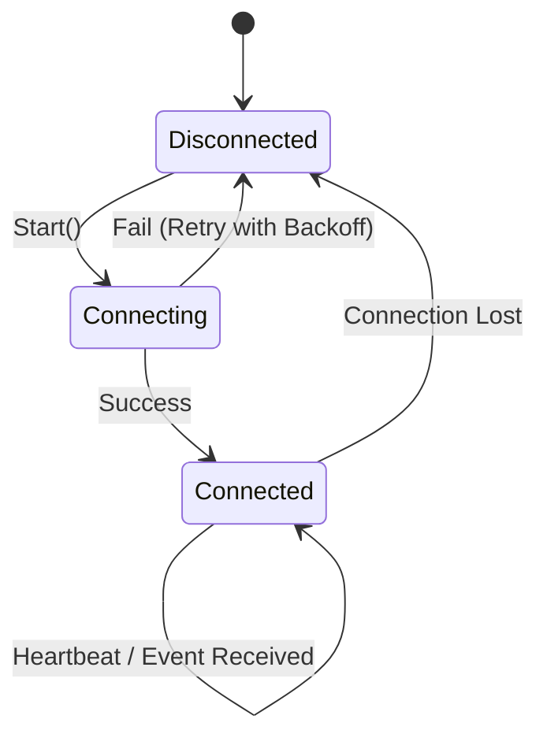

# DETAILED_DESIGN: 飞书集成通信层设计

| 版本号 | 日期 | 变更说明 | 作者 |
| :--- | :--- | :--- | :--- |
| v1.0.0 | 2026-04-16 | 初始版本，定义 WebSocket 客户端与任务调度 | Gemini CLI |
| v1.1.0 | 2026-04-27 | 详细中间状态反馈机制设计 | Gemini CLI |

## 1. 模块职责

飞书集成模块（Feishu Integration）负责维护与飞书服务器的长连接，作为系统的流量入口与出口，并管理任务的调度优先级。

## 2. WebSocket 客户端实现

基于 `lark-oapi` 的 `WSClient` 实现。

### 2.1 状态机设计



### 2.2 事件分发

- 仅订阅 `im.message.receive_v1` 事件。
- **幂等处理**: 使用 Redis（若有）或本地 LRU Cache 存储最近 1000 个 `message_id`。
- **用户鉴权**: 检查 `event.sender.sender_id.open_id == allowed_user_open_id`。

## 3. 任务调度逻辑：串行 FIFO 队列

由于 Agent 执行可能包含写文件、执行 Shell 等具有副作用的操作，系统必须保证单用户指令的串行执行。

```python
class TaskQueue:
    def __init__(self):
        self.queue = asyncio.Queue()
        self.worker_task = None

    async def start(self):
        self.worker_task = asyncio.create_task(self._worker())

    async def _worker(self):
        while True:
            task = await self.queue.get()
            try:
                await task.execute()
            finally:
                self.queue.task_done()
```

## 4. 消息交互契约

### 4.1 即时响应 (Processing Status)

收到消息后，立即通过 `client.im.v1.message.reply` 发送一条内容为 `{"text": "🤖 R-MAN 正在思考中，请稍候..."}` 的消息，并记录其 `message_id` 以便后续可能的回退或更新。

### 4.2 卡片消息设计 (Card Message Structure)

所有响应统一使用飞书交互式卡片。

#### 最终执行报告模板
```json
{
    "header": {
        "title": {"tag": "plain_text", "content": "🤖 R-MAN 执行报告"},
        "template": "blue"
    },
    "elements": [
        {
            "tag": "div",
            "text": {
                "tag": "lark_md",
                "content": "**执行结果**:\n{final_answer}"
            }
        },
        {
            "tag": "note",
            "elements": [{"tag": "plain_text", "content": "⏱ 任务完成"}]
        }
    ]
}
```

#### 4.2.2 表格渲染优化算法
为了解决列数较多时的排版混乱问题，`CardFormatter` 采用以下策略：
1.  **采样分析**: 遍历表格前 10 行数据，计算每列的最大平均字符长度。
2.  **权重分配**:
    - 总权重设定为 100。
    - 根据每列长度占比分配 `weighted` 值。
    - **保底逻辑**: 每列最小分配 5% 权重，防止极短列消失。
3.  **模式切换**:
    - 强制设置 `row_height: "auto"`。
    - 在卡片 `config` 层注入 `wide_screen_mode: true`。

#### 4.2.3 增强型中间状态反馈 (Detailed Status Design)
为了解决 Agent 执行过程中的“黑盒”问题，系统引入结构化中间反馈。

**数据流向**:
1.  **AgentRunner**: 解析出 `Action` 和 `Action Input`。
2.  **Callback**: 构造包含 `tool`, `thought_summary`, `target_param` 的结构化字符串。
3.  **FeishuInteraction**: 接收字符串并渲染为两行文本卡片。

**渲染逻辑示例**:
- **第一行**: `**准备调用 {tool}** : {thought_summary}` (加粗工具名)
- **第二行**: `> 目标：{target_param}` (使用引用块样式或普通文本)

**各工具 target 提取规则**:
- `read_file` / `write_file` / `replace`: 提取 `file_path`。
- `bash`: 提取命令的前 30 个字符并追加 `...`。
- `memory_search`: 提取 `query`。
- `web_search`: 提取搜索词。

#### 实现方法：`_send_card`
- **输入**: `chat_id`, `title`, `markdown_content`, `color_template`
- **逻辑**: 
    1. 构造 JSON 结构。
    2. **配置开启**: 设置 `config.wide_screen_mode = True`。
    3. 调用 `client.im.v1.message.create` 接口，并使用 `loop.run_in_executor` 保持异步非阻塞。

## 5. 异常处理

### 5.1 消息重试
- **发送失败**: 使用指数退避策略重试。

### 5.2 连接看门狗 (Connection Watchdog)
系统采用“内层心跳 + 外层看门狗”的混合监测机制：

1.  **内层心跳 (SDK Level)**:
    - 基于 `lark-oapi` 的原生机制，每 **30 秒** 发送一次 Ping 包。
    - SDK 负责维护底层的 TCP 存活及指数退避重连（Auto Reconnect）。
2.  **外层看门狗 (App Level)**:
    - 职责：监测 SDK 线程是否发生假死或令牌刷新失败。
    - **逻辑**: 
        - 交互层暴露 `check_connection` 接口执行极简 API 调用。
        - 主循环每分钟触发一次探活。
        - 若 **300 秒 (5 分钟)** 内既无业务消息，主动探活也连续失败，则判定连接假死。
    - **自愈**: 触发进程自杀，由 `systemd` 重新拉起，实现 100% 状态重置。

---
> 下一步：[更新设计文档索引](../index.md)
