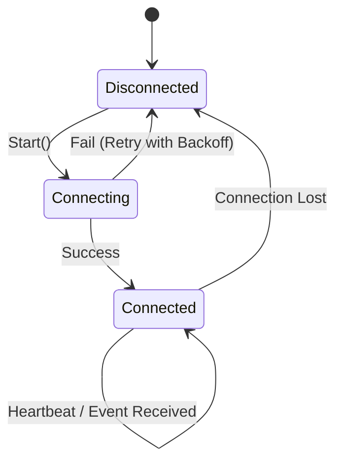

# DETAILED_DESIGN: 飞书集成通信层设计

| 版本号 | 日期 | 变更说明 | 作者 |
| :--- | :--- | :--- | :--- |
| v1.0.0 | 2026-04-16 | 初始版本，定义 WebSocket 客户端与任务调度 | Gemini CLI |

## 1. 模块职责

飞书集成模块（Feishu Integration）负责维护与飞书服务器的长连接，作为系统的流量入口与出口，并管理任务的调度优先级。

## 2. WebSocket 客户端实现

基于 `lark-oapi` 的 `WSClient` 实现。

### 2.1 状态机设计



### 2.2 事件分发

- 仅订阅 `im.message.receive_v1` 事件。
- **幂等处理**: 使用 Redis（若有）或本地 LRU Cache 存储最近 1000 个 `message_id`。
- **用户鉴权**: 检查 `event.sender.sender_id.open_id == allowed_user_open_id`。

## 3. 任务调度逻辑：串行 FIFO 队列

由于 Agent 执行可能包含写文件、执行 Shell 等具有副作用的操作，系统必须保证单用户指令的串行执行。

```python
class TaskQueue:
    def __init__(self):
        self.queue = asyncio.Queue()
        self.worker_task = None

    async def start(self):
        self.worker_task = asyncio.create_task(self._worker())

    async def _worker(self):
        while True:
            task = await self.queue.get()
            try:
                await task.execute()
            finally:
                self.queue.task_done()
```

## 4. 消息交互契约

### 4.1 即时响应 (Processing Status)

收到消息后，立即通过 `client.im.v1.message.reply` 发送一条内容为 `{"text": "🤖 R-MAN 正在思考中，请稍候..."}` 的消息，并记录其 `message_id` 以便后续可能的回退或更新。

### 4.2 卡片消息设计 (Card Message Structure)

所有响应统一使用飞书交互式卡片。

#### 最终执行报告模板
```json
{
    "header": {
        "title": {"tag": "plain_text", "content": "🤖 R-MAN 执行报告"},
        "template": "blue"
    },
    "elements": [
        {
            "tag": "div",
            "text": {
                "tag": "lark_md",
                "content": "**执行结果**:\n{final_answer}"
            }
        },
        {
            "tag": "note",
            "elements": [{"tag": "plain_text", "content": "⏱ 任务完成"}]
        }
    ]
}
```

#### 实现方法：`_send_card`
- **输入**: `chat_id`, `title`, `markdown_content`, `color_template`
- **逻辑**: 构造上述 JSON，调用 `client.im.v1.message.create` 接口，并使用 `loop.run_in_executor` 保持异步非阻塞。

## 5. 异常处理

- **Agent 超时**: 若 Agent 执行超过 120 秒，向用户发送“仍在执行中，请继续等待”的消息，每 60 秒触发一次。
- **发送失败**: 使用指数退避策略重试。

---
> 下一步：[更新设计文档索引](../index.md)
