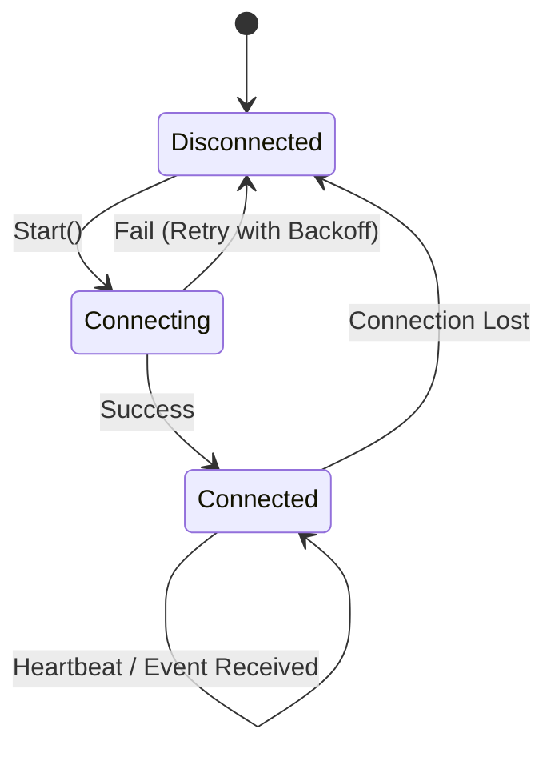
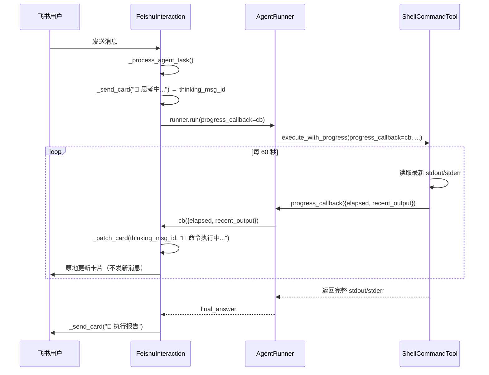

# DETAILED_DESIGN: 飞书集成通信层设计

| 版本号 | 日期 | 变更说明 | 作者 |
| :--- | :--- | :--- | :--- |
| v1.0.0 | 2026-04-16 | 初始版本，定义 WebSocket 客户端与任务调度 | Gemini CLI |
| v1.1.0 | 2026-04-27 | 详细中间状态反馈机制设计 | Gemini CLI |
| v2.0.0 | 2026-05-15 | 新增消息解析异常防护、卡片 JSON 大小限制双层保护、ensure_ascii 修复 | GitHub Copilot |
| v2.1.0 | 2026-05-22 | 新增前台命令进度心跳：_send_card 返回 message_id、_patch_card 就地更新、progress_callback 闭包；思考中卡片移入 _process_agent_task | GitHub Copilot |

## 1. 模块职责

飞书集成模块（Feishu Integration）负责维护与飞书服务器的长连接，作为系统的流量入口与出口，并管理任务的调度优先级。

## 2. WebSocket 客户端实现

基于 `lark-oapi` 的 `WSClient` 实现。

### 2.1 状态机设计


```mermaid
stateDiagram-v2
    [*] --> Disconnected
    Disconnected --> Connecting: Start()
    Connecting --> Connected: Success
    Connecting --> Disconnected: Fail (Retry with Backoff)
    Connected --> Connected: Heartbeat / Event Received
    Connected --> Disconnected: Connection Lost
```

### 2.2 事件分发

- 仅订阅 `im.message.receive_v1` 事件。
- **幂等处理**: 使用 Redis（若有）或本地 LRU Cache 存储最近 1000 个 `message_id`。
- **用户鉴权**: 检查 `event.sender.sender_id.open_id == allowed_user_open_id`。

## 3. 任务调度逻辑：串行 FIFO 队列

由于 Agent 执行可能包含写文件、执行 Shell 等具有副作用的操作，系统必须保证单用户指令的串行执行。

```python
class TaskQueue:
    def __init__(self):
        self.queue = asyncio.Queue()
        self.worker_task = None

    async def start(self):
        self.worker_task = asyncio.create_task(self._worker())

    async def _worker(self):
        while True:
            task = await self.queue.get()
            try:
                await task.execute()
            finally:
                self.queue.task_done()
```

## 4. 消息交互契约

### 4.1 即时响应 (Processing Status)

收到消息后，立即通过 `client.im.v1.message.reply` 发送一条内容为 `{"text": "🤖 R-MAN 正在思考中，请稍候..."}` 的消息，并记录其 `message_id` 以便后续可能的回退或更新。

### 4.2 卡片消息设计 (Card Message Structure)

所有响应统一使用飞书交互式卡片。

#### 最终执行报告模板
```json
{
    "header": {
        "title": {"tag": "plain_text", "content": "🤖 R-MAN 执行报告"},
        "template": "blue"
    },
    "elements": [
        {
            "tag": "div",
            "text": {
                "tag": "lark_md",
                "content": "**执行结果**:\n{final_answer}"
            }
        },
        {
            "tag": "note",
            "elements": [{"tag": "plain_text", "content": "⏱ [Time] | R-MAN | [Hostname]"}]
        }
    ]
}
```

#### 4.2.2 表格渲染优化算法
为了解决列数较多时的排版混乱问题，`CardFormatter` 采用以下策略：
1.  **采样分析**: 遍历表格前 10 行数据，计算每列的最大平均字符长度。
2.  **权重分配**:
    - 总权重设定为 100。
    - 根据每列长度占比分配 `weighted` 值。
    - **保底逻辑**: 每列最小分配 5% 权重，防止极短列消失。
3.  **模式切换**:
    - 强制设置 `row_height: "auto"`。
    - 在卡片 `config` 层注入 `wide_screen_mode: true`。

#### 4.2.3 增强型中间状态反馈 (Detailed Status Design)
为了解决 Agent 执行过程中的“黑盒”问题，系统引入结构化中间反馈。

**数据流向**:
1.  **AgentRunner**: 解析出 `Action` 和 `Action Input`。
2.  **Callback**: 构造包含 `tool`, `thought_summary`, `target_param` 的结构化字符串。
3.  **FeishuInteraction**: 接收字符串并渲染为两行文本卡片。

**渲染逻辑示例**:
- **第一行**: `**准备调用 {tool}** : {thought_summary}` (加粗工具名)
- **第二行**: `> 目标：{target_param}` (使用引用块样式或普通文本)

**各工具 target 提取规则**:
- `read_file` / `write_file` / `replace`: 提取 `file_path`。
- `bash`: 提取命令的前 30 个字符并追加 `...`。
- `memory_search`: 提取 `query`。
- `web_search`: 提取搜索词。

#### 实现方法：`_send_card` / `_patch_card`

**`_send_card(chat_id, title, content_md, template, usage) → Optional[str]`**（v2.1.0 改为返回 `message_id`）
- **输入**: `chat_id`, `title`, `markdown_content`, `color_template`, 可选 `usage` 统计
- **逻辑**: 
    1. 内容软限截断 → 自动颜色推断 → `CardFormatter` 渲染 → 可选 token 用量分栏。
    2. 硬限兜底：card JSON 超 28 KB 时降级为极简纯文本卡片。
    3. 调用 `client.im.v1.message.create`，**成功时返回 `response.data.message_id`**，可供后续 `_patch_card` 使用。

**`_patch_card(message_id, title, content_md, template) → bool`**（v2.1.0 新增）
- 调用飞书 `client.im.v1.message.patch` 接口就地更新已发送的卡片。
- 用于长时间命令的进度心跳：每 60 秒刷新同一张卡片，而非发送新消息，避免刷屏。
- 返回 `True` 表示更新成功，`False` 表示失败（记录 WARNING 日志，不抛出异常）。

## 5. 异常处理

### 5.1 消息解析防护（v2.0.0）

`_on_message_received` 是 SDK 的同步回调函数，内部异常会直接崩溃事件循环。因此对 `message.content` 的 JSON 解析**必须**包裹 try/except：

```python
try:
    text_json = json.loads(message.content)
    text = text_json.get("text", "").strip()
except (json.JSONDecodeError, AttributeError) as e:
    logger.warning(f"Failed to parse message content: {e!r}")
    return  # 静默丢弃，不影响后续消息处理
```

### 5.2 卡片 JSON 大小限制（v2.0.0）

飞书官方文档确认：**卡片消息请求体最大不能超过 30 KB**。

`_send_card` 在发送前执行两层保护：

| 层次 | 阈值 | 触发条件 | 策略 |
| :--- | :--- | :--- | :--- |
| **软上限** | 18 KB | `content_md` UTF-8 字节数超限 | 截断文本并追加 `⚠️ 内容较长，已截断显示` 提示 |
| **硬限制** | 28 KB | 构建后 card JSON 字节数超限 | 降级为极简纯文本卡片，内容仅保留前 1000 字符 |

**CJK 字节放大修复**：原 `json.dumps(card_json)` 默认使用 ASCII unicode 转义，每个汉字 3 字节（UTF-8）被编码为 `\uXXXX`（6字节），实际可用文本预算减半。v2.0.0 改为 `json.dumps(card_json, ensure_ascii=False)`，在同等卡片大小限制下文本容量翻倍。

### 5.3 消息发送重试
- **发送失败**: 最多重试 3 次，每次间隔 2 秒。

### 5.4 连接看门狗 (Connection Watchdog)
系统采用“内层心跳 + 外层看门狗”的混合监测机制：

1.  **内层心跳 (SDK Level)**:
    - 基于 `lark-oapi` 的原生机制，每 **30 秒** 发送一次 Ping 包。
    - SDK 负责维护底层的 TCP 存活及指数退避重连（Auto Reconnect）。
2.  **外层看门狗 (App Level)**:
    - 职责：监测 SDK 线程是否发生假死或令牌刷新失败。
    - **逻辑**: 
        - 交互层暴露 `check_connection` 接口执行极简 API 调用。
        - 主循环每分钟触发一次探活。
        - 若 **300 秒 (5 分钟)** 内既无业务消息，主动探活也连续失败，则判定连接假死。
    - **自愈**: 触发进程自杀，由 `systemd` 重新拉起，实现 100% 状态重置。

## 6. 前台命令进度心跳（v2.1.0）

### 6.1 问题背景

原 `run_shell_command` 前台模式使用 `communicate()` 死等，用户在命令执行期间（如 `docker build`、`pip install`）收不到任何反馈，体验与卡死无异。

### 6.2 整体数据流


```mermaid
sequenceDiagram
    participant U as 飞书用户
    participant F as FeishuInteraction
    participant R as AgentRunner
    participant S as ShellCommandTool

    U->>F: 发送消息
    F->>F: _process_agent_task()
    F->>F: _send_card("🤖 思考中...") → thinking_msg_id
    F->>R: runner.run(progress_callback=cb)
    R->>S: execute_with_progress(progress_callback=cb, ...)
    loop 每 60 秒
        S->>S: 读取最新 stdout/stderr
        S->>R: progress_callback({elapsed, recent_output})
        R->>F: cb({elapsed, recent_output})
        F->>F: _patch_card(thinking_msg_id, "🔄 命令执行中...")
        F->>U: 原地更新卡片（不发新消息）
    end
    S-->>R: 返回完整 stdout/stderr
    R-->>F: final_answer
    F->>U: _send_card("🤖 执行报告")
```

### 6.3 `ShellCommandTool` 内部实现

`_prepare_and_launch()` 封装了公共的权限校验、安全检查和子进程创建逻辑，返回 `Tuple[Optional[str], Optional[Process]]`：

| 返回值 | 含义 |
| :--- | :--- |
| `(error_str, None)` | 权限拒绝 / 安全拦截 / 后台模式成功（直接返回） |
| `(None, process)` | 前台进程就绪，调用方继续处理 |

`_run_foreground_with_heartbeat()` 流式读取 stdout/stderr（避免管道缓冲区满死锁），每秒轮询进程状态，每 60 秒触发一次 `progress_callback`。

### 6.4 节流策略

- 进度更新**仅刷新原卡片**（`_patch_card`），不发送新消息。
- 心跳回调异常（网络抖动等）只记录 WARNING，不中断命令执行。
- `is_background=True` 命令不走心跳路径，逻辑完全不变。

---
> 下一步：[更新设计文档索引](../index.md)
