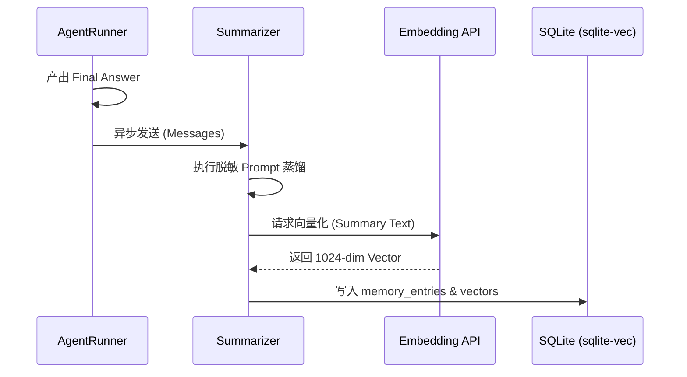

# DETAILED_DESIGN: 长期记忆系统详细设计

| 版本号 | 日期 | 变更说明 | 作者 |
| :--- | :--- | :--- | :--- |
| v2.0.0 | 2026-04-17 | 初始版本，定义脱敏摘要算法与 SQLite 向量存储 | Gemini CLI |
| v2.1.0 | 2026-05-15 | 配置化 TTL/清理间隔、搜索过期过滤、expires_at 索引、修复裸连接 Bug | GitHub Copilot |

## 1. 核心流程：异步摘要存入 (Auto-Dump)


```mermaid
sequenceDiagram
    participant A as AgentRunner
    participant S as Summarizer
    participant E as Embedding API
    participant DB as SQLite (sqlite-vec)

    A->>A: 产出 Final Answer
    A->>S: 异步发送 (Messages)
    S->>S: 执行脱敏 Prompt 蒸馏
    S->>E: 请求向量化 (Summary Text)
    E-->>S: 返回 1024-dim Vector
    S->>DB: 写入 memory_entries & vectors
```

## 2. 脱敏摘要指令 (Summarizer Prompt)

**Prompt 模板**:
> “你是一个记忆构建专家。请将以下对话总结为一段简短的摘要。
> 规则：
> 1. 提取任务核心目标、成功执行的命令、以及用户的偏好。
> 2. **隐私清理**: 严禁包含任何 Key、密码、IP 地址或敏感 Token。将它们替换为 `[REDACTED]`。
> 3. 只输出摘要文本，不含任何解释。
> 4. 语言必须与原文保持一致。”

## 3. 存储引擎设计

### 3.1 环境检测 (Bootstrap)
```python
def check_vector_extension():
    try:
        import sqlite_vec
        conn = sqlite3.connect(":memory:")
        conn.enable_load_extension(True)
        sqlite_vec.load(conn)
        # 验证
        conn.execute("SELECT vec_version();")
    except Exception:
        print(">>> WARNING: sqlite-vec missing. Memory disabled.")
```
### 3.2 数据库 Schema
```sql
CREATE TABLE IF NOT EXISTS memory_entries (
    id TEXT PRIMARY KEY,
    summary TEXT NOT NULL,
    tag TEXT,
    created_at DATETIME DEFAULT CURRENT_TIMESTAMP,
    expires_at DATETIME
);

CREATE VIRTUAL TABLE IF NOT EXISTS memory_vectors USING vec0(
    id TEXT PRIMARY KEY,
    embedding float[1024]
    -- sqlite-vec v0.1.9 仅支持 vec0（暴力 KNN），不支持 HNSW 索引
    -- 对于单用户 Agent（< 10,000 条记忆），暴力 KNN 性能完全可接受
);

-- 加速 expires_at 过滤与清理查询
CREATE INDEX IF NOT EXISTS idx_memory_expires ON memory_entries(expires_at);
```

### 3.3 自动维护机制 (Background Maintenance)
为了应对长期不重启的生产环境，系统实施双重清理策略：
1.  **静态清理**: 每次程序启动时执行 `_cleanup_expired`。
2.  **动态清理**: 主循环内置计时器，每隔 `config.memory.cleanup_interval_hours`（默认 24 小时）自动触发一次过期记录物理删除，确保数据库体积受控。

**重要实现细节**：定时清理必须使用 `memory_store._get_connection()`（会加载 sqlite_vec 扩展），而不能使用裸 `sqlite3.connect()`。`memory_vectors` 是 `vec0` 虚拟表，没有 sqlite_vec 扩展时 `DELETE FROM memory_vectors` 会静默失败，导致向量数据永不清理。

## 4. 检索策略
- **工具**: `memory_search(query: str, limit: int)`
- **配置**:
    - `config.memory.top_k`: 返回条目数上限（默认 3）。
    - `config.memory.score_floor`: 最低相似度过滤阈值（默认 0.0）。
- **逻辑**: 
    1. 生成 `query` 的 Embedding。
    2. 执行 KNN 向量相似度搜索（sqlite-vec vec0 暴力搜索）。
    3. **过滤过期条目**：查询加入 `AND (e.expires_at IS NULL OR e.expires_at > CURRENT_TIMESTAMP)` 条件，防止定时清理未执行时过期记忆污染搜索结果。
    4. 返回匹配度最高的摘要文本。

```sql
SELECT e.summary, e.tag, e.created_at, v.distance
FROM memory_vectors v
JOIN memory_entries e ON v.id = e.id
WHERE embedding MATCH ? AND k = ?
  AND (e.expires_at IS NULL OR e.expires_at > CURRENT_TIMESTAMP)
ORDER BY distance ASC
```

## 5. 配置项参考

| 配置路径 | 默认值 | 说明 |
| :--- | :--- | :--- |
| `memory.default_ttl_days` | 90 | 记忆默认有效期（天），`memory_dump` 工具使用此值 |
| `memory.cleanup_interval_hours` | 24 | 定期清理过期记忆的执行间隔（小时） |
| `memory.top_k` | 3 | 向量搜索返回条目数上限 |
| `memory.score_floor` | 0.0 | 最低相似度过滤阈值（0 = 不过滤） |
| `memory.db_path` | `./data/memory.db` | SQLite 数据库文件路径 |

## 5. 会话历史持久化 (Session Persistence)

为了实现跨实例的多轮对话能力，系统通过持久化消息序列来维护上下文。

### 5.1 数据库 Schema
```sql
CREATE TABLE IF NOT EXISTS session_history (
    chat_id TEXT,
    role TEXT,       -- user, assistant, tool, summary (来自 80/60 压缩)
    content TEXT,
    tool_call_id TEXT, -- 用于关联原生 tool_calls
    name TEXT,         -- 工具名称
    timestamp DATETIME DEFAULT CURRENT_TIMESTAMP
);
CREATE INDEX IF NOT EXISTS idx_session_chat ON session_history(chat_id);
```

### 5.2 恢复机制
1.  **加载**: 启动新 Agent 时，加载最近 20-50 条消息。
2.  **重组**: 消息按时间戳排序，确保 `Assistant (Tool Call)` 紧跟其对应的 `Tool (Observation)`。
3.  **对齐**: 如果历史记录中包含 LLM 压缩后的 `[Compacted Summary]`，系统会原样加载，Agent 将根据该摘要理解早期的任务进展，并根据近期的原始 Observation 继续执行。
