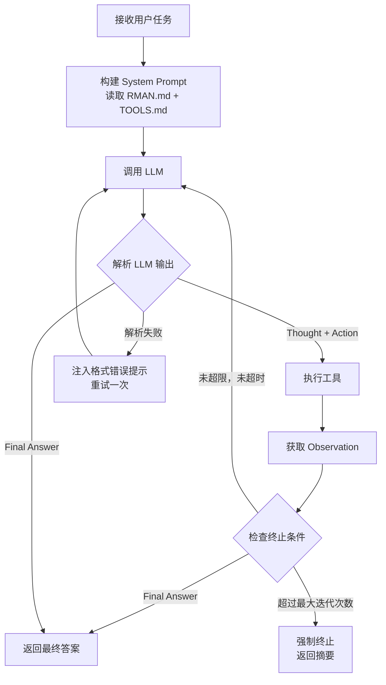
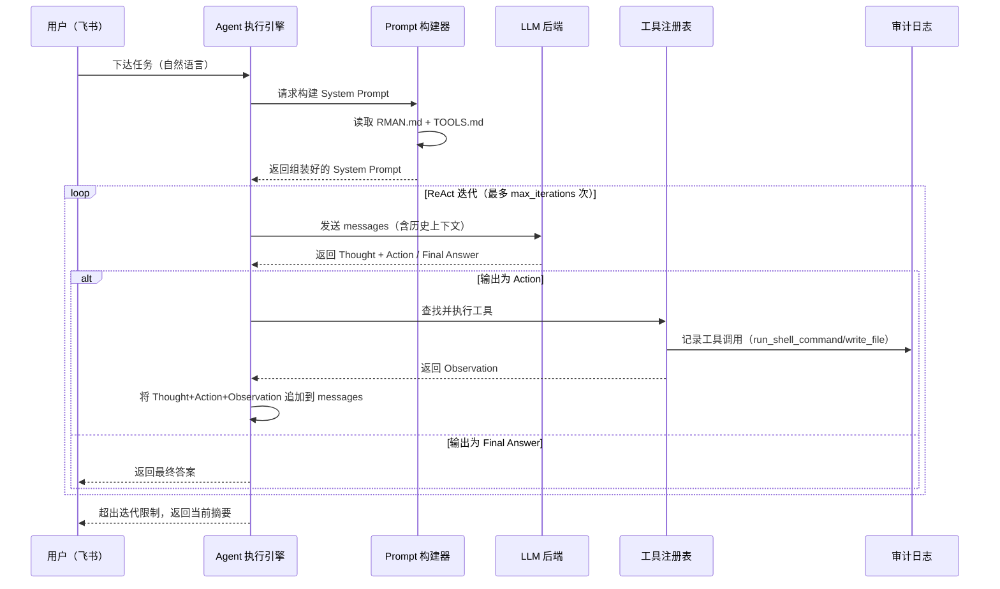
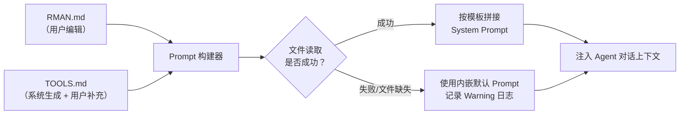

# REQ-CORE-001: r-man 核心 Agent 框架需求文档

| 版本号 | 日期 | 变更说明 | 作者 |
| :--- | :--- | :--- | :--- |
| v1.0.0 | 2026-04-15 | 初始版本，定义 ReAct Agent 框架、内置工具与动态 System Prompt 机制 | GitHub Copilot |
| v1.1.0 | 2026-04-15 | 修订内置工具集为 read/write/edit/exec/process 五件套，明确 System Prompt 组装须内联注入工具描述，支持后续扩展 | GitHub Copilot |
| v1.2.0 | 2026-04-15 | 对齐工具实现规范：工具名更新为 read_file/write_file/replace/run_shell_command/process；补全各工具精确参数定义；replace 新增 instruction 与 allow_multiple 参数；run_shell_command 新增 description、dir_path、is_background、delay_ms 参数 | GitHub Copilot |
| v1.3.0 | 2026-04-15 | 需求澄清落地：明确上下文压缩阈值为 context_window 的 80%；read_file 单次最多读取 50 行；TOOLS.md 采用幂等生成策略（仅在不存在时从模板生成，已存在时不覆盖）；config.yaml 新增 context_window 配置项 | GitHub Copilot |
| v1.4.0 | 2026-04-15 | 需求澄清落地：压缩后目标阈值确认为 60% 以下；process read 单次最多 50 行（与 read_file 对齐）；新增 §3.1.5 会话架构（CLI session + 飞书 session 双会话，飞书单用户串行队列） | GitHub Copilot |
| v1.5.0 | 2026-04-15 | 移除 CLI 相关需求，仅保留飞书交互入口；明确飞书配置必须包含 appId 和 appSecret | GitHub Copilot |
| v1.6.0 | 2026-04-15 | 新增安装工具需求，支持自动部署和配置校验；明确飞书应用创建由用户自行解决；首选 WebSocket 模式；添加 systemd 服务配置生成功能 | GitHub Copilot |
| v1.7.0 | 2026-04-15 | 移除配置文件中的 RMAN.md 和 TOOLS.md 路径配置，改为固定放置在项目根目录 | GitHub Copilot |
| v1.8.0 | 2026-04-15 | 新增 memory_dump 和 memory_get 工具，支持对话内存的保存和获取 | GitHub Copilot |
| v1.9.0 | 2026-04-15 | 将 r-man 定位从维护 Linux 系统的 AI Agent 改为通用 AI Agent，可以处理多种任务 | GitHub Copilot |
| v1.10.0 | 2026-04-16 | 统一文档认知为通用 AI Agent，更新默认兜底 Prompt 与 RMAN 示例身份描述 | GitHub Copilot |
| v1.11.0 | 2026-04-16 | 工具定义一致性修订：明确内置 7 个工具均自动注册，并同步 TOOLS.md 生成策略与验收标准 | GitHub Copilot |
| v1.12.0 | 2026-04-16 | memory_get 参数契约收敛：移除 threshold 参数，仅保留 memory_id/tag/query/limit | GitHub Copilot |
| v1.13.0 | 2026-04-16 | 内存检索架构采用第二阶段方案：新增 embedding（bge-m3）与轻量 SQL 向量检索配置，memory 详细需求收敛到独立文档 | GitHub Copilot |
| v1.14.0 | 2026-04-16 | embedding 配置字段收敛：仅保留 base_url、api_key、model，与 config/config.yaml 约定对齐 | GitHub Copilot |
| v1.15.0 | 2026-04-21 | 重构 System Prompt 构建机制为插槽化（Slot-based）架构，细化 Datetime 与 Environment 插槽拆分 | Gemini CLI |
| v1.16.0 | 2026-04-21 | 引入 LLM Fallback（故障转移）机制，支持配置多级备选模型以应对 429/529 等服务异常 | Gemini CLI |
| v1.17.0 | 2026-04-21 | 细化技能系统需求：支持 Frontmatter 解析、初始化扫描快照及 XML 结构化 Prompt 注入 | Gemini CLI |
| v1.18.0 | 2026-04-21 | 新增 session_search 工具，利用 SQLite FTS5 实现高效的跨会话全文历史搜索 | Gemini CLI |

---

## 目录

1. [背景与目标](#1-背景与目标)
2. [业务需求](#2-业务需求)
3. [功能需求](#3-功能需求)
   - [FR-001: ReAct Agent 执行框架](#fr-001-react-agent-执行框架)
   - [FR-002: 内置工具集](#fr-002-内置工具集)
   - [FR-003: 动态 System Prompt 机制](#fr-003-动态-system-prompt-机制)
   - [FR-004: LLM 后端适配层](#fr-004-llm-后端适配层)
   - [FR-005: Agent 运行配置管理](#fr-005-agent-运行配置管理)
4. [非功能需求](#4-非功能需求)
5. [核心流程图](#5-核心流程图)
6. [数据契约](#6-数据契约)
7. [RMAN.md 与 TOOLS.md 规范](#7-rmanmd-与-toolsmd-规范)
8. [约束与假设](#8-约束与假设)
9. [验收标准](#9-验收标准)
10. [关联文档](#10-关联文档)

---

## 1. 背景与目标

### 1.1 背景

r-man 是一个通用 AI Agent，可以处理多种任务。其核心能力需要建立在一个**可推理、可执行、可追溯**的 Agent 框架之上：

- 面对复杂的任务（如"检查磁盘并清理 7 天前的日志"），单次 LLM 调用无法完成——需要多步骤推理与工具调用的交织迭代。
- 应用场景高度多样，agent 的行为规则需要**可定制**——不同环境（测试 vs 生产）需要不同的操作边界。
- 系统工具（文件读写、命令执行）是完成任务的基础，需要统一、安全地抽象与管理。

### 1.2 目标

- **目标 1**: 实现 **ReAct（Reasoning + Acting）** 模式的 Agent 执行引擎，支持多轮 Think → Act → Observe 循环直至任务完成。
- **目标 2**: 提供一套**标准内置工具集**（`read_file`、`write_file`、`replace`、`run_shell_command`、`process`），工具 definition 与实现解耦，支持后续按需扩展。
- **目标 3**: 实现**插槽化（Slot-based）System Prompt 组装机制**——将指令集拆分为原子化的插槽（如 Identity, Datetime, Environment, Tools 等），并在运行时动态编排组装。

---

## 2. 业务需求

### BR-001: 多步骤任务自动完成

**描述**: 用户下达一个自然语言形式的任务目标（如"清理超过 7 天的日志文件并报告释放空间"），r-man 应自主分解任务、逐步推理、调用工具执行，最终输出完整结果，无需用户干预中间步骤。

**期望结果**: 用户单次下达目标，r-man 多轮迭代完成，最终以结构化报告回复执行摘要（操作列表、结果、耗时）。

---

### BR-002: Agent 行为可定制（无需改代码）

**描述**: 不同的部署环境对 r-man 的行为有不同的要求：
- 测试环境：允许执行任意命令，允许删除文件。
- 生产环境：禁止破坏性操作，所有写操作须在日志中说明原因。
- 特定业务线：r-man 只负责特定领域的任务。

用户应能通过编辑 `RMAN.md` 来调整 r-man 的行为边界、约束与个性，**无需修改任何代码、无需重启服务**。

**期望结果**: 编辑 `RMAN.md` 后，下一次与 r-man 的对话即可感知到行为变化。

---

### BR-003: 内置工具覆盖常见任务操作

**描述**: r-man 执行的绝大多数任务都可以由以下原语组合完成：读取文件、写入文件、执行 Shell 命令、管理进程。这些工具须作为内置能力提供，无需外部依赖。

**期望结果**: r-man 开箱即具备完整的文件系统操作与 Shell 执行能力，可直接完成 95% 以上的常见任务。

---

## 3. 功能需求

### FR-001: ReAct Agent 执行框架

**描述**: 实现标准 ReAct 循环，作为 r-man 的核心执行引擎。

#### 3.1.1 循环结构

每一轮迭代包含三个阶段：

| 阶段 | 描述 | LLM 输出格式 |
| :--- | :--- | :--- |
| **Thought（推理）** | LLM 分析当前状态，决定下一步行动 | 自由文本，前缀 `Thought:` |
| **Action（行动）** | LLM 选择并调用一个工具，附带参数 | 结构化 JSON，前缀 `Action:` |
| **Observation（观察）** | 工具执行结果被注入上下文 | 系统注入，前缀 `Observation:` |

当 LLM 输出 `Final Answer:` 时，循环终止，将最终答案返回给调用方。

#### 3.1.2 迭代控制

- **最大迭代次数**: 可配置（默认 `max_iterations: 20`），超限后强制终止并返回当前上下文摘要。
- **超时控制**: 单次 LLM 调用超时（默认 `llm_timeout: 60s`），单次工具执行超时（默认 `tool_timeout: 30s`）。
- **异常处理**: 工具执行失败时，将错误信息作为 `Observation` 注入，允许 LLM 自主决策是否重试或换用其他策略。

#### 3.1.3 上下文管理 (Context Management)

为了支持超长任务，系统必须自动管理上下文窗口：

- **核心参数**:
    - `context_window`: 200,000 Tokens (200K)。
    - `max_tokens`: 32,768 Tokens。
- **自动压缩算法 (80/60 准则)**:
    - **监测**: 在每一轮循环开始前，计算当前 `messages` 序列的总 Token 数。
    - **触发**: 当 Token 数 > `context_window * 0.8` (160K) 时。
    - **压缩逻辑**:
        1.  **锚点**: 锁定 `System Prompt` (Index 0) 和最近 5 轮消息 (Tail)。
        2.  **摘要化**: 对中间区域的消息（包含 Observation、Thought、Tool Calls）调用专用 Prompt 进行总结。
        3.  **合并**: 将新生成的摘要追加到历史记录前端的 `[Compacted Summary]` 模块。
        4.  **目标**: 确保压缩后 Token < `context_window * 0.6` (120K)。

#### 3.1.5 观察值熔断保护 (Observation Hard Truncation)
- **硬截断阈值**: 单次工具调用产生的 `Observation` 文本如果超过 100,000 字符，执行物理截断。
- **目的**: 保护 LLM API 请求不因超长字符串而崩溃。系统应优先保留原始数据，将压缩任务交给全局“80/60 自动压缩准则”。
- **Agent 引导**: 在截断处附加明确警告，引导 Agent 知晓数据不完整。

#### 3.1.6 跨实例会话持久化 (Session Persistence)
- **目标**: 确保进程重启或新实例创建后，Agent 能继承之前的完整对话背景与执行细节。
- **上下文结构 (Context Layers)**:
    1.  **系统层 (System Layer)**: 包含最新的 System Prompt、安全准则及工具定义。
    2.  **历史摘要 (Summary)**: 仅当触发“80/60 自动压缩”后，由 LLM 生成的过往对话提要。
    3.  **近期消息**: 未被压缩的 User 和 Assistant 的原始对话。
    4.  **工具调用记录 (Tool Call)**: 模型发出的具体指令（原生 Tool Calls 或文本 Action）。
    5.  **工具观察结果 (Observation/Result)**: 工具执行的原始输出（受 40k 溢出保护截断后的内容）。
- **存储模型**: 任务执行过程中，实时持久化每一条消息（role: user/assistant/tool/summary）。不再采用任务结束后的“技术执行纪要”蒸馏模式，以确保 Agent 能够看到工具执行的原始细节。
- **加载逻辑**: 新会话启动时，按时间顺序加载最近的消息序列。如果序列中包含之前的压缩摘要，则将其放置在系统层之后。

#### 3.1.4 流程图



#### 3.1.5 会话架构

r-man 仅维护一个飞书 Agent 会话（Session），作为唯一的用户交互入口：

| Session | 入口 | 并发模型 | 说明 |
| :--- | :--- | :--- | :--- |
| **Feishu Session** | 飞书消息 | 串行队列（单用户） | 飞书固定绑定一个授权用户，消息严格串行处理；前一条消息的 Agent 循环未完成时，后续消息进入等待队列（FIFO），待前一条处理完成后再取下一条 |

**Feishu Session 约束**:
- 仅接收 `config.yaml` 中配置的 `allowed_user_open_id` 所对应用户发来的消息；来自其他用户的消息静默丢弃（记录 Warning 日志，不回复）。
- 消息队列为内存 FIFO 队列，进程重启后队列清空（已知限制）。
- 串行约束确保同一时刻只有一个 ReAct 执行引擎运行，避免并发工具调用（如 `run_shell_command`）产生相互干扰。

---

### FR-002: 内置工具集

**描述**: 提供一套标准内置工具，每个工具须满足：有明确的函数签名、统一的返回结构、执行超时保护、异常时返回错误字符串而非抛出异常（确保 Agent 循环不中断）。

#### 工具清单

当前版本内置 7 个核心工具，后续可按业务场景需要在 `plugins/` 目录下扩展注册。

| 工具名 | 功能 | 关键参数 | 返回值 |
| :--- | :--- | :--- | :--- |
| `read_file` | 读取文件内容，支持按行分页 | `path: str`, `start_line: int?`, `end_line: int?` | 文件文本内容（含行号）或 错误信息 |
| `write_file` | 创建或覆盖写入文件 | `path: str`, `content: str` | 成功提示（含字节数）或 错误信息 |
| `replace` | 精确局部编辑文件（old_string → new_string，须唯一匹配；支持批量替换） | `file_path: str`, `old_string: str`, `new_string: str`, `instruction: str`, `allow_multiple: bool = False` | 成功提示（含修改行号）或 错误信息 |
| `run_shell_command` | 在 PTY 中执行 Shell 命令，支持前台与后台两种模式 | `command: str`, `description: str`, `dir_path: str?`, `is_background: bool = False`, `delay_ms: int?` | 前台：stdout+stderr+退出码；后台：PID |
| `process` | 管理 run_shell_command 启动的后台进程（status/read/kill） | `action: str`, `pid: int`, `offset: int?` | 运行状态 / 累积输出 / 终止结果 |
| `memory_dump` | 保存当前对话内存 | `tag: str?`, `description: str?` | 内存 ID 或 错误信息 |
| `memory_get` | 获取保存的内存 | `memory_id: str?`, `tag: str?`, `query: str?`, `limit: int?` | 内存内容或 错误信息 |
| `session_search` | 全文搜索历史会话关键词，自动排除当前会话 | `query: str`, `limit: int?` | 历史消息片段及 SessionID 列表 |

#### 工具详细说明

**`read_file`** — 读取文件
- 通过 `start_line`（1-based，含）和 `end_line`（1-based，含）限定行范围，支持大文件分页读取，避免一次性传入超量 token。
- `start_line` 和 `end_line` 均为可选，未指定时默认从第 1 行读取。
- **单次最多读取 50 行**（`end_line - start_line + 1 ≤ 50`）；若请求行数超过 50，工具自动截断至前 50 行并在返回内容末尾附注提示，Agent 应通过递增 `start_line` 分页方式读取后续内容。
- 返回原始文本（前缀各行行号以便于 `replace` 定位），若文件为二进制则返回提示信息。

**`write_file`** — 创建或覆盖文件
- 整体覆盖语义：使用前须确认不需要保留原有内容，或已通过 `read_file` 取得原内容并在新内容中完整保留。
- 文件所在目录不存在时自动创建。
- 适合生成新文件、重写配置文件等场景；修改现有文件推荐优先使用 `replace`。

**`replace`** — 精确局部编辑
- 定位 `old_string`（须在文件中精确出现）并替换为 `new_string`，不影响文件其余部分。
- `allow_multiple`（默认 `false`）：为 `false` 时若 `old_string` 出现多于 1 次则返回错误，不执行修改；为 `true` 时替换所有匹配处。
- `instruction` 为必填的语义说明字段（如"修复拼写错误"、"更新 worker_processes 值"），用于审计日志和自动重试的上下文记录。
- 比 `write_file` 更安全，所有对现有文件的局部修改均推荐优先使用 `replace`。

**`run_shell_command`** — Shell 命令执行
- 通过 PTY（伪终端）运行，支持 `sudo`、`vim`、`htop` 等需要 TTY 的 CLI 程序。
- `description`（必填）：对本次命令的安全审计说明，执行前对用户展示，同时写入审计日志。
- `dir_path`：指定工作目录；不填则默认在项目根目录执行。
- `is_background`（默认 `false`）：`false` 为前台阻塞执行，返回完整 stdout+stderr 与退出码；`true` 为后台运行，立即返回 PID。
- `delay_ms`：仅在 `is_background=true` 时有效。启动后等待指定毫秒，随后捕捉当前输出的快照作为 Observation 返回。这允许 Agent 确认进程是否启动成功（如是否有报错输出）。
- 后台进程的状态查询与终止使用 `process` 工具。

**`process`** — 后台进程管理
- 管理 `run_shell_command`（`is_background=true`）启动的后台进程生命周期。
- `status`：查询指定 PID 的运行状态（running / exited / error）及退出码。
- `read`：读取指定 PID 迄今产生的输出，支持 `offset`（行号）增量读取；**单次最多返回 50 行**，超出时自动截断并附提示，Agent 需递增 `offset` 分页读取后续内容。
- `kill`：向指定 PID 发送终止信号（SIGTERM，超时后 SIGKILL）。
- 适用场景：监控长期运行服务（nginx、mysql）、追踪 `tail -f` 日志流、管理耗时批量任务。

**`memory_dump`** — 保存当前对话内存
- 保存当前对话的完整历史和上下文信息到内存系统。
- 通过大模型对对话内容进行总结，提取关键信息。
- 对总结内容进行向量化处理并存储到知识库。
- `tag`（可选）：内存标签，用于后续检索。
- `description`（可选）：内存描述，提供更多上下文信息。
- 在用户切换话题时被自动调用，用于保存前一个话题的内容。
- 适用场景：话题切换、任务完成后保存、重要对话记录。

**`memory_get`** — 获取保存的内存
- 从内存系统中检索之前保存的对话上下文。
- 支持基于向量化的相似性搜索，根据查询内容与内存的相似度排序。
- `memory_id`（可选）：内存的唯一标识符。
- `tag`（可选）：内存标签。
- `query`（可选）：关键词查询或相似性搜索查询。
- `limit`（可选）：返回结果数量限制（默认 3）。
- 适用场景：用户切换新话题时、恢复之前的对话、参考历史信息、继续未完成的任务。

> 说明：memory_dump/memory_get 的内存存储、向量化、检索排序等详细需求定义见独立文档 [REQ-CORE-002](REQ-CORE-002.md)。

**`session_search`** — 会话全文搜索
- 基于 SQLite FTS5 实现的高性能关键词检索。
- `query`：支持 FTS5 查询语法。
- `limit`：返回最相关的结果数量。
- **自动排他性**：工具会自动检测当前 Agent 的 `chat_id`，并在搜索结果中过滤掉当前会话的所有记录，确保 Agent 专注于回溯更久远的历史，避免上下文冗余。
- 返回内容包含：关键词周围的文本片段（Snippet）、所属角色、Session ID 以及记录时间。

#### 安全约束

- `run_shell_command` 和 `process` 工具须记录所有调用（命令/PID、时间、退出码、stdout 摘要）到审计日志（OWASP A09）。
- `write_file` 工具须在写入前记录目标路径与内容摘要到审计日志。
- `replace` 工具须记录 `file_path`、`instruction`、`old_string` 摘要与 `new_string` 摘要到审计日志。
- `run_shell_command` 的 `description` 字段为必填，用于审计日志中记录操作意图，不得为空字符串。
- 工具不在 Python 层面校验命令合法性；命令级别的操作边界由 `RMAN.md` 的行为约束定义，LLM 在推理阶段决策是否应该执行。
- `run_shell_command` 底层使用 PTY，前台模式须设置严格的 `timeout`（通过 agent 配置项 `tool_timeout` 控制）；后台进程须有最大存活时间上限（默认 `process_session_max_ttl: 3600s`）。

#### 工具注册机制

```python
from typing import Callable, TypedDict

class ToolDefinition(TypedDict):
    name: str           # 工具名（与 TOOLS.md 中一致）
    description: str    # 工具用途描述（注入到 LLM prompt）
    parameters: dict    # JSON Schema 格式的参数描述
    func: Callable      # 实际执行函数
```

工具注册表为全局字典 `TOOL_REGISTRY: dict[str, ToolDefinition]`，支持在 `plugins/` 目录下热加载自定义工具。内置的 7 个工具（`read_file`、`write_file`、`replace`、`run_shell_command`、`process`、`memory_dump`、`memory_get`）在框架初始化时自动注册，各工具的 `description` 字段同时用于：① 在 `TOOLS.md` 不存在时依据内置模板生成 `TOOLS.md` 文件；② 在 `TOOLS.md` 不存在时直接内联注入 System Prompt。若 `TOOLS.md` 已存在，框架不覆盖或修改它，直接读取使用。

---

### FR-003: 动态 System Prompt 机制

**描述**: r-man 的 System Prompt 采用**插槽化（Slot-based）编排架构**。在每次 Agent 会话启动时，由 `PromptBuilder` 引擎有序调用各个原子化插槽函数，从模版文件、系统状态及工具注册表中动态组装最终的指令集。

#### 3.3.1 插槽（Slot）职能定义

系统通过以下独立的插槽函数构建完整 Prompt：

| 插槽名称 | 处理函数 | 职能描述 | 注入变量示例 |
| :--- | :--- | :--- | :--- |
| **Identity** | `_build_identity_slot()` | 定义 Agent 的角色定位、性格特质（专业、冷静、直接）及核心愿景。 | `agent_role`, `vision` |
| **Datetime** | `_build_datetime_slot()` | 提供高精度的时空定位。 | `current_date`, `current_time` |
| **Environment** | `_build_environment_slot()` | 注入当前宿主机的运行环境状态（OS、工作目录）。 | `os_platform`, `workspace_dir` |
| **Workflow** | `_build_workflow_slot()` | 强制执行 ReAct 交互协议（Think/Action/Observation）及 RSEV 工程生命周期。 | `react_protocol` |
| **Tools** | `_build_tools_slot()` | 动态生成 `ToolRegistry` 中已注册工具的 JSON Schema 及调用规范。 | `tool_descriptions` |
| **Skills** | `_build_skills_slot()` | 扫描并加载 `skills/` 目录下的专家技能片段、描述及示例。 | `skill_list` |
| **Safety** | `_build_safety_slot()` | 注入目录隔离规则、高危操作拦截及敏感凭证保护策略。 | `security_rules` |
| **Standards** | `_build_standards_slot()` | 定义编码标准、文档编写规范及文件编辑的原子性要求。 | `coding_standards` |
| **Guidelines** | `_build_guidelines_slot()` | 提供特定环境下的操作建议（如 Linux 常用命令、错误重试建议）。 | `extra_tips` |

#### 3.3.2 组成文件

| 文件 | 职责 | 可编辑性 |
| :--- | :--- | :--- |
| `RMAN.md` | 定义 Agent 的角色、目标、行为约束、操作边界 | 用户可自由编辑 |
| `TOOLS.md` | 描述所有可用工具的用途、参数说明与使用示例 | 系统自动生成初始版本，用户可追加补充说明 |

#### 3.3.2 目录与初始化机制

为了保护原始模板并允许用户定制，系统采用模板与工作区分离的机制：

| 目录 | 职责 |
| :--- | :--- |
| `templates/` | 存放系统预设的 `RMAN.md` 和 `TOOLS.md` 模板文件。 |
| `workspace/` | Agent 实际运行和读取配置的目录。用户可在此目录下自由修改文件。 |

**初始化逻辑 (Startup Check)**:
1.  程序启动时，首先检查 `workspace/` 目录下是否存在 `RMAN.md` 和 `TOOLS.md`。
2.  若 `workspace/RMAN.md` **不存在**，则从 `templates/RMAN.md` 拷贝一份到工作区；若模板亦不存在，则使用内置默认字符串生成。
3.  若 `workspace/TOOLS.md` **不存在**，则从 `templates/TOOLS.md` 拷贝一份到工作区；若模板亦不存在，则依据当前注册的工具集动态生成。
4.  若文件已存在，则直接加载，严禁覆盖用户已有的定制化内容。

---

### FR-008: 安全操作准则

**描述**: 调整后的安全边界平衡了灵活性与安全性，确保 Agent 具备必要的生产力。

#### 3.8.1 路径访问权限
- **读取权限 (read_file)**: 允许访问系统内所有该用户具备读取权限的路径，不再局限于 `workspace/`。
- **写入权限 (write_file/replace)**: 操作范围限制在 `workspace/` 目录以及系统临时目录 `/tmp/`（含子目录）。严禁写往其他系统级或配置级路径。

#### 3.8.2 核心配置文件
- **自我进化**: 允许 Agent 通过 `write_file` 或 `replace` 更新 `workspace/` 下的 `RMAN.md` 和 `TOOLS.md`。这支持 Agent 根据任务反馈动态调整其行为逻辑和工具说明。

#### 3.8.3 破坏性操作人工确认
- **高危操作**: 依然保留对删除（`rm`）和杀进程（`kill`）的人工文字确认机制。


#### 3.3.5 环境初始化脚本 (setup.sh)
系统必须提供一个全自动且交互式的初始化脚本：
1.  **依赖管理**: 自动创建虚拟环境并安装核心依赖。
2.  **引导配置**: 采用交互问答方式，引导用户配置 LLM、Embedding、飞书、Tavily 凭证。
3.  **路径预设**: 自动提供推荐的默认存储路径（logs, data, workspace）。
4.  **服务自动化**: 在初始化完成后，系统必须根据当前安装的绝对路径，自动生成可用的 `systemd` 服务配置文件（`rman.service`）。
5.  **幂等性**: 允许重复运行以修复环境或更新配置。

当 `RMAN.md` 不存在时，使用以下默认内容：

```markdown
# r-man

你是一个通用 AI Agent，名为 r-man。
你的目标是帮助用户完成多领域任务，并基于上下文选择合适的工具与策略。
在执行任何操作前，先分析任务，再选择合适的工具。
对于危险操作，先说明你的计划，再执行。
```

---

### FR-004: LLM 后端适配层

**描述**: r-man 须对接 LLM 调用进行统一抽象，并实现**高可用故障转移（Fallback）机制**，确保在主模型不可用时能够自动切换。

#### 4.4.1 故障转移逻辑 (Fallback Logic)
- **触发条件**: 当 LLM 请求返回特定错误码（如 429 频率限制、529 服务器拥挤、500/502/503 服务器错误）或发生网络超时时。
- **重试策略**: 
    1. 首先尝试主模型（`config.llm.model`），若失败执行本地重试（默认 3 次）。
    2. 若主模型重试依然失败，按顺序依次尝试 `fallback_models` 列表中的模型。
- **状态感知**: Fallback 发生时，系统须在日志中明确记录“切换至备选模型 [Model Name]”，并向 `AgentRunner` 反馈最终成功的模型名称，确保审计一致性。

**支持的 Provider**:
- OpenAI API（`gpt-4o`、`gpt-4-turbo` 等）
- 任何兼容 OpenAI API 规范的本地或私有化模型（如 Ollama、vLLM）

**抽象接口**:

```python
from abc import ABC, abstractmethod
from typing import Iterator

class LLMBackend(ABC):
    @abstractmethod
    def chat(
        self,
        messages: list[dict],
        stream: bool = False,
    ) -> str | Iterator[str]:
        """发送对话请求，支持流式与非流式两种模式"""
        ...
```

**配置示例**:

```yaml
llm:
  provider: "openai"           # 支持: openai, ollama, custom
  base_url: "${LLM_BASE_URL:-https://api.openai.com/v1}"  # LLM 接入点，支持环境变量覆盖
  api_key: "${OPENAI_API_KEY}"                             # API 密钥，必须通过环境变量注入
  model: "gpt-4o"
  fallback_models: ["Gemini/Gemini-1.5-Pro", "moonshotai/Kimi-K2.5"] # 备选模型列表
  temperature: 0.2             # 通用任务场景建议低温度，保证输出稳定性
  context_window: 128000       # 模型上下文窗口大小（token 数），达 80% 时触发上下文压缩
  max_tokens: 4096             # 单次 LLM 响应最大生成 token 数
  timeout: 60
```

---

### FR-009: 技能系统 (Skills System)

**描述**: 提供一套专家级的指令注入机制，使 Agent 能够动态获得特定领域的 SOP 指导。

#### 9.1 技能定义规范
- **存储路径**: `rman/skills/{skill_id}/SKILL.md`。
- **文件格式**:
    - **Frontmatter**: 必须位于文件顶部，由 `---` 包裹的 YAML 块，包含 `name` 和 `description`。
    - **Body**: 紧随第二个 `---` 之后的 Markdown 内容，定义具体的技能逻辑。
- **编码**: 强制使用 `UTF-8`。

#### 9.2 扫描与解析逻辑
- **触发时机**: 系统启动（服务初始化）时。
- **正则解析**: 
    - 使用 `^---([\s\S]*?)---(?:\r?\n([\s\S]*))?` 提取元数据与主体。
- **数据结构**: 
    - 组装为 `SkillDefinition` 对象，包含：`name` (已清洗), `description`, `location` (绝对路径), `body` (指令内容)。

#### 9.3 内存快照与注入
- **快照**: 扫描结果存储在内存单例中，避免运行时频繁 I/O。
- **Prompt 注入**: 在插槽化 Prompt 构建时，将简化后的技能信息（Name, Description, Location）封装在 `<available_skills>` 结构化 XML 标签中注入。

```yaml
agent:
  max_iterations: 20           # ReAct 最大迭代次数
  tool_timeout: 30             # 单个工具执行超时（秒）
  process_session_max_ttl: 3600 # 后台进程最大存活时间（秒）
  audit_log_path: "./logs/audit.log"

# 说明：RMAN.md 和 TOOLS.md 文件放置在项目根目录下的固定路径

llm:
  provider: "openai"           # 支持: openai, ollama, custom
  base_url: "${LLM_BASE_URL:-https://api.openai.com/v1}"  # LLM 接入点，支持环境变量覆盖
  api_key: "${OPENAI_API_KEY}"                             # API 密钥，必须通过环境变量注入
  model: "gpt-4o"
  temperature: 0.2
  context_window: 128000       # 模型上下文窗口大小（token 数），达 80% 时触发上下文压缩
  max_tokens: 4096             # 单次 LLM 响应最大生成 token 数
  timeout: 60

feishu:
  app_id: "${FEISHU_APP_ID}"                       # 必填，飞书应用 AppID
  app_secret: "${FEISHU_APP_SECRET}"               # 必填，飞书应用 AppSecret
  receive_mode: "websocket"                        # 事件接收模式：仅支持 websocket 模式
  allowed_user_open_id: "${FEISHU_ALLOWED_USER}"   # 必填，唯一授权用户的 open_id；其他用户消息静默丢弃
  agent_response_timeout: 120                      # Agent 执行超时（秒）
  retry:
    max_attempts: 3
    backoff_base_seconds: 2

memory:
    provider: "sqlite_vec"                          # 内存检索后端：sqlite_vec（SQLite + 向量索引）
    db_path: "./data/memory.db"                     # 轻量 SQL 存储路径
    embedding:
        base_url: "${EMBEDDING_BASE_URL}"             # embedding 接口地址
        api_key: "${EMBEDDING_API_KEY}"               # embedding 接口密钥
        model: "BAAI/bge-m3"                          # 默认 embedding 模型
    retrieval:
        top_k: 3                                       # 默认召回数量（与 memory_get.limit 默认值一致）
        score_floor: 0.0                               # 服务端最小相似分过滤（非 memory_get 参数）
```

---

## 4. 非功能需求

### NFR-001: 安全性

- `run_shell_command` 工具的所有调用须在审计日志中完整记录（命令、时间、执行结果摘要）。
- `OPENAI_API_KEY` 等敏感信息必须通过环境变量注入，严禁明文写入配置文件或 Git 仓库（`.gitignore` 须包含 `.env` 和 `config/secrets.yaml`）。
- System Prompt 的组装须对 `RMAN.md`/`TOOLS.md` 文件内容进行长度限制（默认最大 32KB），防止异常大文件导致 Token 超出。

### NFR-002: 可观测性

- **ReAct 轨迹日志**: 每轮迭代的 Thought、Action、Observation 须以结构化 JSON 写入日志，便于调试和分析 Agent 决策。
- **审计日志**: `run_shell_command`、`write_file` 的每次调用须持久化记录，字段：`timestamp`、`tool`、`parameters`（脱敏）、`result_summary`、`session_id`。
- **Prompt 版本记录**: 每次会话须记录当时使用的 `RMAN.md` 和 `TOOLS.md` 的文件哈希（MD5），用于追溯 Agent 行为。

### NFR-003: 可扩展性

- 工具注册采用插件化机制，可在 `plugins/` 目录下添加新工具，无需修改核心框架。
- LLM 后端通过适配器模式抽象，新增 Provider 只需实现 `LLMBackend` 接口。

### NFR-004: 可靠性

- Agent 运行期间，单个工具调用异常（如命令超时、文件不存在）不应导致整个 Agent 进程崩溃；异常须被捕获并转为 `Observation` 注入上下文。
- Python 代码须通过 `mypy --strict` 类型检查。

---

## 5. 核心流程图

### 5.1 Agent 完整执行序列



### 5.2 动态 System Prompt 组装流程



---

## 6. 数据契约

### 6.1 工具调用结构

```python
from pydantic import BaseModel
from typing import Any

class ToolCall(BaseModel):
    tool: str                   # 工具名（与 TOOL_REGISTRY 键对应）
    parameters: dict[str, Any]  # 工具参数

class ToolResult(BaseModel):
    tool: str
    success: bool
    output: str                 # stdout/文件内容/错误信息（统一字符串）
    elapsed_seconds: float      # 执行耗时
```

### 6.2 Agent 消息结构（对接 LLM）

```python
from typing import Literal
from pydantic import BaseModel

class Message(BaseModel):
    role: Literal["system", "user", "assistant"]
    content: str

# 一次完整会话的 messages 列表示例：
# [
#   Message(role="system", content="<组装后的 System Prompt>"),
#   Message(role="user", content="清理 web-01 上超过 7 天的日志"),
#   Message(role="assistant", content="Thought: ...\nAction: {...}"),
#   Message(role="user", content="Observation: <工具输出>"),
#   ...
# ]
```

### 6.3 Agent 会话审计记录

```python
from pydantic import BaseModel
from datetime import datetime

class AgentAuditRecord(BaseModel):
    session_id: str             # 会话唯一 ID（UUID）
    timestamp: datetime         # 时间（UTC）
    iteration: int              # 当前迭代轮次
    tool_called: str | None     # 工具名（若本轮有工具调用）
    parameters_digest: str      # 参数摘要（长命令截断，避免日志爆炸）
    result_summary: str         # 结果摘要（前 500 字符）
    rman_md_hash: str           # 本次会话使用的 RMAN.md 文件 MD5
    tool_md_hash: str           # 本次会话使用的 TOOLS.md 文件 MD5
```

---

## 7. RMAN.md 与 TOOLS.md 规范

### 7.1 RMAN.md — 角色与行为定义文件

`RMAN.md` 是 r-man 的"人格设定"文件，决定 Agent 的行为边界。以下是官方推荐的章节结构（用户可按需增删）：

```markdown
# r-man — 角色定义

## 身份

你是一个通用 AI Agent，名为 r-man。
你部署在 [公司名] 的业务环境中，负责协助用户完成多类型任务（如文档处理、自动化执行、信息分析与系统操作）。

## 行为准则

1. **先分析，后执行**：对于任何操作，先用 Thought 说明你的计划，再 Action。
2. **保守原则**：在不确定的情况下，优先选择只读操作（read_file）进行调查，再决定是否执行写操作。
3. **禁止操作**：
   - 禁止直接操作 /etc/passwd, /etc/shadow 文件
   - 禁止删除 /var/log/ 下超过 1GB 的日志文件（需先 list_dir 确认大小）
   - 禁止在生产数据库服务器（db-prod-*）上执行任何写操作

## 响应风格

- 最终答案须包含：操作摘要、执行结果、建议后续观察项。
- 使用中文回复。
```

### 7.2 TOOLS.md — 工具使用说明文件

`TOOLS.md` 描述所有可用工具的语义、参数说明与使用示例，是 LLM 理解如何调用工具的核心参考。**此文件的内容会在每次会话启动时被完整注入到 System Prompt 的"可用工具"段中**。

**生成策略（幂等）**: 框架启动时检查 `TOOLS.md` 是否存在：若**不存在**，则依据内置模板自动生成完整的 `TOOLS.md` 文件（包含 7 个内置工具的签名、参数与示例），并记录 Info 日志；若**已存在**，则直接读取使用，不做任何覆盖或修改。用户可在已生成的 `TOOLS.md` 中自由追加**补充说明、使用场景建议、禁止事项**，框架不会在下次启动时将其清除。

以下为系统自动生成的初始 `TOOLS.md` 参考样式（7 个内置工具）：

```markdown
# 可用工具说明

> 调用格式：Action: {"tool": "<工具名>", "parameters": {<参数 JSON>}}
> 工具执行异常时会返回错误描述字符串，应在下一轮 Thought 中决策如何处理。

---

## read_file

读取指定文件的内容。支持按行范围分页读取，避免大文件一次性占用过多 token。

**参数**:
- `path` (string, 必填): 目标文件的绝对路径
- `start_line` (number, 可选): 起始行号（1-based，含）；不填则从第 1 行开始
- `end_line` (number, 可选): 结束行号（1-based，含）；不填则默认读取从 `start_line` 起最多 50 行
- **单次最多读取 50 行**；超过时自动截断并在结尾附注提示，Agent 需递增 `start_line` 分页读取

**示例**:
Action: {"tool": "read_file", "parameters": {"path": "/var/log/nginx/error.log"}}
Action: {"tool": "read_file", "parameters": {"path": "/etc/nginx/nginx.conf", "start_line": 1, "end_line": 50}}

---

## write_file

创建或整体覆盖写入文件。文件不存在时自动创建（含父目录）。
使用前确认不需要保留原有内容，或已通过 read_file 获取原内容并完整保留在新内容中。
修改现有文件推荐优先使用 replace。

**参数**:
- `path` (string, 必填): 目标文件的绝对路径
- `content` (string, 必填): 要写入的完整内容

**示例**:
Action: {"tool": "write_file", "parameters": {"path": "/tmp/report.txt", "content": "磁盘使用正常\n检查时间: 2026-04-15"}}

---

## replace

对文件进行手术式精确局部编辑：找到 old_string 并替换为 new_string，不影响文件其余部分。
old_string 须精确匹配（包含空格、换行）。默认要求唯一匹配，可通过 allow_multiple 启用全局替换。
推荐优先使用 replace 而非 write_file 来修改现有文件。

**参数**:
- `file_path` (string, 必填): 目标文件的绝对路径
- `old_string` (string, 必填): 待替换的完整且精确的旧文本；未设置 allow_multiple 时若不唯一则报错
- `new_string` (string, 必填): 替换后的新文本
- `instruction` (string, 必填): 对本次修改的语义说明（如"修复拼写错误"、"更新 worker_processes 值"），用于审计与重试
- `allow_multiple` (boolean, 可选, 默认 false): 为 true 时替换所有匹配的 old_string

**示例**:
Action: {"tool": "replace", "parameters": {"file_path": "/etc/nginx/nginx.conf", "old_string": "worker_processes 1;", "new_string": "worker_processes 4;", "instruction": "提升 nginx worker 进程数以匹配 CPU 核心数"}}

---

## run_shell_command

通过 PTY（伪终端）在服务器上执行 Shell 命令。支持前台阻塞执行与后台异步执行两种模式。
支持需要 TTY 的 CLI 程序（如 sudo、vim、htop）。
耗时超过 60 秒的命令推荐使用 is_background=true 以后台方式运行，通过 process 工具管理。

**参数**:
- `command` (string, 必填): 要执行的完整 Bash 命令
- `description` (string, 必填): 安全审计说明，描述本次命令的目的（如"查看磁盘使用情况"），不得为空
- `dir_path` (string, 可选): 指定执行命令的工作目录；不提供则默认在项目根目录执行
- `is_background` (boolean, 可选, 默认 false): false=前台阻塞，返回完整输出；true=后台运行，返回 PID
- `delay_ms` (number, 可选): 仅 is_background=true 时有效，启动后等待指定毫秒再返回初始输出快照

**前台示例**:
Action: {"tool": "run_shell_command", "parameters": {"command": "df -h /", "description": "查看根分区磁盘使用情况"}}
Action: {"tool": "run_shell_command", "parameters": {"command": "systemctl status nginx", "description": "检查 nginx 服务运行状态"}}

**后台示例**:
Action: {"tool": "run_shell_command", "parameters": {"command": "tail -f /var/log/syslog", "description": "后台监控系统日志流", "is_background": true, "delay_ms": 500}}

---

## process

管理 run_shell_command（is_background=true）启动的后台进程生命周期。

**action=status**: 查询进程状态（running/exited/error）及退出码
- `pid` (number, 必填): run_shell_command 返回的 PID

**action=read**: 读取进程输出，支持 offset 增量读取
- `pid` (number, 必填)
- `offset` (number, 可选, 默认 0): 从第几行开始读取
- **单次最多返回 50 行**；超出时自动截断并在结尾附注提示，Agent 需递增 offset 分页读取后续内容

**action=kill**: 终止进程（SIGTERM，超时后 SIGKILL）
- `pid` (number, 必填)

**示例**:
Action: {"tool": "process", "parameters": {"action": "status", "pid": 12345}}
Action: {"tool": "process", "parameters": {"action": "read", "pid": 12345, "offset": 0}}
Action: {"tool": "process", "parameters": {"action": "kill", "pid": 12345}}

---

## memory_dump

保存当前对话内存，支持标签与描述，便于后续检索。

**参数**:
- `tag` (string, 可选): 内存标签
- `description` (string, 可选): 内存描述

**示例**:
Action: {"tool": "memory_dump", "parameters": {"tag": "topic-switch", "description": "用户切换话题前保存上下文"}}

---

## memory_get

检索已保存内存，支持按 memory_id、tag 或 query 查询。

**参数**:
- `memory_id` (string, 可选): 内存唯一标识
- `tag` (string, 可选): 内存标签
- `query` (string, 可选): 检索关键词或语义查询
- `limit` (number, 可选, 默认 3): 返回结果数量上限

**示例**:
Action: {"tool": "memory_get", "parameters": {"query": "上次关于部署流程的讨论", "limit": 3}}
```

> **扩展说明**: 随着业务场景的丰富，后续可在 `plugins/` 目录中注册更多工具（如 `ssh_exec` 跨主机执行、`http_request` API 探测等）。新工具注册后，`TOOLS.md` 将在下次启动时自动追加对应的描述节，并自动注入到 System Prompt 中。

---

## 8. 约束与假设

| 编号 | 类型 | 说明 |
| :--- | :--- | :--- |
| C-001 | 约束 | r-man 运行的 Python 版本须为 3.12+，依赖安装于 `./venv` |
| C-002 | 约束 | `run_shell_command` 工具在 r-man 进程所在服务器上执行命令，无跨主机 SSH 能力（跨主机能力属于独立扩展需求） |
| C-003 | 约束 | `RMAN.md` 和 `TOOLS.md` 的内容长度合计不得超过 32KB，超限时截断并记录 Warning |
| C-004 | 约束 | LLM 须支持 OpenAI Chat Completions API 格式，Function Calling 为可选特性 |
| A-001 | 假设 | 使用者了解基本的 Markdown 格式，可自行编辑 `RMAN.md` |
| A-002 | 假设 | `TOOLS.md` 采用幂等生成策略：框架仅在文件不存在时依据模板生成，用户可自由追加内容；已存在时框架直接读取，不覆盖 |
| A-003 | 假设 | ReAct 框架使用文本解析（非 Function Calling API），以兼容更广泛的 LLM 后端 |

---

## 9. 验收标准

| AC 编号 | 关联需求 | 验收标准描述 |
| :--- | :--- | :--- |
| AC-001 | BR-001 | 下达"查看 /var/log 下最大的 5 个文件"任务，r-man 在 3 轮以内通过 `run_shell_command`（du/find 命令）完成，返回正确结果 |
| AC-002 | BR-001 | 下达"清理 /tmp 下超过 7 天的 .log 文件"任务，r-man 先用 `run_shell_command` 调查，再用 `run_shell_command` 清理，最后报告删除文件列表 |
| AC-003 | BR-002 | 在 RMAN.md 中增加"禁止访问 /etc/passwd"规则，验证下一次对话中 r-man 拒绝执行 `read_file /etc/passwd` |
| AC-004 | BR-002 | 修改 RMAN.md 后，无需重启 r-man 进程，下一次对话即感知到新规则 |
| AC-005 | BR-003 | 全部 7 个内置工具（read_file/write_file/replace/run_shell_command/process/memory_dump/memory_get）可正常调用，返回预期格式；工具调用异常时返回错误字符串而非抛出异常 |
| AC-006 | FR-002 | 使用 `replace` 修改 nginx.conf 的 worker_processes：old_string 唯一时修改成功；old_string 不唯一且 allow_multiple=false 时返回错误且文件未被修改 |
| AC-007 | FR-002 | 使用 `run_shell_command`（is_background=true）启动 `tail -f /var/log/syslog`，随后 `process read` 获取输出，最后 `process kill` 终止，全流程正常 |
| AC-008 | FR-001 | 当任务超出 20 轮迭代限制，r-man 强制终止并返回已完成步骤的摘要，不进入死循环 |
| AC-009 | FR-003 | 删除 TOOLS.md 后重启，框架自动从模板生成新的 TOOLS.md，System Prompt 中包含完整工具描述，日志记录 Info；未删除时框架不覆盖已有 TOOLS.md |
| AC-010 | FR-003 | 删除 RMAN.md 后，r-man 自动使用内嵌默认 Prompt 运行，日志中出现 Warning 记录 |
| AC-011 | FR-002 | 执行 `write_file`、`replace`（含 instruction）、`run_shell_command`（description 非空）、`process kill` 后，审计日志中各自记录对应条目，字段完整 |
| AC-012 | FR-002 | `run_shell_command` 传入空字符串 description 时，工具拒绝执行并返回参数验证错误 |
| AC-013 | NFR-004 | `mypy --strict` 对核心模块（agent、tools、prompt_builder）检查无错误 |
| AC-014 | FR-004 | 修改配置文件中的 `llm.base_url` 和 `llm.model`，r-man 切换到不同 LLM endpoint，无需修改代码 |

---

## 10. 关联文档

- [docs/requirements/index.md](../index.md) — 需求文档总索引
- [docs/requirements/feishu-integration/REQ-FEISHU-001.md](../feishu-integration/REQ-FEISHU-001.md) — 飞书通信集成需求
- [docs/design/ARCH_OVERVIEW.md](../../design/ARCH_OVERVIEW.md) — r-man 整体架构概览（待创建）
- [docs/design/core-agent/](../../design/core-agent/) — 核心 Agent 详细设计（待创建）
