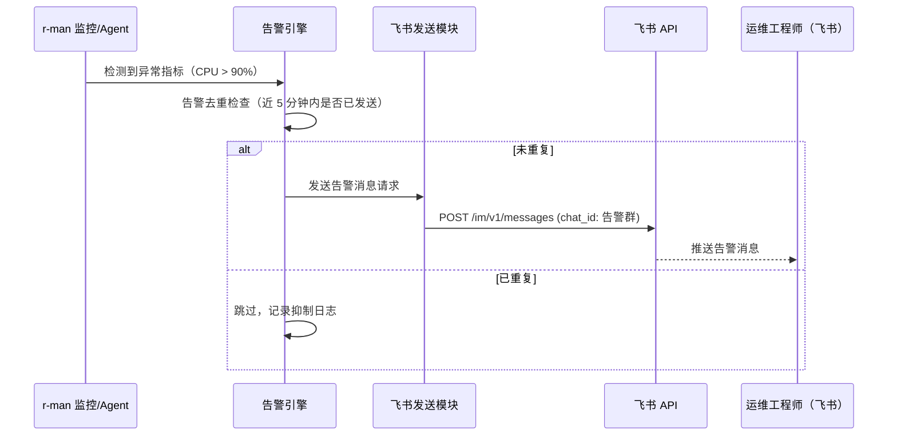
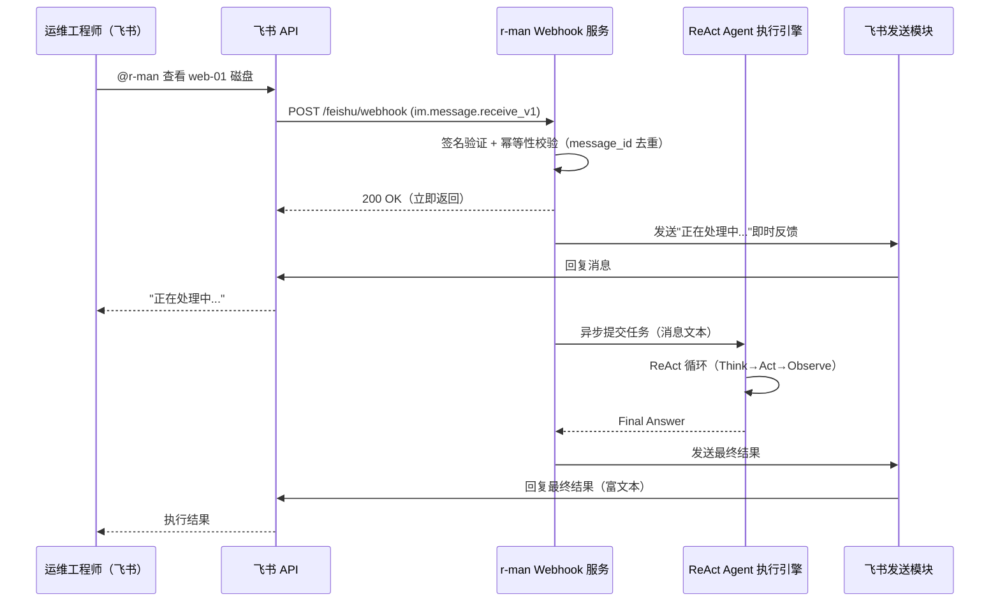

# REQ-FEISHU-001: r-man 飞书通信能力需求文档

| 版本号 | 日期 | 变更说明 | 作者 |
| :--- | :--- | :--- | :--- |
| v1.0.0 | 2026-04-15 | 初始版本，梳理飞书集成全量需求 | GitHub Copilot |
| v1.1.0 | 2026-04-15 | 需求范围调整：移除人工审批门禁（BR-004、FR-007）、移除复杂多角色权限体系（FR-006），简化为基础双向通信；增加与核心 Agent 框架的集成说明 | GitHub Copilot |
| v1.2.0 | 2026-04-15 | 技术选型确定：采用官方 `lark-oapi` Python SDK；新增 FR-006 SDK 技术选型章节；FR-002 补充 WebSocket 模式作为本地开发首选方案；更新约束 C-003/C-004（SDK 自动管理 Token，WebSocket 无需公网 IP） | GitHub Copilot |
| v1.3.0 | 2026-04-15 | 需求澄清落地：明确飞书入口为单用户授权模式；消息处理采用串行 FIFO 队列；新增 `allowed_user_open_id` 配置项；移除"10 并发"约束，更新 NFR-003 与 AC-008 | GitHub Copilot |

---

## 目录

1. [背景与目标](#1-背景与目标)
2. [业务需求](#2-业务需求)
3. [功能需求](#3-功能需求)
4. [非功能需求](#4-非功能需求)
5. [集成方案对比](#5-集成方案对比)
6. [业务流程图](#6-业务流程图)
7. [数据契约](#7-数据契约)
8. [约束与假设](#8-约束与假设)
9. [验收标准](#9-验收标准)
10. [关联文档](#10-关联文档)

---

## 1. 背景与目标

### 1.1 背景

r-man 是一个面向 Linux 系统全自动维护的 AI Agent（见 [REQ-CORE-001](../core-agent/REQ-CORE-001.md)），其核心能力是接收自然语言任务、通过 ReAct 框架推理并调用工具执行。然而没有通信通道，用户只能通过本地 CLI 与 r-man 交互。

飞书（Lark）作为企业内部核心协作平台，是为 r-man 提供**移动端、随时随地交互入口**的理想选择：
- r-man 检测到异常时，主动通过飞书通知用户。
- 用户无需登录服务器，直接在飞书发消息驱动 r-man 执行运维任务，获得执行结果。

### 1.2 目标

- **目标 1**: 为 r-man 建立**主动推送**能力——异常告警、巡检报告可实时触达运维人员飞书。
- **目标 2**: 为运维人员提供**自然语言指令入口**——通过飞书聊天向 r-man 下达运维指令并获取执行结果。
- **目标 3**: 确保通信链路的**安全性与可靠性**——消息签名验证、发送失败重试、防重复告警。

> **范围说明（v1.1.0）**: 本版本聚焦于基础双向通信能力。高风险操作人工审批门禁、多级用户角色权限体系不在本版本范围内，可在后续版本迭代中扩展。

---

## 2. 业务需求

### BR-001: 系统告警实时推送

**描述**: 当 r-man 检测到系统异常事件时，须在 30 秒内通过飞书将告警信息推送至指定运维群组或责任人。

**触发事件示例**:
- CPU 使用率持续 5 分钟超过阈值（默认 90%）
- 内存使用率超过阈值（默认 85%）
- 磁盘使用率超过阈值（默认 80%）
- 关键服务（如 nginx、mysql、sshd）进程异常退出
- 系统日志中出现 `ERROR` / `CRITICAL` 级别关键词
- 网络连通性中断

**期望结果**: 运维人员在飞书收到结构化告警消息，包含：告警级别、受影响主机、具体指标值、发生时间、建议操作。

---

### BR-002: 自然语言指令下发与执行

**描述**: 运维工程师可以在飞书中通过 @机器人 或私聊的方式，使用自然语言向 r-man 下达运维指令，r-man 执行后将结果回复到同一会话。r-man 的实际执行能力由 ReAct Agent 框架（见 [REQ-CORE-001](../core-agent/REQ-CORE-001.md)）提供。

> **单用户授权模式**: 飞书入口仅支持一个授权用户（通过 `allowed_user_open_id` 配置指定）。来自其他用户的消息静默丢弃（记录 Warning 日志，不回复）。消息处理采用**串行 FIFO 队列**：前一条消息的 Agent 循环未完成时，后续消息进入等待队列，待前一条完成后再取出执行。

**指令示例**:
- "查一下 web-prod-01 的磁盘使用情况"
- "重启 app-server-03 上的 nginx 服务"
- "查看过去 1 小时的 sshd 登录日志"
- "检查所有节点的内存状态"

**期望结果**: r-man 理解指令意图，通过 ReAct 框架执行任务，并以可读的飞书富文本消息格式回复执行结果。

---

### BR-003: 定时系统巡检报告

**描述**: r-man 按可配置的周期（默认每日 08:00）主动向运维群组推送系统健康全量报告，报告内容标准化。

**报告内容**:
- 所有受管节点的汇总状态（正常/告警/离线）
- 关键指标摘要（CPU、内存、磁盘）
- 过去 24 小时内的告警事件统计
- 待处理问题列表

**期望结果**: 运维团队每天通过飞书掌握全局系统健康状况，无需主动登录任何系统。

---

## 3. 功能需求

### FR-001: 飞书自建应用接入

**描述**: 在飞书开放平台创建自建应用，获取 `App ID` 与 `App Secret`，并配置必要的 API 权限范围与事件订阅。

**所需权限范围 (OAuth Scopes)**:
- `im:message` — 读取/发送消息
- `im:message.group_at_msg` — 接收群组 @ 消息
- `im:message.p2p_msg` — 接收私聊消息
- `im:chat` — 获取会话信息
- `contact:user.id:readonly` — 解析用户信息

**事件订阅**:
- `im.message.receive_v1` — 接收消息事件（群聊 @ 和私聊）

---

### FR-002: 飞书事件接收服务

**描述**: r-man 需要能够实时接收飞书推送的消息事件。`lark-oapi` SDK 提供两种事件接收模式，可按部署环境选择：

#### 模式 A：WebSocket 模式（推荐用于本地开发与无公网 IP 场景）

通过 `lark.WSClient` 与飞书建立持久 WebSocket 长连接，飞书主动将事件推送到 r-man。**无需配置公网 IP 或域名**，本地开发零配置即可接收消息。

```python
import lark_oapi as lark
from lark_oapi.api.im.v1 import P2ImMessageReceiveV1

def do_p2_im_message_receive_v1(data: P2ImMessageReceiveV1) -> None:
    msg_content = data.event.message.content
    sender_id = data.event.sender.sender_id.open_id
    # 将消息转发给 Agent 执行引擎（异步）

event_handler = lark.EventDispatcherHandler.builder("", "") \
    .register_p2_im_message_receive_v1(do_p2_im_message_receive_v1) \
    .build()

cli = lark.WSClient(app_id, app_secret, event_handler=event_handler)
cli.start()
```

**特性**:
- 无需处理 Challenge-Response 握手验证
- SDK 自动维持心跳与断线重连
- 消息推送延迟极低（通常 < 1s）

#### 模式 B：HTTP Webhook 回调（适用于生产部署、有公网 IP 的服务器）

r-man 内置一个轻量 HTTP 服务（推荐 FastAPI）监听飞书事件回调。

**技术要求**:
- 监听指定端口（默认 `8080`），路径 `/feishu/webhook`
- 处理飞书平台的 **URL 验证挑战**（Challenge-Response 握手）
- 使用飞书提供的 `Verification Token` 或 **消息加密（AES）** 验证请求合法性，防止伪造请求（OWASP A07）
- Webhook 端点须通过公网或企业内网对飞书服务器可访问

**两种模式均须满足的要求**:
- 对每条事件消息进行**幂等性处理**（通过 `message_id` 去重，防止重复处理）
- 异步处理指令执行，避免阻塞事件响应（HTTP 模式须在 3 秒内返回 200）

---

### FR-003: 消息发送模块

**描述**: 封装飞书消息发送 API，支持向不同目标发送多种格式的消息。底层使用 `lark-oapi` SDK 的 `client.im.v1.message.create()` 接口，SDK 自动管理 `tenant_access_token` 的获取、缓存与过期刷新，无需手动实现 Token 管理逻辑。

**SDK 初始化**（单例，全局复用）:

```python
import lark_oapi as lark

client = lark.Client.builder() \
    .app_id(app_id) \
    .app_secret(app_secret) \
    .log_level(lark.LogLevel.INFO) \
    .build()
```

**发送消息示例**:

```python
from lark_oapi.api.im.v1 import CreateMessageRequest, CreateMessageRequestBody

request = CreateMessageRequest.builder() \
    .receive_id_type("open_id") \           # 或 "chat_id"
    .request_body(CreateMessageRequestBody.builder() \
        .receive_id(target_id) \
        .msg_type("text") \
        .content('{"text":"消息内容"}') \
        .build()) \
    .build()

response = client.im.v1.message.create(request)
if not response.success():
    # 记录错误日志，触发重试
    logger.error(f"发送失败: {response.code}, {response.msg}")
```

**支持的目标类型**:
- 用户（`receive_id_type="open_id"`）
- 群组会话（`receive_id_type="chat_id"`）
- 配置文件中指定的默认告警群组

**支持的消息类型**:
- `text` — 纯文本消息（用于简单回复）
- `post` — 富文本消息（用于指令执行结果，支持代码块、链接）

**可靠性要求**:
- 发送失败时，按指数退避策略重试，最多 3 次（间隔 2s、4s、8s）
- 重试耗尽后记录错误日志

---

### FR-004: 指令转发至 Agent

**描述**: 将从飞书接收到的自然语言消息直接转发给 r-man 核心 Agent（ReAct 执行框架），获得执行结果后回复到飞书。

**处理流程**:
1. Webhook 服务接收 `im.message.receive_v1` 事件，提取消息文本（去除 @ 提及前缀）。
2. 验证发送人是否为 `allowed_user_open_id` 授权用户；非授权用户的消息静默丢弃（记录 Warning）。
3. 将消息文本加入 Feishu Session 串行队列（FIFO）。
4. 当队列头消息出队时，将其作为用户任务提交给 Agent 执行引擎（见 [REQ-CORE-001 FR-001](../core-agent/REQ-CORE-001.md#fr-001-react-agent-执行框架)）。
5. Agent 执行完成后，将 `Final Answer` 通过消息发送模块回复到来源会话。
6. Agent 执行期间，向用户发送"正在处理中..."即时响应，避免用户长时间等待无反馈。

**超时处理**: 若 Agent 执行超过配置的最大等待时间（默认 120 秒），向用户推送超时通知，Agent 继续后台运行并在完成后追加回复。

---

### FR-005: 配置管理

**描述**: 飞书集成相关配置须统一管理，支持环境变量覆盖，敏感信息不得硬编码。

**配置项清单**（集成在 `config/config.yaml` 的 `feishu` 节点下）：

```yaml
feishu:
  app_id: "${FEISHU_APP_ID}"                       # 必填，飞书应用 AppID
  app_secret: "${FEISHU_APP_SECRET}"               # 必填，飞书应用 AppSecret
  receive_mode: "websocket"                        # 事件接收模式：websocket（默认）或 webhook
  # WebSocket 模式无需以下 webhook 配置
  webhook:
    host: "0.0.0.0"
    port: 8080
    path: "/feishu/webhook"
    verification_token: "${FEISHU_VERIFICATION_TOKEN}" # HTTP 模式必填，用于验签
    encrypt_key: "${FEISHU_ENCRYPT_KEY}"           # HTTP 模式可选，开启消息加密时使用
  default_alert_chat_id: ""                        # 默认告警推送群组 ID
  allowed_user_open_id: "${FEISHU_ALLOWED_USER}"   # 必填，唯一授权用户的 open_id；其他用户消息静默丢弃
  agent_response_timeout: 120                      # Agent 执行超时（秒）
  alert_dedup_window_seconds: 300                  # 告警去重窗口（5 分钟）
  retry:
    max_attempts: 3
    backoff_base_seconds: 2
```

---

### FR-006: Python SDK 技术选型（lark-oapi）

**描述**: r-man 的飞书通信层全面采用飞书官方 Python SDK `lark-oapi`，不使用手写 HTTP 客户端。

**安装**:

```bash
pip install lark-oapi -U
```

**选型理由**:

| 特性 | 说明 |
| :--- | :--- |
| **全量 API 覆盖** | 支持最新版本飞书所有服务端 API（IM、通讯录、云文档、多维表格等），扩展能力完备 |
| **自动 Token 管理** | SDK 内部自动处理 `tenant_access_token` 的获取、缓存与过期刷新（2 小时有效期），业务代码无需关心 |
| **强类型支持** | 提供完整的 Request / Response 对象定义，IDE 代码补全体验好，减少运行时错误 |
| **WebSocket 支持** | 内置 `lark.WSClient`，本地开发无需公网 IP 即可实时接收消息事件 |
| **官方维护** | 飞书官方出品，与 API 版本同步更新，长期可信赖 |

**官方文档**: [飞书开放平台 — Python SDK 快速入门](https://open.feishu.cn/document/server-docs/sdk-guides/python-sdk/preparations-before-development)

---

## 4. 非功能需求

### NFR-001: 安全性

- **消息签名验证**: Webhook 接收端必须校验飞书请求签名（`X-Lark-Signature` 或 AES 解密），拒绝非法请求，防止 SSRF/消息伪造攻击（OWASP A03、A07）。
- **密钥管理**: `App Secret`、`Encrypt Key`、`Verification Token` 等敏感配置必须通过环境变量注入，严禁明文写入代码或 Git 仓库。
- **输入透传安全**: 飞书消息文本在传递给 Agent 前不做 Shell 拼接；Agent 内部工具的安全约束由 `RMAN.md` 的行为规则控制（见 [REQ-CORE-001](../core-agent/REQ-CORE-001.md)）。
- **最小权限原则**: 飞书应用申请的 API 权限范围须遵循最小必要原则。

### NFR-002: 可靠性

- **消息发送成功率**: 目标 ≥ 99%（含重试机制后）。
- **幂等性保障**: 相同 `message_id` 的事件不得触发重复执行；相同告警事件在 5 分钟内不重复推送（告警降噪）。
- **服务可用性**: Webhook 服务须随 r-man 主进程启动，异常退出时通过 systemd 自动重启。

### NFR-003: 性能

- **Webhook 响应延迟**: HTTP 模式下，接收到事件后须在 **3 秒内**返回 200，Agent 实际执行须异步进行；WebSocket 模式下无此硬性约束，但事件处理回调须立即返回，耗时逻辑须提交到异步任务队列。
- **告警推送延迟**: 从检测到告警到飞书消息送达，端到端延迟须 **＜ 30 秒**。
- **消息处理模型**: 飞书指令入口采用单用户串行处理模型（FIFO 队列），同一时刻最多运行一个 ReAct 循环。asyncio 事件循环用于飞书 SDK 的 I/O 调度，不用于并发 Agent 执行。

### NFR-004: 可观测性

- **结构化日志**: 所有飞书通信事件须以 JSON 结构化日志记录，含 `timestamp`、`event_type`、`message_id`、`chat_id`、`status`。
- **健康检查接口**: Webhook 服务须暴露 `GET /health` 端点，返回服务运行状态与飞书 API 连通性。

---

## 5. 集成方案对比

| 维度 | 方案 A: 飞书自建应用 + Event Callback | 方案 B: 飞书自定义机器人 Webhook |
| :--- | :--- | :--- |
| **通信方向** | 双向（收发消息） | 单向（仅推送） |
| **接收用户消息** | ✅ 支持 | ❌ 不支持 |
| **配置复杂度** | 中（需在开放平台创建应用） | 低（生成 Webhook URL 即可） |
| **安全性** | 高（签名验证 + AES 加密选项） | 中（仅 Token 验证） |
| **适合场景** | 双向交互（本项目需求） | 仅告警推送（降级方案） |

**决策**: **采用方案 A（飞书自建应用 + Event Callback）**，满足双向通信需求。方案 B 可作为网络不通时的降级告警推送备用。

---

## 6. 业务流程图

### 6.1 告警推送流程



### 6.2 指令接收与执行流程



---

## 7. 数据契约

### 7.1 飞书入站消息（内部表示）

```python
from pydantic import BaseModel

class FeishuInboundMessage(BaseModel):
    message_id: str       # 飞书消息 ID（用于幂等去重）
    chat_id: str          # 来源会话 ID
    sender_open_id: str   # 发送人 open_id
    sender_name: str      # 发送人显示名
    text: str             # 消息文本（已去除 @ 前缀）
    chat_type: str        # "p2p"（私聊）或 "group"（群聊）
```

### 7.2 告警事件内部结构

```python
from pydantic import BaseModel
from datetime import datetime
from enum import Enum
from typing import Optional

class AlertLevel(str, Enum):
    INFO = "INFO"
    WARNING = "WARNING"
    CRITICAL = "CRITICAL"

class AlertEvent(BaseModel):
    alert_id: str             # 唯一告警 ID（UUID）
    level: AlertLevel         # 告警级别
    host: str                 # 受影响主机名
    metric: str               # 指标名称（如 cpu_usage）
    current_value: float      # 当前指标值
    threshold: float          # 触发阈值
    description: str          # 人类可读描述
    triggered_at: datetime    # 触发时间（UTC）
    suggestion: Optional[str] # 建议操作（可选）
```

---

## 8. 约束与假设

| 编号 | 类型 | 说明 |
| :--- | :--- | :--- |
| C-001 | 约束 | r-man 所在服务器需能访问飞书 Open API（`open.feishu.cn`），或通过代理访问 |
| C-002 | 约束 | 飞书自建应用需由管理员在企业飞书开放平台创建并授权，r-man 不自动创建应用 |
| C-003 | 约束 | **WebSocket 模式**（默认）无需公网 IP，适合本地开发与内网部署；**HTTP Webhook 模式**需要飞书服务器能访问到 r-man 的 Webhook 端点（公网 IP、内网穿透或企业网关） |
| C-004 | 约束 | `lark-oapi` SDK 自动管理 `tenant_access_token`（有效期 2 小时）的获取、缓存与刷新，r-man 代码无需手动实现 Token 刷新逻辑 |
| A-001 | 假设 | 企业已有飞书组织，运维人员均在组织内 |
| A-002 | 假设 | 本版本不实现用户权限细分，所有能向机器人发消息的飞书用户均视为可信运维人员；后续可通过扩展 `RMAN.md` 中的约束规则实现行为限制 |

---

## 9. 验收标准

| AC 编号 | 关联需求 | 验收标准描述 |
| :--- | :--- | :--- |
| AC-001 | BR-001 | 模拟 CPU 超阈值事件，飞书告警群在 30 秒内收到告警消息，字段完整 |
| AC-002 | BR-001 | 同一告警事件在 5 分钟内触发 3 次，飞书仅收到 1 条告警消息（去重验证） |
| AC-003 | BR-002 | 在飞书发送" @r-man 查看 web-01 磁盘"，先收到"处理中"响应，之后收到含磁盘信息的回复消息 |
| AC-004 | BR-002 | 发送复杂指令"清理 /tmp 下超过 7 天的日志并报告"，r-man 完成多步骤执行后，回复完整操作报告 |
| AC-005 | BR-003 | 配置每日 08:00 推送，系统准时向告警群发送每日报告，内容覆盖所有受管节点 |
| AC-006 | FR-002 | 向 Webhook 发送未签名或签名错误的请求，返回 403，日志记录拒绝事件 |
| AC-007 | FR-002 | 相同 message_id 的事件发送两次，Agent 只被触发一次执行（幂等验证） |
| AC-008 | NFR-003 | WebSocket 模式下发送两条消息，第二条进入队列等待；第一条完成后第二条开始处理（串行验证）。HTTP 模式下接收消息事件，HTTP 200 响应在 3 秒内返回 |
| AC-009 | NFR-004 | 查看飞书通信日志，每条收发记录包含：时间、message_id、chat_id、处理状态 |

---

## 10. 关联文档

- [docs/requirements/index.md](../index.md) — 需求文档总索引
- [docs/requirements/core-agent/REQ-CORE-001.md](../core-agent/REQ-CORE-001.md) — r-man 核心 Agent 框架需求
- [docs/design/ARCH_OVERVIEW.md](../../design/ARCH_OVERVIEW.md) — r-man 整体架构概览（待创建）
- [docs/design/feishu-integration/](../../design/feishu-integration/) — 飞书集成详细设计（待创建）
- [飞书开放平台 — Python SDK 快速入门](https://open.feishu.cn/document/server-docs/sdk-guides/python-sdk/preparations-before-development) — lark-oapi 官方文档（外部链接）
