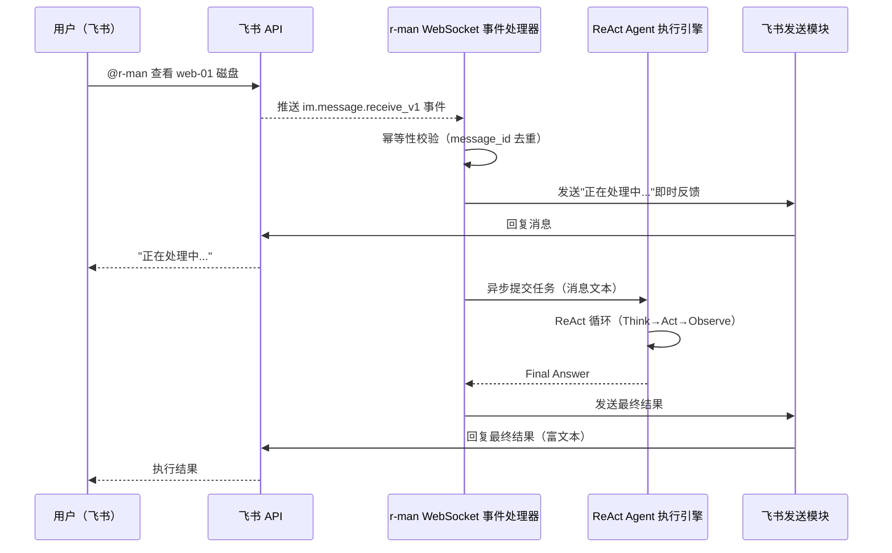

# REQ-FEISHU-001: r-man 飞书通信能力需求文档

| 版本号 | 日期 | 变更说明 | 作者 |
| :--- | :--- | :--- | :--- |
| v1.0.0 | 2026-04-15 | 初始版本，梳理飞书集成全量需求 | GitHub Copilot |
| v1.1.0 | 2026-04-15 | 需求范围调整：移除人工审批门禁（BR-004、FR-007）、移除复杂多角色权限体系（FR-006），简化为基础双向通信；增加与核心 Agent 框架的集成说明 | GitHub Copilot |
| v1.2.0 | 2026-04-15 | 技术选型确定：采用官方 `lark-oapi` Python SDK；新增 FR-006 SDK 技术选型章节；FR-002 补充 WebSocket 模式作为本地开发首选方案；更新约束 C-003/C-004（SDK 自动管理 Token，WebSocket 无需公网 IP） | GitHub Copilot |
| v1.3.0 | 2026-04-15 | 需求澄清落地：明确飞书入口为单用户授权模式；消息处理采用串行 FIFO 队列；新增 `allowed_user_open_id` 配置项；移除"10 并发"约束，更新 NFR-003 与 AC-008 | GitHub Copilot |
| v1.4.0 | 2026-04-15 | 明确飞书应用创建由用户自行解决；首选 WebSocket 模式；集成安装工具需求 | GitHub Copilot |
| v1.5.0 | 2026-04-15 | 明确与飞书间通信仅使用 WebSocket 模式 | GitHub Copilot |
| v1.6.0 | 2026-04-15 | 移除 BR-001 系统告警实时推送和 BR-003 定时系统巡检报告需求 | GitHub Copilot |
| v1.7.0 | 2026-04-16 | 统一文档认知为通用 AI Agent，角色表述从“运维人员”调整为“用户/操作者” | GitHub Copilot |
| v1.8.0 | 2026-04-16 | 通信模式收敛：彻底移除 HTTP Webhook 方案与相关 NFR/AC，仅保留 WebSocket 模式 | GitHub Copilot |
| v1.9.0 | 2026-04-16 | 范围一致性修订：移除告警推送/定时报告残留描述、流程与验收项，仅保留指令接收与结果回复能力 | GitHub Copilot |

---

## 目录

1. [背景与目标](#1-背景与目标)
2. [业务需求](#2-业务需求)
3. [功能需求](#3-功能需求)
4. [非功能需求](#4-非功能需求)
5. [集成方案对比](#5-集成方案对比)
6. [业务流程图](#6-业务流程图)
7. [数据契约](#7-数据契约)
8. [约束与假设](#8-约束与假设)
9. [验收标准](#9-验收标准)
10. [关联文档](#10-关联文档)

---

## 1. 背景与目标

### 1.1 背景

r-man 是一个通用 AI Agent，可以处理多种任务（见 [REQ-CORE-001](../core-agent/REQ-CORE-001.md)），其核心能力是接收自然语言任务、通过 ReAct 框架推理并调用工具执行。

飞书（Lark）作为企业内部核心协作平台，是为 r-man 提供**移动端、随时随地交互入口**的理想选择：
- 用户无需登录服务器，直接在飞书发消息驱动 r-man 执行任务，获得执行结果。

**说明**：飞书应用创建由用户自行解决，用户需在飞书开放平台创建自建应用并获取 App ID 和 App Secret。

### 1.2 目标

- **目标 1**: 为用户提供**自然语言指令入口**——通过飞书聊天向 r-man 下达任务指令并获取执行结果。
- **目标 2**: 确保通信链路的**安全性与可靠性**——消息事件可靠接收、发送失败重试、幂等处理。
- **目标 3**: 提供便捷的部署工具——通过安装工具辅助用户完成配置和服务启动。

> **范围说明（v1.1.0）**: 本版本聚焦于基础双向通信能力。高风险操作人工审批门禁、多级用户角色权限体系不在本版本范围内，可在后续版本迭代中扩展。
> 
> **技术选型说明（v1.5.0）**: 与飞书间通信仅使用 WebSocket 模式，无需公网 IP，适合所有部署场景。

---

## 2. 业务需求

### BR-002: 自然语言指令下发与执行

**描述**: 用户可以在飞书中通过 @机器人 或私聊的方式，使用自然语言向 r-man 下达任务指令，r-man 执行后将结果回复到同一会话。r-man 的实际执行能力由 ReAct Agent 框架（见 [REQ-CORE-001](../core-agent/REQ-CORE-001.md)）提供。

> **单用户授权模式**: 飞书入口仅支持一个授权用户（通过 `allowed_user_open_id` 配置指定）。来自其他用户的消息静默丢弃（记录 Warning 日志，不回复）。消息处理采用**串行 FIFO 队列**：前一条消息的 Agent 循环未完成时，后续消息进入等待队列，待前一条完成后再取出执行。

**指令示例**:
- "查一下 web-prod-01 的磁盘使用情况"
- "重启 app-server-03 上的 nginx 服务"
- "查看过去 1 小时的 sshd 登录日志"
- "检查所有节点的内存状态"

**期望结果**: r-man 理解指令意图，通过 ReAct 框架执行任务，并以可读的飞书富文本消息格式回复执行结果。

---

## 3. 功能需求

### FR-001: 飞书自建应用接入

**描述**: 在飞书开放平台创建自建应用，获取 `App ID` 与 `App Secret`，并配置必要的 API 权限范围与事件订阅。

**所需权限范围 (OAuth Scopes)**:
- `im:message` — 读取/发送消息
- `im:message.group_at_msg` — 接收群组 @ 消息
- `im:message.p2p_msg` — 接收私聊消息
- `im:chat` — 获取会话信息
- `contact:user.id:readonly` — 解析用户信息

**事件订阅**:
- `im.message.receive_v1` — 接收消息事件（群聊 @ 和私聊）

---

### FR-002: 飞书事件接收服务

**描述**: r-man 需要能够实时接收飞书推送的消息事件。当前版本仅采用 `lark-oapi` SDK 的 WebSocket 长连接模式。

#### 模式 A：WebSocket 模式（推荐用于本地开发与无公网 IP 场景）

通过 `lark.WSClient` 与飞书建立持久 WebSocket 长连接，飞书主动将事件推送到 r-man。**无需配置公网 IP 或域名**，本地开发零配置即可接收消息。

```python
import lark_oapi as lark
from lark_oapi.api.im.v1 import P2ImMessageReceiveV1

def do_p2_im_message_receive_v1(data: P2ImMessageReceiveV1) -> None:
    msg_content = data.event.message.content
    sender_id = data.event.sender.sender_id.open_id
    # 将消息转发给 Agent 执行引擎（异步）

event_handler = lark.EventDispatcherHandler.builder("", "") \
    .register_p2_im_message_receive_v1(do_p2_im_message_receive_v1) \
    .build()

cli = lark.WSClient(app_id, app_secret, event_handler=event_handler)
cli.start()
```

**特性**:
- 无需处理 Challenge-Response 握手验证
- SDK 自动维持心跳与断线重连
- 消息推送延迟极低（通常 < 1s）

**模式要求**:
- 对每条事件消息进行**幂等性处理**（通过 `message_id` 去重，防止重复处理）
- 异步处理指令执行，避免阻塞事件回调

---

### FR-003: 消息交互卡片化

**描述**: 为了提升用户体验，r-man 与飞书的所有异步交互（即时反馈与最终报告）必须采用“交互式卡片（Interactive Card）”格式，而非纯文本或富文本。

**卡片规范**:
1.  **卡片类型**: 设置 `msg_type` 为 `interactive`。
2.  **视觉分层**:
    *   **Header (标题栏)**: 
        *   文字: 统一为 `🤖 R-MAN 执行报告`（最终结果）或 `🤖 R-MAN 正在思考...`（中间状态）。
        *   颜色: 蓝色 (blue) 代表执行中或正常结果；红色 (red) 代表执行失败。
    *   **Content (正文区)**: 使用 `lark_md` 标签，支持完整的 Markdown 语法渲染。
    *   **Note (注脚区)**: 使用 `note` 标签展示元数据（如耗时、时间戳、UserID）。

**优势**:
*   相比纯文本，卡片消息在移动端展示更整洁，且支持长文本的优雅排版。
*   支持 Markdown 代码块，方便展示 Shell 输出。

---

### FR-004: 指令转发至 Agent

**描述**: 将从飞书接收到的自然语言消息直接转发给 r-man 核心 Agent（ReAct 执行框架），获得执行结果后回复到飞书。

**处理流程**:
1. WebSocket 事件处理器接收 `im.message.receive_v1` 事件，提取消息文本（去除 @ 提及前缀）。
2. 验证发送人是否为 `allowed_user_open_id` 授权用户；非授权用户的消息静默丢弃（记录 Warning）。
3. 将消息文本加入 Feishu Session 串行队列（FIFO）。
4. 当队列头消息出队时，将其作为用户任务提交给 Agent 执行引擎（见 [REQ-CORE-001 FR-001](../core-agent/REQ-CORE-001.md#fr-001-react-agent-执行框架)）。
5. Agent 执行完成后，将 `Final Answer` 通过消息发送模块回复到来源会话。
6. Agent 执行期间，向用户发送"正在处理中..."即时响应，避免用户长时间等待无反馈。

**超时处理**: 若 Agent 执行超过配置的最大等待时间（默认 120 秒），向用户推送超时通知，Agent 继续后台运行并在完成后追加回复。

---

### FR-005: 配置管理

**描述**: 飞书集成相关配置须统一管理，支持环境变量覆盖，敏感信息不得硬编码。

**配置项清单**（集成在 `config/config.yaml` 的 `feishu` 节点下）：

```yaml
feishu:
  app_id: "${FEISHU_APP_ID}"                       # 必填，飞书应用 AppID
  app_secret: "${FEISHU_APP_SECRET}"               # 必填，飞书应用 AppSecret
  receive_mode: "websocket"                        # 事件接收模式：仅支持 websocket
  allowed_user_open_id: "${FEISHU_ALLOWED_USER}"   # 必填，唯一授权用户的 open_id；其他用户消息静默丢弃
  agent_response_timeout: 120                      # Agent 执行超时（秒）
  retry:
    max_attempts: 3
    backoff_base_seconds: 2
```

---

### FR-006: Python SDK 技术选型（lark-oapi）

**描述**: r-man 的飞书通信层全面采用飞书官方 Python SDK `lark-oapi`，不使用手写 HTTP 客户端。

**安装**:

```bash
pip install lark-oapi -U
```

**选型理由**:

| 特性 | 说明 |
| :--- | :--- |
| **全量 API 覆盖** | 支持最新版本飞书所有服务端 API（IM、通讯录、云文档、多维表格等），扩展能力完备 |
| **自动 Token 管理** | SDK 内部自动处理 `tenant_access_token` 的获取、缓存与过期刷新（2 小时有效期），业务代码无需关心 |
| **强类型支持** | 提供完整的 Request / Response 对象定义，IDE 代码补全体验好，减少运行时错误 |
| **WebSocket 支持** | 内置 `lark.WSClient`，本地开发无需公网 IP 即可实时接收消息事件 |
| **官方维护** | 飞书官方出品，与 API 版本同步更新，长期可信赖 |

**官方文档**: [飞书开放平台 — Python SDK 快速入门](https://open.feishu.cn/document/server-docs/sdk-guides/python-sdk/preparations-before-development)

---

### FR-007: 安装工具集成

**描述**: 与 r-man 核心安装工具集成，支持飞书配置的引导和验证。

**功能特性**:
1. **配置引导**:
   - 提示用户输入飞书 App ID 和 App Secret
   - 提示用户配置飞书授权用户 open_id
   - 自动生成飞书相关配置项

2. **配置校验**:
   - 验证飞书 App ID 和 App Secret 的有效性
   - 验证飞书授权用户 open_id 的格式

3. **服务配置**:
   - 生成包含飞书配置的 systemd 服务文件
   - 配置飞书相关环境变量

**集成要求**:
- 安装工具需检查飞书 SDK 依赖是否正确安装
- 安装过程中需验证飞书 API 调用权限
- 安装完成后需验证飞书连接状态

---

## 4. 非功能需求

### NFR-001: 安全性

- **连接凭据安全**: `App Secret` 等敏感配置必须通过环境变量注入，严禁明文写入代码或 Git 仓库。
- **输入透传安全**: 飞书消息文本在传递给 Agent 前不做 Shell 拼接；Agent 内部工具的安全约束由 `RMAN.md` 的行为规则控制（见 [REQ-CORE-001](../core-agent/REQ-CORE-001.md)）。
- **最小权限原则**: 飞书应用申请的 API 权限范围须遵循最小必要原则。

### NFR-002: 可靠性

- **消息发送成功率**: 目标 ≥ 99%（含重试机制后）。
- **幂等性保障**: 相同 `message_id` 的事件不得触发重复执行。
- **服务可用性**: WebSocket 事件接收服务须随 r-man 主进程启动，异常退出时通过 systemd 自动重启。

### NFR-003: 性能

- **事件处理延迟**: WebSocket 事件回调须立即返回，耗时逻辑必须提交到异步任务队列，避免阻塞后续消息处理。
- **消息处理模型**: 飞书指令入口采用单用户串行处理模型（FIFO 队列），同一时刻最多运行一个 ReAct 循环。asyncio 事件循环用于飞书 SDK 的 I/O 调度，不用于并发 Agent 执行。

### NFR-004: 可观测性

- **结构化日志**: 所有飞书通信事件须以 JSON 结构化日志记录，含 `timestamp`、`event_type`、`message_id`、`chat_id`、`status`。
- **健康检查接口**: 事件接收服务须暴露 `GET /health` 端点，返回服务运行状态与飞书 API 连通性。

---

## 5. 集成方案对比

| 维度 | WebSocket 事件接收（唯一方案） |
| :--- | :--- |
| **通信方向** | 双向（收发消息） |
| **接收用户消息** | ✅ 支持 |
| **网络要求** | 无需公网 IP，支持本地与内网部署 |
| **实现方式** | 使用 `lark.WSClient` 建立长连接 |
| **可靠性** | SDK 自动维持心跳与断线重连 |

**决策**: 当前版本仅采用 WebSocket 事件接收方案，不提供 HTTP Webhook 回调实现。

---

## 6. 业务流程图

### 6.1 指令接收与执行流程



---

## 7. 数据契约

### 7.1 飞书入站消息（内部表示）

```python
from pydantic import BaseModel

class FeishuInboundMessage(BaseModel):
    message_id: str       # 飞书消息 ID（用于幂等去重）
    chat_id: str          # 来源会话 ID
    sender_open_id: str   # 发送人 open_id
    sender_name: str      # 发送人显示名
    text: str             # 消息文本（已去除 @ 前缀）
    chat_type: str        # "p2p"（私聊）或 "group"（群聊）
```

---

## 8. 约束与假设

| 编号 | 类型 | 说明 |
| :--- | :--- | :--- |
| C-001 | 约束 | r-man 所在服务器需能访问飞书 Open API（`open.feishu.cn`），或通过代理访问 |
| C-002 | 约束 | 飞书自建应用需由管理员在企业飞书开放平台创建并授权，r-man 不自动创建应用 |
| C-003 | 约束 | 与飞书间通信仅支持 **WebSocket 模式**，无需公网 IP，适合本地开发与内网部署 |
| C-004 | 约束 | `lark-oapi` SDK 自动管理 `tenant_access_token`（有效期 2 小时）的获取、缓存与刷新，r-man 代码无需手动实现 Token 刷新逻辑 |
| A-001 | 假设 | 企业已有飞书组织，目标用户均在组织内 |
| A-002 | 假设 | 本版本不实现用户权限细分，所有能向机器人发消息的飞书用户均视为可信用户；后续可通过扩展 `RMAN.md` 中的约束规则实现行为限制 |

---

## 9. 验收标准

| AC 编号 | 关联需求 | 验收标准描述 |
| :--- | :--- | :--- |
| AC-001 | BR-002 | 在飞书发送" @r-man 查看 web-01 磁盘"，先收到"处理中"响应，之后收到含磁盘信息的回复消息 |
| AC-002 | BR-002 | 发送复杂指令"清理 /tmp 下超过 7 天的日志并报告"，r-man 完成多步骤执行后，回复完整操作报告 |
| AC-003 | FR-002 | 使用错误的 `app_id` 或 `app_secret` 启动 WebSocket 客户端时，连接失败并在日志中记录认证错误 |
| AC-004 | FR-002 | 相同 message_id 的事件发送两次，Agent 只被触发一次执行（幂等验证） |
| AC-005 | NFR-003 | WebSocket 模式下发送两条消息，第二条进入队列等待；第一条完成后第二条开始处理（串行验证） |
| AC-006 | NFR-004 | 查看飞书通信日志，每条收发记录包含：时间、message_id、chat_id、处理状态 |

---

## 10. 关联文档

- [docs/requirements/index.md](../index.md) — 需求文档总索引
- [docs/requirements/core-agent/REQ-CORE-001.md](../core-agent/REQ-CORE-001.md) — r-man 核心 Agent 框架需求
- [docs/design/ARCH_OVERVIEW.md](../../design/ARCH_OVERVIEW.md) — r-man 整体架构概览（待创建）
- [docs/design/feishu-integration/](../../design/feishu-integration/) — 飞书集成详细设计（待创建）
- [飞书开放平台 — Python SDK 快速入门](https://open.feishu.cn/document/server-docs/sdk-guides/python-sdk/preparations-before-development) — lark-oapi 官方文档（外部链接）
